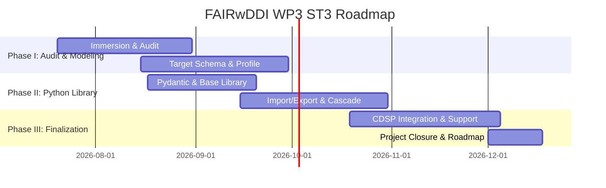

# FAIRwDDI Lifecycle

[](https://www.python.org/downloads/)
[](https://ddialliance.org/)
[](https://django-ninja.rest-framework.com/)
[](LICENSE)
[](https://cdsp.sciences-po.fr/)

**FAIRwDDI WP3 ST3** — Implementation of a standard-agnostic **DDI Data Model** (aligned with **DDI 4.0** and **DDI-CDI**, with **DDI-Lifecycle 3.3** compatibility) for the CDSP [ReQuest](https://request.sciencespo.fr/) Question Bank.

---

## 📌 Context & Objectives

The **Centre de Données Socio-Politiques (CDSP, UAR 828 CNRS / Sciences Po)** preserves, documents, and disseminates high-quality research data for the social sciences. As part of this mission, CDSP operates **[ReQuest](https://request.sciencespo.fr/)**, an open platform exploring over 65,000 questions and variables across longitudinal and cross-sectional survey collections (including the ELIPSS panel and CEVIPOF French electoral surveys).

As part of the **FAIRwDDI** research infrastructure initiative (Work Package 3, Subtask 3), this project modernizes the ReQuest database and ingestion pipelines from a pseudo-DDI architecture (DDI-Codebook 2.5 with custom Django abstractions) into a fully compliant, standard-agnostic **DDI Core Model** aligned with **DDI 4.0 (COGS model)**, **DDI-CDI (Cross-Domain Integration)**, and **DDI-Lifecycle 3.3**.

### Key Project Objectives

1. **FAIR & Cross-Domain Interoperability:** Align ReQuest metadata models with European social science data infrastructures (CESSDA, Dataverse, Colectica), cross-domain standards (**DDI-CDI**), and modern DDI 4 models.
2. **Native Multilingual Support:** Implement multi-language metadata handling (`xml:lang`) across all question wording, response categories, and variable concepts using PostgreSQL `JSONB` array of objects.
3. **Harmonization & Variable Cascade:** Establish the 3-tier DDI variable cascade (`ConceptualVariable` → `RepresentedVariable` → `InstanceVariable`) anchored to controlled vocabularies and multilingual thesauri (e.g. CESSDA ELSST).
4. **Lightweight & Maintainable Profile:** Deliver a focused, robust DDI profile specifically tailored for question banks without importing unneeded specification bloat.
5. **Streaming Ingestion & Multi-Standard Adapters:** Implement high-performance staging and streaming normalization supporting DDI 4 JSON, DDI-L 3.3 XML, DDI-C 2.5, Croissant, and CSV.

> [!NOTE]
> **DDI Document Availability & Licensing Notice:**  
> The raw DDI XML corpus documents and reference metadata harvested from external repositories (e.g., CLOSER, Ireland CSO, MIDUS, EQB) are not tracked in this public repository due to their large file size (multi-gigabyte payloads with tens of millions of resources) and, in some cases, upstream licensing and redistribution constraints. Testing and development pipelines utilize synthetic fixtures and localized mock fragments.

---

## 🏛️ Architectural Overview

### 1. The DDI Variable Cascade

The upgrade introduces a clear separation between conceptual definitions, question representations, and physical survey dataset bindings:

```
[ Concept Layer ]
  └── ConceptualVariable (anchored to Controlled Vocabularies / Thesauri)
        │
[ Representation Layer ]
  ├── QuestionItem (reusable question text & interviewer instructions)
  ├── CodeList / CodeItem (structured numerical codes & category values)
  └── RepresentedVariable (synthesizes QuestionItem + CodeList)
        │
[ Dataset / Physical Layer ]
  └── InstanceVariable (realization of variable in a specific survey column / wave)
```

### 2. Terminology & Model Mapping

| Legacy `request-ddi` Model | Target DDI Model (DDI 4 / DDI-CDI / DDI-L) | Layer | Description |
| :--- | :--- | :--- | :--- |
| `ConceptualVariable` | **ConceptualVariable** | Concept | Abstract measurement concept (anchored to controlled vocabulary) |
| `RepresentedVariable` | **RepresentedVariable** | Representation | Question representation + code list association |
| _(implicit / inline)_ | **QuestionItem** | Representation | Standalone reusable question text & interviewer instructions |
| `Category` | **Category** | Representation | Canonical response text label with multilingual JSONB |
| _(new entity)_ | **CodeList** / **CodeItem** | Representation | Decoupled numerical codes and category value bindings |
| _(new entity)_ | **VariableGroup** | Organization | Thematic grouping of variables within a survey study |
| `Survey` | **StudyUnit** | Dataset | Specific survey wave, collection, or study |
| `BindingSurveyRepresentedVariable` | **InstanceVariable** | Dataset | Physical realization of a variable in a specific survey dataset column |

### 3. Core Technical Decisions

- **Deterministic URN Identification:** Canonical URN generation (`urn:ddi:{agency}:{identifier}:{version}`) provides stable identifiers across all entities.
- **SHA-256 Content Fingerprinting:** Canonical JSON hashing of normalized text detects metadata drift (same URN, differing content) and routes ambiguous records to archivist quarantine.
- **Multilingual `JSONB` Storage:** PostgreSQL `JSONB` fields store ISO 639-1 language dictionaries (e.g., `{"fr": "...", "en": "..."}`) with sorted-key canonical serialization.
- **Streaming XML Parsing:** `lxml.etree.iterparse` streams large DDI-Lifecycle XML instances with minimal memory overhead, replacing DOM-based parsing.
- **Unified Pydantic v2 Schemas:** Shared validation models between ingestion pipelines, `django-ninja` REST APIs, and multilingual Elasticsearch indexing.

---

## 🗓️ Project Roadmap & Deliverables

The work is organized across three phases under the FAIRwDDI WP3 ST3 Statement of Work:



| Phase | Milestone | Expected Deliverable |
| :--- | :--- | :--- |
| **Phase I**<br>*(Jul 20 – Sep 30, 2026)* | **Audit and Modeling** | • Technical Audit Report (`Rapport d'audit`)<br>• Formal DDI-Lifecycle 3.3 ReQuest Profile<br>• Validated PostgreSQL target schema & Django migration plan |
| **Phase II**<br>*(Aug 17 – Oct 31, 2026)* | **Python Library (`fairwddi`)** | • Source library with DDI-L import/export pipelines (`dartfx-ddi`)<br>• Unified Pydantic v2 schemas and cascade managers<br>• Automated Pytest test suite and API documentation |
| **Phase III**<br>*(Oct 19 – Dec 18, 2026)* | **Integration and Support** | • Deployment and integration into CDSP ReQuest infrastructure<br>• Pre-production migration scripts and verification<br>• Final closure dossier (`Dossier de clôture`) and strategic roadmap |

---

## 🛠️ Technology Stack

| Category | Technology / Tool | Description |
| :--- | :--- | :--- |
| **Language** | [Python 3.12+](https://www.python.org/) | Core language runtime |
| **Package Management** | [uv](https://github.com/astral-sh/uv) | Fast package resolution and environment management |
| **Build System** | [hatchling](https://hatch.pypa.io/) / `hatch-vcs` | PEP 517 build backend with dynamic versioning |
| **Framework** | [Django](https://www.djangoproject.com/) ≥ 5.0 / [Django Ninja](https://django-ninja.rest-framework.com/) | Web framework & high-performance OpenAPI REST interface |
| **DDI Toolkit** | [dartfx-ddi](https://github.com/DataArtifex/ddi-toolkit) | Data Artifex DDI Lifecycle toolkit |
| **Database** | [PostgreSQL 17](https://www.postgresql.org/) via [`psycopg3`](https://www.psycopg.org/psycopg3/) | Relational database with JSONB and ICU multilingual collations |
| **Search Engine** | [Elasticsearch 9.x](https://www.elastic.co/) | Multilingual full-text indexing and faceted search |
| **Validation** | [Pydantic v2](https://docs.pydantic.dev/) | High-speed schema validation and serialization |
| **XML Processing** | [lxml](https://lxml.de/) (`iterparse`) | Streaming XML parsing for large DDI instances |
| **CLI & Formatting** | [Typer](https://typer.tiangolo.com/) & [Rich](https://rich.readthedocs.io/) | Interactive terminal command-line interface |
| **Quality & Tests** | [pytest](https://pytest.org/), [Ruff](https://astral.sh/ruff), [Pyrefly](https://github.com/facebook/pyrefly) | Testing, linting, formatting, and static type checking |

---

## 🚀 Getting Started

### 1. Environment Setup

Clone the repository and initialize the virtual environment using `uv`:

```bash
# Clone the repository
git clone https://github.com/PlgaH/fairwddi-wp3-3.git
cd fairwddi-wp3-3

# Create virtual environment and install dependencies
uv venv --python 3.12
uv sync --all-extras
```

### 2. Command Line Interface (CLI)

The `fairwddi` CLI provides tools for database administration, schema initialization, demonstration data seeding, DDL export, and status reporting:

```bash
# Display CLI help
uv run fairwddi --help

# Display system and environment information
uv run fairwddi info

# Initialize or migrate database schema
uv run fairwddi db init

# Seed database with demonstration DDI entities
uv run fairwddi db seed

# Display database inventory and record counts
uv run fairwddi db status

# Export standalone PostgreSQL >= 17 DDL SQL
uv run fairwddi db export-ddl --output schema.sql

# Ingest SKOS controlled vocabulary (e.g. ELSST R6 with Level 2 depth)
uv run fairwddi db load-vocab vocab/ELSST_R6.ttl --levels 2

# Inspect loaded vocabularies inventory
uv run fairwddi db check-vocab

# Wipe all database records (requires string confirmation 'WIPE')
uv run fairwddi db wipe
```

> 📖 **Full CLI Documentation:** See the **[CLI User Guide](deliverables/cli_user_guide.md)** for complete command options, environment variables, and programmatic Python examples.

### 3. Running Tests

```bash
# Run unit and integration tests
uv run pytest

# Run tests with test coverage reporting
uv run pytest --cov=fairwddi
```

### 4. Code Quality & Formatting

```bash
# Linting checks
uv run ruff check .

# Code formatting check
uv run ruff format --check .

# Static type checking
uv run pyrefly check
```

---

## 📚 Deliverables & References

- **Project Activities & Progress Log:** [docs/activities.md](docs/activities.md) — Live log of completed tasks, ongoing work, planned milestones, and pending items.
- **Team Presentation Deck (Marp):** [docs/20260909_meeting.md](docs/20260909_meeting.md) — 20–25 minute project overview, architecture breakdown, and roadmap slides.
- **ReQuest Platform Overview:** [docs/request_overview.md](docs/request_overview.md) — Architecture, ETL mechanics, and search design of the current `request-ddi` codebase.
- **Migration & Upgrade Specification:** [docs/request_upgrade.md](docs/request_upgrade.md) — Comprehensive technical roadmap, Pydantic schemas, and Elasticsearch indexing.
- **Target Database Schema:** [deliverables/database.md](deliverables/database.md) — Complete 15-table PostgreSQL schema documentation, primary keys, foreign keys, and indexes.
- **DDI Model Glossary:** [deliverables/glossary.md](deliverables/glossary.md) — Canonical terminology and cross-model entity mappings across DDI 4, DDI-CDI, DDI-Lifecycle, and ReQuest.
- **Hashing & Fingerprinting:** [deliverables/hashing_algorithms.md](deliverables/hashing_algorithms.md) — Two-tier content fingerprinting, canonical JSON hashing, and drift detection.
- **Normalization Strategy:** [deliverables/normalization.md](deliverables/normalization.md) — Multilingual string cleaning rules and format adapters.
- **Variable-Question Relationships:** [deliverables/variable_question_relationships.md](deliverables/variable_question_relationships.md) — 6 canonical DDI-L relationship paths.
- **CLI User Guide:** [deliverables/cli_user_guide.md](deliverables/cli_user_guide.md) — Comprehensive guide to the `fairwddi` command-line tools, database management, seeding, and DDL export.
- **Official Specification:** [DDI-Lifecycle 3.3 Technical Guide](https://ddi-lifecycle-technical-guide.readthedocs.io/en/latest/)

---

## 📄 License & Attribution

This project is licensed under the [MIT License](LICENSE).

Developed for **Centre des Données Socio-Politiques (CDSP)** — Sciences Po / CNRS as part of the **FAIRwDDI** research infrastructure initiative.
