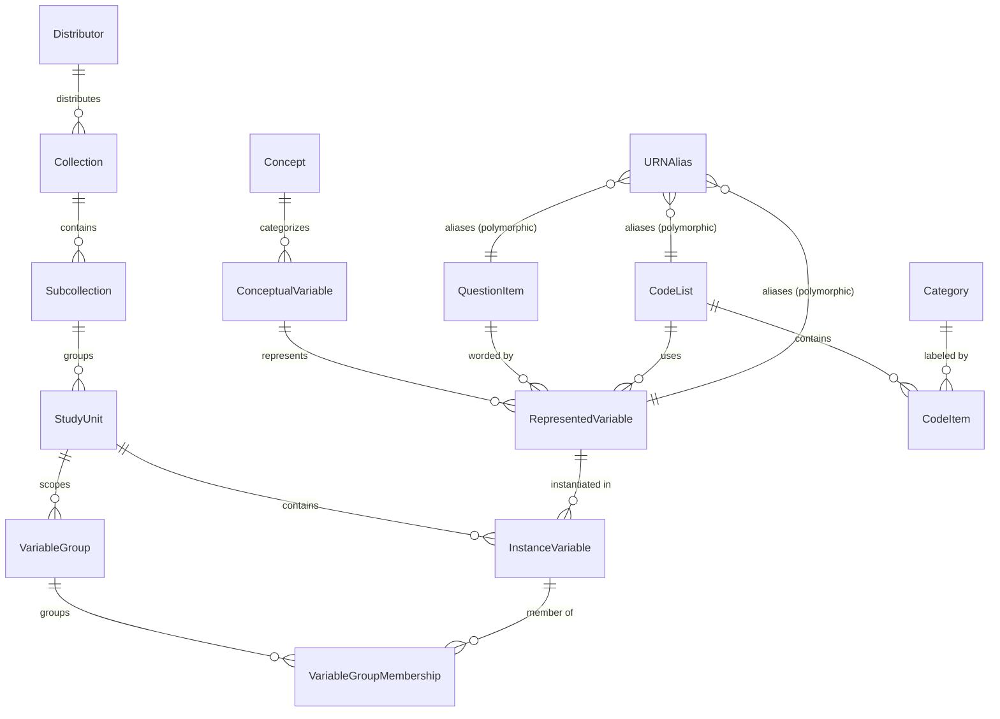
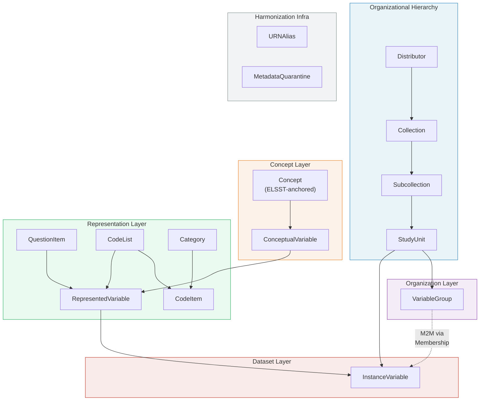

# Database Schema — DDI-Lifecycle 3.3 (Draft v0.1)

> **Status:** Initial draft for review
> **Scope:** Lightweight DDI-L profile for the ReQuest question bank only
> **Target DB:** PostgreSQL 17 with ICU collations

---

## 1. Entity-Relationship Diagram



---

## 2. Design Conventions

All tables in this schema follow these conventions unless stated otherwise:

| Convention | Rule |
| :--- | :--- |
| **Primary key** | `id` — `BigAutoField` (Django default). |
| **URN columns** | `urn`, `agency`, `ddi_identifier`, `version` — present on all DDI entities (see §2.1). |
| **Content hash** | `content_hash` — `CharField(64)`, SHA-256 hex digest for deduplication and drift detection. |
| **Multilingual text** | `JSONB` with ISO 639-1 keys: `{"fr": "...", "en": "..."}`. Canonical hash uses sorted keys. |
| **Timestamps** | `created_at` (`auto_now_add`), `updated_at` (`auto_now`) on all tables. |
| **Collation** | `request_ddi_case_accent_insensitive_collation` (ICU `und-u-ks-level1`) for text comparison fields. |
| **Naming** | Table names use DDI-Lifecycle 3.3 terminology. Django `db_table` is `request_ddi_{snake_case}`. |

### 2.1 DDI Identification Mixin

Every DDI entity inherits from an abstract base providing persistent identification:

```python
class DDIIdentifiable(models.Model):
    """Abstract mixin for DDI-Lifecycle URN identification and multi-algorithm fingerprinting."""
    urn = models.CharField(max_length=512, unique=True, null=True, blank=True,
                           help_text="Full URN: urn:ddi:{agency}:{identifier}:{version}")
    agency = models.CharField(max_length=255, default="fr.cdsp")
    ddi_identifier = models.CharField(max_length=255, null=True, blank=True,
                                      db_index=True)
    version = models.CharField(max_length=64, default="1.0.0")
    
    # Primary digest governed by PREFERRED_HASH_STRATEGY
    content_hash = models.CharField(max_length=64, blank=True, default="",
                                    db_index=True,
                                    help_text="SHA-256 hex digest of primary canonical content")
    
    # Multi-algorithm auxiliary strategy hashes: {"v1_strict": "...", "v2_unordered": "..."}
    content_hashes = models.JSONField(default=dict, blank=True,
                                      help_text="Multi-algorithm strategy hash digests")
    
    created_at = models.DateTimeField(auto_now_add=True)
    updated_at = models.DateTimeField(auto_now=True)

    class Meta:
        abstract = True
```

> [!NOTE]
> The field is named `ddi_identifier` (not `identifier`) to avoid collision with Django internals and potential ORM conflicts.

---

## 3. Table Definitions

### 3.1 Organizational Hierarchy

These tables are **not renamed** — they predate DDI terminology and serve as the institutional container layer.

---

#### Distributor

Top-level organization distributing datasets (e.g., CDSP). **Unchanged from current schema.**

| Column | Type | Constraints | Notes |
| :--- | :--- | :--- | :--- |
| `id` | `BigAutoField` | PK | |
| `name` | `CharField(255)` | unique | Organization name |
| `created_at` | `DateTimeField` | auto | |
| `updated_at` | `DateTimeField` | auto | |

---

#### Collection

Logical grouping of survey series. Maps to DDI-L `<Group>`.

| Column | Type | Constraints | Notes |
| :--- | :--- | :--- | :--- |
| `id` | `BigAutoField` | PK | |
| `distributor_id` | `BigInt` | FK → Distributor | |
| `name` | `CharField(255)` | | Series title |
| `description` | `JSONField` | nullable | Multilingual `{"fr": "...", "en": "..."}` |
| `urn` | `CharField(512)` | unique, nullable | DDI-L Group URN for automated ingestion |
| `created_at` | `DateTimeField` | auto | |
| `updated_at` | `DateTimeField` | auto | |

---

#### Subcollection

Sub-series grouping. Maps to DDI-L `<SubGroup>`.

| Column | Type | Constraints | Notes |
| :--- | :--- | :--- | :--- |
| `id` | `BigAutoField` | PK | |
| `collection_id` | `BigInt` | FK → Collection | |
| `name` | `CharField(255)` | | |
| `urn` | `CharField(512)` | unique, nullable | DDI-L SubGroup URN |
| `created_at` | `DateTimeField` | auto | |
| `updated_at` | `DateTimeField` | auto | |

---

### 3.2 Concept Layer

---

#### Concept

High-level thematic domain anchored to ELSST vocabulary (e.g., "Political Attitudes", "Social Inequality").

| Column | Type | Constraints | Notes |
| :--- | :--- | :--- | :--- |
| `id` | `BigAutoField` | PK | |
| `label` | `JSONField` | | Multilingual label `{"fr": "...", "en": "..."}` |
| `elsst_uri` | `CharField(512)` | unique, nullable | ELSST concept URI for interoperability |
| `description` | `JSONField` | nullable | Multilingual description |
| `created_at` | `DateTimeField` | auto | |
| `updated_at` | `DateTimeField` | auto | |

> [!IMPORTANT]
> Sciences Po plans to curate a collection of high-level concepts based on the ELSST vocabulary. The `elsst_uri` field links each Concept to the authoritative CESSDA thesaurus entry, enabling cross-archive interoperability.

---

#### ConceptualVariable

Abstract measurement concept (e.g., "Left-Right Political Placement"). Inherits `DDIIdentifiable`.

| Column | Type | Constraints | Notes |
| :--- | :--- | :--- | :--- |
| `id` | `BigAutoField` | PK | |
| `concept_id` | `BigInt` | FK → Concept, nullable | ELSST-anchored parent concept |
| `label` | `JSONField` | | Multilingual label |
| `description` | `JSONField` | nullable | Multilingual description |
| _DDIIdentifiable_ | | | `urn`, `agency`, `ddi_identifier`, `version`, `content_hash`, timestamps |

**Content hash formula:** `SHA-256(sorted_json(label) + sorted_json(description))`

---

### 3.3 Representation Layer

---

#### QuestionItem

Standalone reusable question text with interviewer instructions. Extracted from the current `RepresentedVariable.question_text`. Inherits `DDIIdentifiable`.

| Column | Type | Constraints | Notes |
| :--- | :--- | :--- | :--- |
| `id` | `BigAutoField` | PK | |
| `question_text` | `JSONField` | | Multilingual literal question wording `{"fr": "...", "en": "..."}` |
| `pre_question_text` | `JSONField` | nullable | Multilingual introductory text / routing preamble |
| `post_question_text` | `JSONField` | nullable | Multilingual post-question closing or transition text |
| `interviewer_instructions` | `JSONField` | nullable | Multilingual interviewer guidance |
| _DDIIdentifiable_ | | | `urn`, `agency`, `ddi_identifier`, `version`, `content_hash`, timestamps |

**Content hash formula:** `SHA-256(canonical_text(question_text) + "|" + canonical_text(pre_question_text) + "|" + canonical_text(post_question_text) + "|" + canonical_text(interviewer_instructions))`

---

#### Category

Response text label. Inherits `DDIIdentifiable`.

| Column | Type | Constraints | Notes |
| :--- | :--- | :--- | :--- |
| `id` | `BigAutoField` | PK | |
| `label` | `JSONField` | | Multilingual category label `{"fr": "Tout à fait d'accord", "en": "Strongly Agree"}` |
| _DDIIdentifiable_ | | | `urn`, `agency`, `ddi_identifier`, `version`, `content_hash`, timestamps |

**Content hash formula:** `SHA-256(sorted_json(label))`

> [!NOTE]
> Under the current schema, `Category` stores both `code` and `category_label` in a single row. In this new schema, the numerical code is moved to `CodeItem`, and `Category` holds only the text label. This enables the same label to be reused across different code lists with different code values.

---

#### CategorySet

Named collection of reusable categories (maps to DDI-L `CategoryScheme`). Inherits `DDIIdentifiable`.

| Column | Type | Constraints | Notes |
| :--- | :--- | :--- | :--- |
| `id` | `BigAutoField` | PK | |
| `name` | `JSONField` | | Multilingual name for the category set |
| `description` | `JSONField` | nullable | Multilingual description |
| _DDIIdentifiable_ | | | `urn`, `agency`, `ddi_identifier`, `version`, `content_hash`, timestamps |

**Content hash formula:** `SHA-256(sorted([category_1.urn[lang], category_2.urn[lang], ...]))`

---

#### CategorySetItem

Junction connecting a `CategorySet` to member `Category` entities.

| Column | Type | Constraints | Notes |
| :--- | :--- | :--- | :--- |
| `id` | `BigAutoField` | PK | |
| `category_set_id` | `BigInt` | FK → CategorySet | Parent category set |
| `category_id` | `BigInt` | FK → Category | Member category label |
| `order` | `PositiveIntegerField` | default=0 | Display order |

**Unique constraint:** `(category_set_id, category_id)`

---

#### CodeList

Structural set of response codes linked to categories. Inherits `DDIIdentifiable`.

| Column | Type | Constraints | Notes |
| :--- | :--- | :--- | :--- |
| `id` | `BigAutoField` | PK | |
| `name` | `JSONField` | nullable | Multilingual human title (e.g. "4-point Agreement Scale") |
| `description` | `JSONField` | nullable | Multilingual description |
| `category_set_id` | `BigInt` | FK → CategorySet, nullable | Optional link to parent CategorySet |
| _DDIIdentifiable_ | | | `urn`, `agency`, `ddi_identifier`, `version`, `content_hash`, timestamps |

**Structural content hash formula:** `SHA-256(sorted([code_value + ":" + category.urn[lang] for item in code_items]))`

> [!NOTE]
> The structural URN of a `CodeList` is computed **purely from its code-category URN mappings**, decoupled from the human `name`. This ensures that two code lists with identical response structures get the exact same canonical URN even if different surveys give them slightly different title strings.

---

#### CodeItem

Junction connecting a `CodeList` to a `Category` with a specific numerical code value. **No URN** (subordinate to CodeList).

| Column | Type | Constraints | Notes |
| :--- | :--- | :--- | :--- |
| `id` | `BigAutoField` | PK | |
| `code_list_id` | `BigInt` | FK → CodeList | Parent code list |
| `category_id` | `BigInt` | FK → Category | Referenced category label |
| `code_value` | `CharField(64)` | | The numerical/string code (e.g., `"1"`, `"98"`) |
| `order` | `PositiveIntegerField` | default=0 | Display order within the code list |
| `created_at` | `DateTimeField` | auto | |
| `updated_at` | `DateTimeField` | auto | |

**Unique constraint:** `(code_list_id, code_value)`

---

#### RepresentedVariable

Combination of a question wording and a response code list, linked to a conceptual variable. Inherits `DDIIdentifiable`.

| Column | Type | Constraints | Notes |
| :--- | :--- | :--- | :--- |
| `id` | `BigAutoField` | PK | |
| `conceptual_variable_id` | `BigInt` | FK → ConceptualVariable | Parent concept |
| `question_item_id` | `BigInt` | FK → QuestionItem | Reusable question text |
| `code_list_id` | `BigInt` | FK → CodeList, nullable | Response code structure (nullable for open-ended questions) |
| `label` | `JSONField` | nullable | Multilingual short label |
| _DDIIdentifiable_ | | | `urn`, `agency`, `ddi_identifier`, `version`, `content_hash`, timestamps |

**Content hash formula:** `SHA-256(question_item.content_hash + code_list.content_hash)`

---

### 3.4 Dataset Layer

---

#### StudyUnit

A specific survey wave or dataset. **Renamed from `Survey`**. Inherits `DDIIdentifiable`.

| Column | Type | Constraints | Notes |
| :--- | :--- | :--- | :--- |
| `id` | `BigAutoField` | PK | |
| `subcollection_id` | `BigInt` | FK → Subcollection | Parent series |
| `title` | `JSONField` | | Multilingual study title |
| `external_ref` | `CharField(512)` | unique, nullable | DOI or external identifier |
| `year` | `PositiveIntegerField` | nullable | Survey year |
| `description` | `JSONField` | nullable | Multilingual abstract |
| _DDIIdentifiable_ | | | `urn`, `agency`, `ddi_identifier`, `version`, `content_hash`, timestamps |

---

#### InstanceVariable

Physical realization of a variable in a specific study column. **Renamed from `BindingSurveyRepresentedVariable`**. Inherits `DDIIdentifiable`.

| Column | Type | Constraints | Notes |
| :--- | :--- | :--- | :--- |
| `id` | `BigAutoField` | PK | |
| `study_unit_id` | `BigInt` | FK → StudyUnit | Parent study |
| `represented_variable_id` | `BigInt` | FK → RepresentedVariable | The harmonized variable being instantiated |
| `variable_name` | `CharField(255)` | | Column name in the dataset (e.g., `q01a`) |
| `universe` | `JSONField` | nullable | Multilingual target population description |
| `notes` | `JSONField` | nullable | Multilingual notes |
| `is_indexed` | `BooleanField` | default=False | Whether this variable is indexed in Elasticsearch |
| _DDIIdentifiable_ | | | `urn`, `agency`, `ddi_identifier`, `version`, `content_hash`, timestamps |

**Unique constraint:** `(study_unit_id, variable_name)`

---

### 3.5 Organization Layer

---

#### VariableGroup

Thematic grouping of variables within a study (e.g., "Demographics", "Political Attitudes"). No URN by default — this is a lightweight organizational construct.

| Column | Type | Constraints | Notes |
| :--- | :--- | :--- | :--- |
| `id` | `BigAutoField` | PK | |
| `study_unit_id` | `BigInt` | FK → StudyUnit | Scoped to a specific study |
| `label` | `JSONField` | | Multilingual group label |
| `description` | `JSONField` | nullable | Multilingual description |
| `concept_id` | `BigInt` | FK → Concept, nullable | Optional link to ELSST concept |
| `created_at` | `DateTimeField` | auto | |
| `updated_at` | `DateTimeField` | auto | |

---

#### VariableGroupMembership

M2M junction between `VariableGroup` and `InstanceVariable`.

| Column | Type | Constraints | Notes |
| :--- | :--- | :--- | :--- |
| `id` | `BigAutoField` | PK | |
| `variable_group_id` | `BigInt` | FK → VariableGroup | |
| `instance_variable_id` | `BigInt` | FK → InstanceVariable | |
| `order` | `PositiveIntegerField` | default=0 | Display order within the group |

**Unique constraint:** `(variable_group_id, instance_variable_id)`

> [!TIP]
> Django can model this as `VariableGroup.instance_variables = ManyToManyField(InstanceVariable, through="VariableGroupMembership")`, which gives both the convenience of `.add()` and the explicit `order` field.

---

### 3.6 Normalization & Harmonization Infrastructure

---

#### URNAlias

Maps auto-generated/random URNs from external tools to canonical database entities, preventing duplicate records when different tools assign different URNs to identical content.

| Column | Type | Constraints | Notes |
| :--- | :--- | :--- | :--- |
| `id` | `BigAutoField` | PK | |
| `alias_urn` | `CharField(512)` | unique | The external/random URN |
| `canonical_urn` | `CharField(512)` | indexed | The canonical database URN |
| `entity_type` | `CharField(64)` | | `"QuestionItem"`, `"CodeList"`, `"RepresentedVariable"`, etc. |
| `hash_strategy` | `CharField(64)` | default=`"v1_strict_sha256"` | Strategy used to establish link (e.g., `v1_strict_sha256`, `fuzzy_icu_v1`, `manual_qa`) |
| `source_file` | `CharField(512)` | nullable | Originating import file for audit trail |
| `created_at` | `DateTimeField` | auto | |

---

#### MetadataQuarantine

Holds incoming metadata that requires archivist review due to URN collisions or ambiguous heuristic matches.

| Column | Type | Constraints | Notes |
| :--- | :--- | :--- | :--- |
| `id` | `BigAutoField` | PK | |
| `incoming_urn` | `CharField(512)` | | URN of the conflicting element |
| `existing_urn` | `CharField(512)` | nullable | URN of the existing database entity |
| `entity_type` | `CharField(64)` | | Which DDI entity type |
| `incoming_content` | `JSONField` | | Full serialized payload of the incoming element |
| `existing_content_hash` | `CharField(64)` | | Hash of the existing record for comparison |
| `incoming_content_hash` | `CharField(64)` | | Hash of the incoming record |
| `conflict_type` | `CharField(32)` | | `"hash_mismatch"`, `"fuzzy_match"`, `"version_conflict"` |
| `resolution` | `CharField(32)` | nullable | `"approved"`, `"forked"`, `"rejected"`, `null` (pending) |
| `resolved_by` | `CharField(255)` | nullable | Username of the reviewing archivist |
| `resolved_at` | `DateTimeField` | nullable | |
| `source_file` | `CharField(512)` | nullable | Originating import file |
| `import_task_id` | `CharField(255)` | nullable | Link to `django-tasks-db` task |
| `created_at` | `DateTimeField` | auto | |

---

### 3.7 Staging & Multi-Standard Ingestion Layer

#### StagedImportPayload

Stores raw uploaded metadata file bundles and un-harmonized payloads prior to Stage 2 background harmonization. Decouples raw source formats (`ddi_l_3.3`, `ddi_l_4_json`, `ddi_c_2.5`, `croissant_1.0`, `csv`) from the standard-agnostic harmonized core.

| Column | Type | Constraints | Notes |
| :--- | :--- | :--- | :--- |
| `id` | `BigAutoField` | PK | |
| `source_format` | `CharField(64)` | | `"ddi_l_3.3"`, `"ddi_l_4_json"`, `"ddi_c_2.5"`, `"croissant_1.0"`, `"csv"` |
| `file_name` | `CharField(512)` | | Original uploaded file name |
| `file_path` | `FileField` | nullable | File storage path for large XML/CSV files (`media/raw_imports/`) |
| `raw_payload` | `JSONField` | nullable | Staged JSON representation of parsed raw file bundle |
| `original_urns` | `JSONField` | default=`dict` | Mapping of original external URNs found in the raw file |
| `status` | `CharField(32)` | default=`"staged"` | `"staged"`, `"harmonized"`, `"quarantined"`, `"failed"` |
| `import_task_id` | `CharField(255)` | nullable | Link to `django-tasks-db` background task |
| `created_at` | `DateTimeField` | auto | Upload timestamp |
| `processed_at` | `DateTimeField` | nullable | Harmonization completion timestamp |

---

#### StagedResourceNode

Stores individual broken-down raw element resources (`raw_urn`, `raw_value`) extracted from the file payload during Stage 1 parsing. Enables granular resource-level harmonization, selective re-harmonization, and native DDI-L 4 JSON / COGS model object ingestion.

| Column | Type | Constraints | Notes |
| :--- | :--- | :--- | :--- |
| `id` | `BigAutoField` | PK | |
| `import_payload_id` | `BigInt` | FK → StagedImportPayload | Parent staged import file bundle |
| `resource_type` | `CharField(64)` | db_index | `"QuestionItem"`, `"CodeList"`, `"Category"`, `"StudyUnit"`, etc. |
| `raw_urn` | `CharField(512)` | db_index | Raw external URN / identifier from incoming file |
| `raw_value` | `JSONField` | | Un-harmonized raw JSON dictionary of fields/attributes |
| `canonical_urn` | `CharField(512)` | nullable, db_index | Resolved canonical database URN after Stage 2 |
| `status` | `CharField(32)` | default=`"staged"` | `"staged"`, `"harmonized"`, `"quarantined"`, `"failed"` |
| `created_at` | `DateTimeField` | auto | Staging timestamp |

---

## 4. Index Strategy

| Table | Index | Type | Purpose |
| :--- | :--- | :--- | :--- |
| *All DDI entities* | `urn` | UNIQUE B-tree | URN lookup for harmonization |
| *All DDI entities* | `content_hash` | B-tree | Fingerprint comparison during import |
| *All DDI entities* | `ddi_identifier` | B-tree | Partial URN searches |
| `Concept` | `elsst_uri` | UNIQUE B-tree | ELSST vocabulary lookup |
| `CodeItem` | `(code_list_id, code_value)` | UNIQUE composite | Code deduplication within a list |
| `InstanceVariable` | `(study_unit_id, variable_name)` | UNIQUE composite | Column-name uniqueness per study |
| `InstanceVariable` | `is_indexed` | Partial (where false) | Efficient ES sync queue |
| `VariableGroupMembership` | `(variable_group_id, instance_variable_id)` | UNIQUE composite | Membership uniqueness |
| `URNAlias` | `alias_urn` | UNIQUE B-tree | Alias resolution during import |
| `URNAlias` | `canonical_urn` | B-tree | Reverse lookup |
| `MetadataQuarantine` | `resolution` | Partial (where null) | Pending review queue |
| `Collection` | `urn` | UNIQUE B-tree | DDI-L Group auto-ingestion |
| `Subcollection` | `urn` | UNIQUE B-tree | DDI-L SubGroup auto-ingestion |

---

## 5. Migration Path from Current Schema

All renames use `migrations.RenameModel` for zero-data-loss migration. New columns are added as nullable first, then backfilled.

### Step 1 — Model Renames

```python
operations = [
    migrations.RenameModel("Survey", "StudyUnit"),
    migrations.RenameModel("BindingSurveyRepresentedVariable", "InstanceVariable"),
    migrations.DeleteModel("BindingVariableCategoryStat"),  # Dropped as category stats are out of scope
]
```

### Step 2 — Add DDI Identification Columns

Add `urn`, `agency`, `ddi_identifier`, `version`, `content_hash` to all DDI entities as nullable fields. No data loss.

### Step 3 — Create New Tables

Create `QuestionItem`, `CodeList`, `CodeItem`, `VariableGroup`, `VariableGroupMembership`, `URNAlias`, `MetadataQuarantine`.

### Step 4 — Data Backfill Migration

- Extract `RepresentedVariable.question_text` → new `QuestionItem` rows.
- Extract `Category.code` + `Category.category_label` → new `CodeItem` rows within auto-generated `CodeList` entries.
- Convert `Category.category_label` (TextField) → `Category.label` (JSONField as `{"fr": category_label}`).
- Compute and populate `content_hash` for all existing records.

### Step 5 — Convert Text Columns to JSONB

For each text field migrating to multilingual JSONB, wrap existing French-only content:

```sql
-- Example for StudyUnit.title
UPDATE request_ddi_studyunit
SET title = jsonb_build_object('fr', title_old)
WHERE title_old IS NOT NULL;
```

### Step 6 — Add Constraints & Drop Legacy Columns

Once backfill is verified:
- Drop legacy `Category.code`, `Category.category_label`, `RepresentedVariable.question_text`.
- Add NOT NULL constraints where appropriate.
- Add unique constraints on composite keys.

---

## 6. Relationship Summary



---

## 7. Open Questions

> [!IMPORTANT]
> **Q1 — Concept granularity:** Should the `Concept` table be seeded with the full ELSST hierarchy, or a curated subset? The current design assumes a flat curated list; a hierarchy would require a self-referential `parent_id` FK.

> [!IMPORTANT]
> **Q2 — VariableGroup scope:** Are variable groups always scoped to a single `StudyUnit`, or can they span across studies (e.g., a cross-survey "Demographics" group)? The current design scopes to one study.

> [!NOTE]
> **Q3 — Legacy Category.code:** Some current `Category` records carry meaningful codes that are shared across surveys. Should the backfill migration create one global `CodeList` per unique `RepresentedVariable`, or attempt to detect shared code lists?

> [!NOTE]
> **Q4 — StudyUnit.year:** The current `Survey` model stores year as a field. DDI-L represents temporal coverage as a date range in `<TemporalCoverage>`. Should we keep `year` as a convenience field or model a proper date range?
