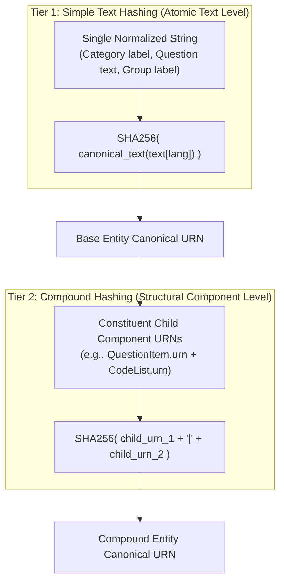
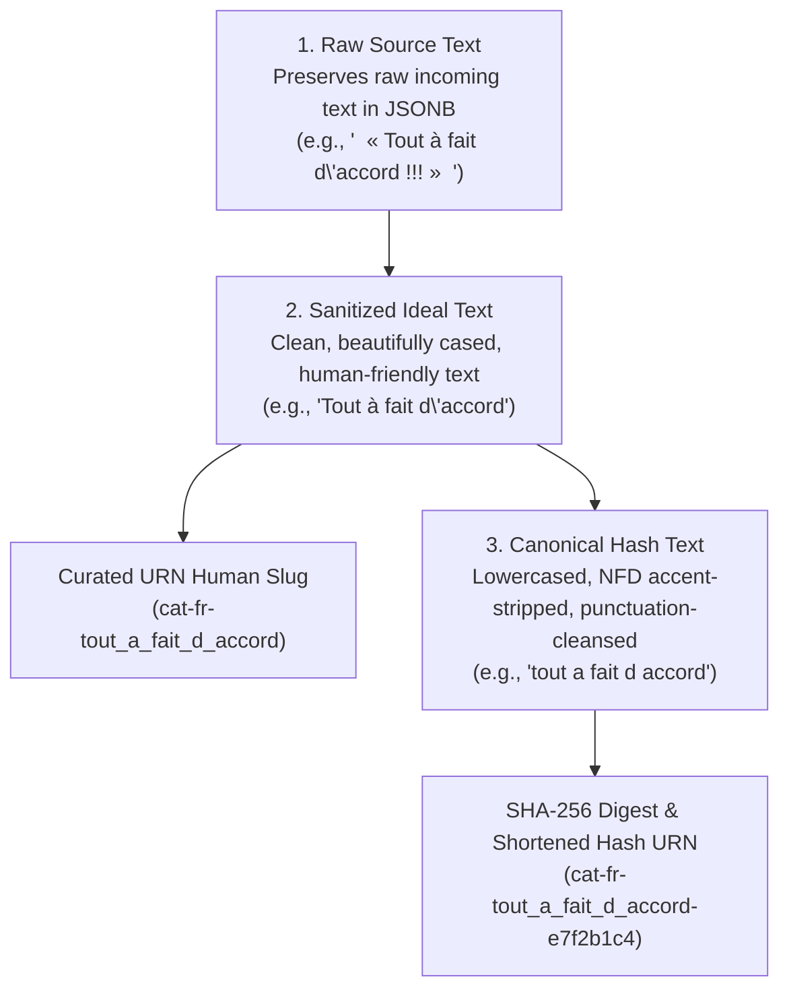
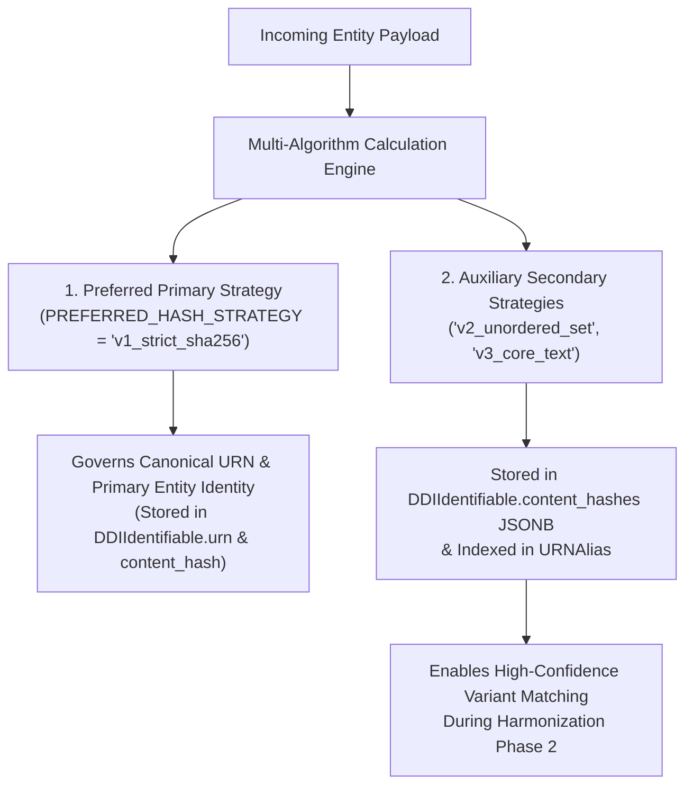

# Hashing Algorithms & Content Fingerprinting Specification

> **Project:** FAIRwDDI WP3 ST3 — Implementation of DDI Architecture for ReQuest  
> **Status:** Technical Specification Deliverable  
> **Target System:** `fairwddi` / PostgreSQL ≥ 17 / Python `hashlib`  

---

## 1. Overview & Objectives

In the ReQuest standard-agnostic DDI architecture (DDI 4 / DDI-CDI / DDI-L), **Content Fingerprinting** (`content_hash`) is split into two distinct tiers operating at the **language level** (`lang`):



### Strategic Advantages of Two-Tier Hashing

1. **Simple Text Hashing (Atomic Level):** Hashes single text strings directly (e.g. Category label, question wording). Fast, deterministic, and language-isolated.
2. **Compound URN Hashing (Structural Level):** Hashes the **canonical URNs** of child components instead of re-hashing raw text payloads. If a child component is reused or updated, its stable URN propagates directly into the compound digest.
3. **Stable Hashes During Incremental Translation Ingestion:** Hashes are computed per language key (`lang`), so appending an English translation later never invalidates an existing French hash.

---

### 1.1 Shortened Hash Strategy for Canonical URN Generation (URL-Shortener Style)

Full 64-character SHA-256 digests are too long to embed directly into URN strings (`urn:ddi:fr.cdsp:Category:cat-fr-e7f2b1c4a9d8e5b2c1f3a4b5c6d7e8f9a0b1c2d3e4f5a6b7c8d9e0f1a2b3c4d5:1.0.0` is unreadable). Random UUIDs are non-deterministic and break content-based deduplication.

ReQuest uses a **Deterministic Shortened Hash Strategy** (similar to Git commit short hashes and URL shorteners):

| Hash Representation | Field / Location | Format & Length | Purpose & Benefits |
| :--- | :--- | :--- | :--- |
| **Full SHA-256 Digest** | `DDIIdentifiable.content_hash` | 64 hex characters | Stored in PostgreSQL for full cryptographic integrity, drift detection, and database indexing. |
| **Shortened Hash Digest** | `DDIIdentifiable.urn`<br>(`ddi_identifier`) | **16 truncated hex chars** (or 10-char Base62) | Used in the Canonical URN string (e.g., `urn:ddi:fr.cdsp:Category:cat-fr-e7f2b1c4a9d8e5b2:1.0.0`). |

#### Key Benefits of Shortened Hashes:
- **100% Deterministic:** Identical text or structure always produces the *exact same URN*, even across different servers or fresh database builds, without requiring database lookups.
- **Clean & Compact URNs:** Keeps URN strings short, readable, and elegant in DDI XML exports, REST APIs, and UI logs.
- **Zero Collision Risk:** A 16-character hexadecimal hash provides $16^{16} = 18.4 \text{ quintillion}$ unique combinations, eliminating practical collision risks across millions of survey variables.

---

## 2. Master Table: DDI-L Resources & Hashing Architecture

Below is the complete specification associating every DDI-Lifecycle resource with its hashing tier, input payload formula, canonical URN pattern, and deduplication behavior:

| DDI-L Resource | Hashing Tier | Input Payload Formula (per language `lang`) | Language-Keyed Canonical URN Pattern | Deduplication & Merging Behavior |
| :--- | :--- | :--- | :--- | :--- |
| **Category** | **Simple Text** | `SHA256( canonical_text(label[lang]) )` | `urn:ddi:fr.cdsp:Category:cat-{lang}-{hash[:16]}:1.0.0` | Global reuse across all code lists when normalized text label in language `lang` matches 100%. |
| **CategorySet** | **Compound URN** | `SHA256( preserved_order([category_urns]) )` | `urn:ddi:fr.cdsp:CategorySet:cs-{lang}-{hash[:16]}:1.0.0` | Represents a named/reusable ordered set of Category URNs (DDI-L `CategoryScheme`). |
| **UnorderedCategorySet** | **Unordered Set** | `SHA256( sorted_alphabetically([category_urns]) )` | `urn:ddi:fr.cdsp:UnorderedCategorySet:ucs-{lang}-{hash[:16]}:1.0.0` | Order-independent set digest. Detects if two CategorySets contain the exact same categories regardless of order. |
| **QuestionItem** | **Compound URN** | `SHA256( q_text.urn + "\|" + pre_text.urn + "\|" + post_text.urn + "\|" + instructions.urn )` | `urn:ddi:fr.cdsp:QuestionItem:qi-{lang}-{hash[:16]}:1.0.0` | Compound hash combining Question Wording URN, Pre/Post Text URNs, and Interviewer Instruction URN. |
| **CodeItem** | **Subordinate** | `code_value + ":" + category.urn[lang]` | *No URN* (Subordinate row) | Unique per `(code_list_id, code_value)` pair inside a `CodeList`. |
| **CodeList** | **Compound URN** | `SHA256( preserved_order([code_item_urns]) )` | `urn:ddi:fr.cdsp:CodeList:cl-{lang}-{hash[:16]}:1.0.0` | Structural URN preserving the explicit display sequence of response codes. |
| **UnorderedCodeList** | **Unordered Set** | `SHA256( sorted_alphabetically([code_value + ":" + category.urn]) )` | `urn:ddi:fr.cdsp:UnorderedCodeList:ucl-{lang}-{hash[:16]}:1.0.0` | Order-independent structural set digest. Detects if two CodeLists contain the exact same code-category pairs regardless of order. |
| **RepresentedVariable** | **Compound URN** | `SHA256( question_item.urn[lang] + "\|" + code_list.urn[lang] )` | `urn:ddi:fr.cdsp:RepresentedVariable:rv-{lang}-{hash[:16]}:1.0.0` | Compound hash joining `QuestionItem.urn` and `CodeList.urn`. |
| **ConceptualVariable** | **Simple Text** | `SHA256( canonical_text(label[lang]) + "\|" + canonical_text(desc[lang]) )` | `urn:ddi:fr.cdsp:ConceptualVariable:cv-{lang}-{hash[:16]}:1.0.0` | Simple text hash of abstract concept label and description. |
| **StudyUnit** | **Simple Text** | `SHA256( canonical_str(external_ref) + "\|" + year )` | `urn:ddi:fr.cdsp:StudyUnit:su-{slug(external_ref)}:1.0.0` | One study unit per dataset wave (DOI / external reference). |
| **InstanceVariable** | **Compound URN** | `SHA256( study_unit.urn + "\|" + variable_name + "\|" + represented_variable.urn[lang] )` | `urn:ddi:fr.cdsp:InstanceVariable:iv-{lang}-{hash[:16]}:1.0.0` | Compound hash joining `StudyUnit.urn`, column `variable_name`, and `RepresentedVariable.urn`. |
| **VariableGroup** | **Simple Text** | `SHA256( study_unit.urn + "\|" + canonical_text(label[lang]) )` | `urn:ddi:fr.cdsp:VariableGroup:vg-{lang}-{hash[:16]}:1.0.0` | Simple text hash of group label scoped to `StudyUnit.urn`. |

---

## 3. Canonical Pre-Processing Pipeline (`canonicalize()`)

Text payloads pass through a multi-stage normalization pipeline prior to hash calculation and URN derivation. ReQuest explicitly distinguishes between **three distinct text representations**:



---

### 3.1 The Three Text Layers

| Text Representation | Storage Location | Processing Rules | Primary System Function |
| :--- | :--- | :--- | :--- |
| **1. Raw Source Text** | PostgreSQL `JSONB` columns (`category_label`, `question_text`) | Preserves original uploaded text per language key (`{"fr": "..."}`). | Complete audit provenance; exact loss-free preservation of incoming files. |
| **2. Sanitized Ideal Text** | PostgreSQL `JSONB` (`sanitized_label`, `sanitized_text`) & Curated URN Slugs | • Unicode NFKC normalization.<br>• French/English typography standardization (`« »` $\rightarrow$ `" `, `’` $\rightarrow$ `'`).<br>• Whitespace collapsing, proper title/sentence casing preserved.<br>• Clean slug generation (e.g. `tout_a_fait_d_accord`). | **Human Display & Curated URN Slugs:** Powers clean UI display and readable human-friendly Curated URNs (e.g. `urn:ddi:fr.cdsp:Category:cat-fr-tout_a_fait_d_accord:1.0.0`). |
| **3. Canonical Hash Text** | Intermediate byte buffer in Python memory | • Full NFD accent stripping (`à` $\rightarrow$ `a`).<br>• ASCII lowercasing.<br>• Punctuation and trailing symbol removal.<br>• Alphabetical JSONB key sorting. | **Deterministic Hashing:** Strictly used to compute `SHA256` digests and shortened hash identifiers. Never rendered directly in the UI. |

---

### 3.2 Pipeline Steps Specification

#### Step 1: Unicode NFKC Normalization
Transforms Unicode characters into canonical compatibility decomposition form (`unicodedata.normalize("NFKC", text)`). Standardizes accents, combined ligatures, and compatibility characters.

#### Step 2: Whitespace & Line Ending Collapsing
- Normalizes all line endings (`\r\n`, `\r` → `\n`).
- Replaces non-breaking spaces (`\u00A0`, `\u202F`, `\u2007`, `\u2060`) with standard spaces (`\u0020`).
- Strips leading and trailing whitespace per line.
- Collapses consecutive spaces into a single space (`" ".join(text.split())`).

#### Step 3: Typography & Punctuation Standardization
- **Quotes:** French guillemets (`«`, `»`), curved double quotes (`“`, `”`) → standard double quote (`"`).
- **Apostrophes:** Curly apostrophe (`’`), grave apostrophe (`` ` ``) → straight apostrophe (`'`).
- **Dashes:** En-dash (`–`), em-dash (`—`) → hyphen-minus (`-`).
- **Ellipses:** Single-character ellipsis (`…`) → three standard dots (`...`).
- **French Punctuation Spacing:** Enforces standard single space before high punctuation (`?`, `;`, `!`, `:`) in French strings.

#### Step 4: Multilingual JSONB Key Sorting
For multilingual text dictionaries (`{"fr": "...", "en": "..."}`), keys are sorted alphabetically before serialization:
```python
import json

def canonicalize_jsonb(data: dict) -> str:
    """Serializes JSONB dictionary with sorted keys and normalized string values."""
    if data is None:
        return ""
    normalized_data = {
        lang: normalize_string(text)
        for lang, text in sorted(data.items())
    }
    return json.dumps(normalized_data, ensure_ascii=False, separators=(',', ':'))
```

---

## 4. Resource Hashing Implementation Algorithms

### 4.1 Category Hashing
```python
import hashlib

def hash_category(label_jsonb: dict) -> str:
    """Computes SHA-256 hash for a Category label."""
    canonical_payload = canonicalize_jsonb(label_jsonb)
    return hashlib.sha256(canonical_payload.encode('utf-8')).hexdigest()
```

### 4.2 QuestionItem Hashing
```python
def hash_question_item(question_text_jsonb: dict, instructions_jsonb: dict = None) -> str:
    """Computes SHA-256 hash for a QuestionItem (text + instructions)."""
    q_text = canonicalize_jsonb(question_text_jsonb)
    instr = canonicalize_jsonb(instructions_jsonb) if instructions_jsonb else ""
    payload = f"{q_text}|{instr}"
    return hashlib.sha256(payload.encode('utf-8')).hexdigest()
```

### 4.3 CodeList Hashing (Hierarchical Composite Hash)
A `CodeList` digest depends on its name and the ordered set of member `CodeItem` entries (each referencing a `Category` content hash):

```python
def hash_code_list(name_jsonb: dict, code_items: list[dict]) -> str:
    """
    code_items format: [{'code_value': '1', 'category_hash': 'cat_hash_123'}, ...]
    """
    name_payload = canonicalize_jsonb(name_jsonb)
    # Sort items by code_value to ensure order-independent deterministic hashing
    sorted_items = sorted(code_items, key=lambda x: str(x['code_value']))
    items_payload = ",".join(f"{item['code_value']}:{item['category_hash']}" for item in sorted_items)
    payload = f"{name_payload}|{items_payload}"
    return hashlib.sha256(payload.encode('utf-8')).hexdigest()
```

### 4.4 RepresentedVariable Hashing (Composite Hash)
Combines `QuestionItem` hash and `CodeList` hash:

```python
def hash_represented_variable(question_item_hash: str, code_list_hash: str) -> str:
    payload = f"{question_item_hash}|{code_list_hash or 'open_ended'}"
    return hashlib.sha256(payload.encode('utf-8')).hexdigest()
```

---

## 5. Multi-Algorithm Architecture & The "Preferred Algorithm" Pattern

To support multiple hashing algorithms simultaneously without causing canonical identity conflicts, ReQuest implements the **Preferred Algorithm Pattern**.



---

### 5.1 Roles of Primary vs. Auxiliary Strategies

| Strategy Tier | Configuration | DB Field | System Role & Execution |
| :--- | :--- | :--- | :--- |
| **Preferred Primary Strategy** | `SETTINGS.PREFERRED_HASH_STRATEGY` (default: `"v1_strict_sha256"`) | `DDIIdentifiable.content_hash`<br>`DDIIdentifiable.urn` | **Governs Canonical Identity:** Generates primary Canonical URNs (`urn:ddi:fr.cdsp:...`), dictates entity creation/reuse in PostgreSQL, and acts as the primary key reference. |
| **Auxiliary Secondary Strategies** | Registered strategy list (e.g. `["v2_unordered_set", "v3_core_text"]`) | `DDIIdentifiable.content_hashes`<br>(`JSONB`) | **Enables Secondary Variant Lookup:** Computed in parallel during ingestion. Allows the Harmonization Cascade to match variants (e.g. reordered items or text ignoring punctuation) without sending false alarms to `MetadataQuarantine`. |

---

### 5.3 Algorithm Benchmark & Evaluation: SHA-256 vs. BLAKE3 vs. xxHash

Evaluating whether to use **SHA-256**, **BLAKE3**, or non-cryptographic hashes like **xxHash** for ReQuest:

| Hash Function | Type & Security | Performance (Small Text <1 KB) | Ecosystem & DB Support | Suitability for ReQuest |
| :--- | :--- | :--- | :--- | :--- |
| **SHA-256** | Cryptographic (NIST Standard) | ~500 MB/s per core<br>(~0.2 µs for 100-byte string) | **Built-in everywhere:** Python `hashlib`, PostgreSQL `pgcrypto`, Node.js `crypto`, Rust, C. | **Default Primary Strategy (`v1_strict_sha256`).** Zero external dependencies; 100% native in Python and PostgreSQL. |
| **BLAKE3** | Cryptographic (128-bit security level) | **~3–12 GB/s per core**<br>(~10x-15x faster than SHA-256) | Requires C extension (`pip install blake3`). PostgreSQL requires custom extension or Python worker computation. | **High-Performance Opt-in Strategy (`v1_blake3`).** Excellent for ultra-fast batch processing of millions of entities. |
| **xxHash64** | Non-Cryptographic | ~15+ GB/s per core | Requires `xxhash` package. | **Not Recommended.** Vulnerable to intentional hash collisions; lacks cryptographic guarantees for persistent URN identity. |

#### Architectural Conclusion & Recommendation:
1. **SHA-256 as Default:** In metadata ETL pipelines, individual text strings are small (~100 bytes). Computing SHA-256 on 100,000 short strings takes only ~25 ms in Python C-bindings. The primary pipeline bottleneck is XML parsing (`lxml`) and SQL IO, not hashing. SHA-256 is selected as the default because it requires zero external C dependencies and works natively inside PostgreSQL (`pgcrypto`).
2. **Pluggable BLAKE3 Support:** For ultra-large batch imports (e.g., millions of variables across 1,000+ survey datasets), BLAKE3 is supported as an opt-in strategy tag (`PREFERRED_HASH_STRATEGY = "v1_blake3"`). The Preferred Algorithm Pattern allows toggling BLAKE3 without schema alterations!

---

### 5.2 Benefits of the Preferred Algorithm Architecture

1. **Multi-Index Variant Lookup:** If an incoming file fails to match on the Preferred Strategy (e.g. because punctuation differed under `v1_strict`), the engine checks auxiliary strategy hashes. If it matches under `v3_core_text`, the engine automatically records an alias in `URNAlias` without manual archivist review!
2. **Zero-Downtime Algorithm Upgrades:** When CDSP upgrades the preferred algorithm (e.g., from `v1_strict` to `v3_core_text`), both hashes are *already* present in the `content_hashes` JSONB column. Upgrading is a simple configuration change (`PREFERRED_HASH_STRATEGY = "v3_core_text"`)—no massive database locking or re-hashing migration required.
3. **Pluggable Cross-Archive Compatibility:** External archives (CESSDA, Dataverse) querying the API can request deduplication matching based on their preferred strategy tag (`?strategy=v3_core_text`).

---

### 5.3 Database Data Model Representation

```python
class DDIIdentifiable(models.Model):
    """Abstract mixin supporting Preferred and Multi-Algorithm Fingerprints."""
    urn = models.CharField(max_length=512, unique=True, null=True, blank=True,
                           help_text="Canonical URN governed by the Preferred Algorithm")
    agency = models.CharField(max_length=255, default="fr.cdsp")
    ddi_identifier = models.CharField(max_length=255, null=True, blank=True, db_index=True)
    version = models.CharField(max_length=64, default="1.0.0")
    
    # Primary hash governed by PREFERRED_HASH_STRATEGY
    content_hash = models.CharField(max_length=64, blank=True, default="", db_index=True)
    
    # Dictionary storing auxiliary multi-algorithm hashes:
    # {"v1_strict_sha256": "...", "v2_unordered_set": "...", "v3_core_text": "..."}
    content_hashes = models.JSONField(default=dict, blank=True,
                                      help_text="Multi-algorithm strategy hash digests")
    
    created_at = models.DateTimeField(auto_now_add=True)
    updated_at = models.DateTimeField(auto_now=True)

    class Meta:
        abstract = True
```

---

## 6. Step-by-Step Concrete Worked Examples (Language-Level Hashing)

### 6.1 Category Example (Per Language)

#### Raw Multilingual Input Payload:
```json
{
  "fr": "  Tout à fait d’accord  \n",
  "en": "Strongly agree "
}
```

#### Step-by-Step Language-Level Execution:

##### French (`fr`) Processing:
1. **Normalized French Text:** `"Tout à fait d'accord"` (NFKC, curly apostrophe normalized, trimmed).
2. **SHA-256 Digest (`hash_fr`):**
   `SHA256("Tout à fait d'accord")` → `e7f2b1c4a5b6c7d8e9f0123456789abcde7f2b1c4a5b6c7d8e9f0123456789ab`
3. **French Canonical URN:**
   `urn:ddi:fr.cdsp:Category:cat-fr-e7f2b1c4a5b6c7d8:1.0.0`

##### English (`en`) Processing:
1. **Normalized English Text:** `"Strongly agree"` (NFKC, trimmed).
2. **SHA-256 Digest (`hash_en`):**
   `SHA256("Strongly agree")` → `99aabbcc11223344556677889900aabb99aabbcc11223344556677889900aabb`
3. **English Canonical URN:**
   `urn:ddi:fr.cdsp:Category:cat-en-99aabbcc11223344:1.0.0`

---

### 6.2 QuestionItem Example (Per Language)

#### Raw Input Payload:
- **Question Text:**
  ```json
  {
    "fr": "Diriez-vous que vous vous intéressez à la politique ?  ",
    "en": "Would you say that you are interested in politics?"
  }
  ```
- **Interviewer Instructions:**
  ```json
  {
    "fr": "Lire les options de réponse.",
    "en": "Read response options."
  }
  ```

#### Language-Level Execution:

##### French (`fr`) Fingerprint:
1. **Payload String:** `Diriez-vous que vous vous intéressez à la politique ?|Lire les options de réponse.`
2. **SHA-256 Digest (`hash_fr`):**
   → `a3f891b2c4d5e6f7890123456789abcdefa3f891b2c4d5e6f7890123456789abc`
3. **French Canonical URN:**
   `urn:ddi:fr.cdsp:QuestionItem:qi-fr-a3f891b2c4d5e6f7:1.0.0`

##### English (`en`) Fingerprint:
1. **Payload String:** `Would you say that you are interested in politics?|Read response options.`
2. **SHA-256 Digest (`hash_en`):**
   → `b5c6d7e8f9a0123456789abcdef01234b5c6d7e8f9a0123456789abcdef01234`
3. **English Canonical URN:**
   `urn:ddi:fr.cdsp:QuestionItem:qi-en-b5c6d7e8f9a01234:1.0.0`

---

### 6.3 CategorySet Example (DDI-L CategoryScheme URN)

A **`CategorySet`** (DDI-L `CategoryScheme`) represents a named, ordered collection of reusable `Category` URNs:

#### Inputs (French `fr` Category URNs):
- `urn:ddi:fr.cdsp:Category:cat-fr-e7f2b1c4a5b6c7d8:1.0.0` ("Tout à fait d'accord")
- `urn:ddi:fr.cdsp:Category:cat-fr-99aabbcc11223344:1.0.0` ("D'accord")
- `urn:ddi:fr.cdsp:Category:cat-fr-556677889900aabb:1.0.0` ("Pas d'accord")
- `urn:ddi:fr.cdsp:Category:cat-fr-ccddeeff00112233:1.0.0` ("Pas du tout d'accord")

#### French CategorySet Execution:
1. **Sorted URN Array Payload String:**
   `urn:ddi:fr.cdsp:Category:cat-fr-556677889900aabb:1.0.0,urn:ddi:fr.cdsp:Category:cat-fr-99aabbcc11223344:1.0.0,urn:ddi:fr.cdsp:Category:cat-fr-ccddeeff00112233:1.0.0,urn:ddi:fr.cdsp:Category:cat-fr-e7f2b1c4a5b6c7d8:1.0.0`
2. **SHA-256 Digest (`hash_fr`):**
   `SHA256(...)` → `778899aabbcc112233445566778899aabbcc112233445566778899aabbcc1122`
3. **CategorySet Canonical URN:**
   `urn:ddi:fr.cdsp:CategorySet:cs-fr-778899aa:1.0.0`

---

### 6.4 CodeList Example (Structural Code-Category Mapping URN)

A **`CodeList` Structural URN** is computed **purely from the ordered code-value + Category URN mappings** (decoupled from the descriptive human name such as *"Échelle d'accord en 4 points"*). This enables the exact same structural code list to be deduplicated globally regardless of minor naming differences across survey documentations:

#### Inputs (French `fr` Code Items):
- Code `"1"` → Category `urn:ddi:fr.cdsp:Category:cat-fr-e7f2b1c4a5b6c7d8:1.0.0`
- Code `"2"` → Category `urn:ddi:fr.cdsp:Category:cat-fr-99aabbcc11223344:1.0.0`
- Code `"3"` → Category `urn:ddi:fr.cdsp:Category:cat-fr-556677889900aabb:1.0.0`
- Code `"4"` → Category `urn:ddi:fr.cdsp:Category:cat-fr-ccddeeff00112233:1.0.0`

#### Structural CodeList Execution:
1. **Pure Code-Category Structural Payload String:**
   `1:urn:ddi:fr.cdsp:Category:cat-fr-e7f2b1c4a5b6c7d8:1.0.0,2:urn:ddi:fr.cdsp:Category:cat-fr-99aabbcc11223344:1.0.0,3:urn:ddi:fr.cdsp:Category:cat-fr-556677889900aabb:1.0.0,4:urn:ddi:fr.cdsp:Category:cat-fr-ccddeeff00112233:1.0.0`
2. **SHA-256 Structural Digest (`hash_fr`):**
   `SHA256(...)` → `4b8c9d0e1f2a3b4c5d6e7f8a9b0c1d2e3f4a5b6c7d8e9f0a1b2c3d4e5f6a7b8`
3. **CodeList Structural Canonical URN:**
   `urn:ddi:fr.cdsp:CodeList:cl-fr-4b8c9d0e1f2a3b4c:1.0.0`

---

### 6.4 RepresentedVariable Compound URN Example

#### Inputs (References Child Component Canonical URNs):
- **QuestionItem Canonical URN:** `urn:ddi:fr.cdsp:QuestionItem:qi-fr-a3f891b2c4d5e6f7:1.0.0`
- **CodeList Canonical URN:** `urn:ddi:fr.cdsp:CodeList:cl-fr-4b8c9d0e1f2a3b4c:1.0.0`

#### Step-by-Step Compound Execution:
1. **Compound URN Payload String:**
   `urn:ddi:fr.cdsp:QuestionItem:qi-fr-a3f891b2c4d5e6f7:1.0.0|urn:ddi:fr.cdsp:CodeList:cl-fr-4b8c9d0e1f2a3b4c:1.0.0`
2. **SHA-256 Digest Calculation:**
   `SHA256("urn:ddi:fr.cdsp:QuestionItem:qi-fr-a3f891b2c4d5e6f7:1.0.0|urn:ddi:fr.cdsp:CodeList:cl-fr-4b8c9d0e1f2a3b4c:1.0.0")`
   → `d4e5f6a7b8c9d0e1f2a3b4c5d6e7f8a9b0c1d2e3f4a5b6c7d8e9f0a1b2c3d4e5`
3. **Resulting Canonical URN:**
   `urn:ddi:fr.cdsp:RepresentedVariable:rv-fr-d4e5f6a7b8c9d0e1:1.0.0`

---

### 6.5 InstanceVariable Compound URN Example

#### Inputs (Dataset Column Realization):
- **StudyUnit Canonical URN:** `urn:ddi:fr.cdsp:StudyUnit:su-10.7303-cdsp-bpf2007:1.0.0`
- **Variable Column Name:** `"q01a"`
- **RepresentedVariable Canonical URN:** `urn:ddi:fr.cdsp:RepresentedVariable:rv-fr-d4e5f6a7b8c9d0e1:1.0.0`

#### Step-by-Step Compound Execution:
1. **Compound URN Payload String:**
   `urn:ddi:fr.cdsp:StudyUnit:su-10.7303-cdsp-bpf2007:1.0.0|q01a|urn:ddi:fr.cdsp:RepresentedVariable:rv-fr-d4e5f6a7b8c9d0e1:1.0.0`
2. **SHA-256 Digest Calculation:**
   → `1f2e3d4c5b6a7908f9e8d7c6b5a432101f2e3d4c5b6a7908f9e8d7c6b5a43210`
3. **Resulting Canonical URN:**
   `urn:ddi:fr.cdsp:InstanceVariable:iv-fr-1f2e3d4c5b6a7908:1.0.0`

---

### 6.6 Unordered Set Hashing Example (`UnorderedCategorySet` & `UnorderedCodeList`)

Unordered set hashing sorts member component URNs set-theoretically before computing the SHA-256 digest. This detects if two CategorySets or CodeLists contain the **exact same items**, even if listed in a different sequence order in different XML files:

#### Input Scenario:
- **CodeList A (Survey 2007 XML):** Listed in order `[1: Yes, 2: No, 9: Refused]`
- **CodeList B (Survey 2012 XML):** Listed in order `[1: Yes, 9: Refused, 2: No]`

#### Order-Independent Hash Execution:
1. **Unordered Sorted Payload String:**
   `1:cat-fr-yes-urn, 2:cat-fr-no-urn, 9:cat-fr-refused-urn` (Alphabetically sorted)
2. **SHA-256 Digest (`hash_fr`):**
   `SHA256(...)` → `ucl_hash_9988776655443322`
3. **Resulting Unordered CodeList URN:**
   `urn:ddi:fr.cdsp:UnorderedCodeList:ucl-fr-9988776655443322:1.0.0`

- **Outcome:** Both CodeList A and CodeList B produce the **exact same `UnorderedCodeList` URN**, enabling the Harmonization Engine to instantly recognize that the two surveys share 100% identical response items!

