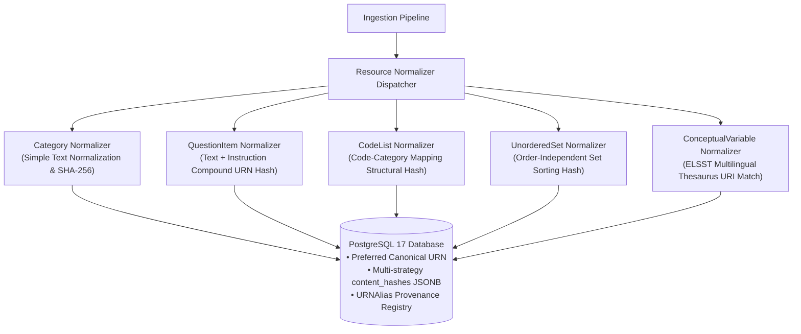
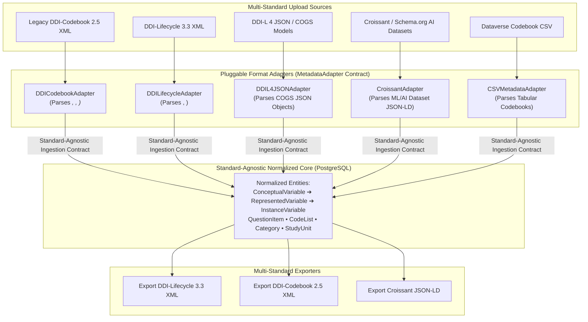
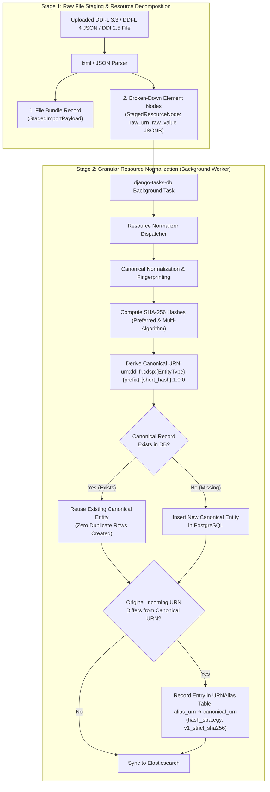
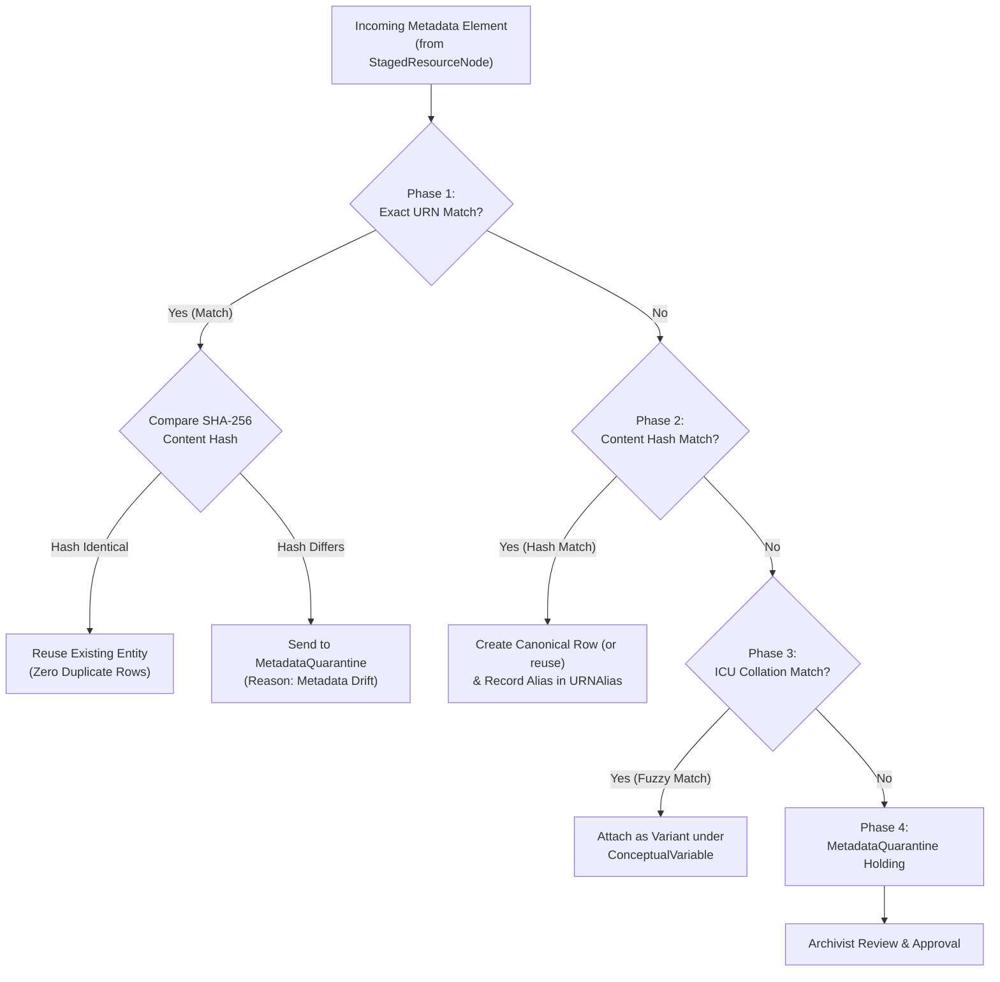

# Technical Specification — Metadata Normalization Engine

> **Project:** FAIRwDDI WP3 ST3 — Implementation of DDI Architecture for ReQuest  
> **Target System:** `fairwddi` / PostgreSQL ≥ 17 / Elasticsearch 9.4.x  
> **Status:** Technical Specification Deliverable  

---

## 1. Executive Summary & Core Principles

The **Metadata Normalization Engine** is responsible for deduplicating, standardizing, versioning, and structuring incoming survey metadata across waves and datasets. It transforms flat, study-bound XML/JSON metadata into clean, canonical DDI entities (aligned with DDI 4 / DDI-CDI / DDI-L) structured around the DDI variable cascade:

$$\text{ConceptualVariable} \longrightarrow \text{RepresentedVariable} \longrightarrow \text{InstanceVariable}$$

### Fundamental Architectural Rules

1. **Single Active Canonical Algorithm per Entity Type:** To avoid competing canonical identities and tree fragmentation, the system uses exactly **one active algorithm** (`v1_strict_sha256`) per resource type to govern primary entity identity in PostgreSQL.
2. **Separation of Normalization vs. Harmonization:**
   - **Technical Metadata Normalization (Deterministic SHA-256):** Standardizes raw text (NFKC, typography), extracts element nodes, generates deterministic URNs, and deduplicates identical entities in PostgreSQL.
   - **Semantic Harmonization (Controlled Vocabularies & Concept Clustering):** Identifies conceptual similarity across survey waves. Groups wording variants or evolving response scales under shared `ConceptualVariable` entities without altering canonical database IDs.
3. **Immutability & Provenance via `URNAlias`:** Original external or random URNs are never overwritten or discarded. They are preserved in `URNAlias` mapped to canonical database URNs along with the strategy name and source file provenance.
4. **Pluggable Resource-Specific Normalizers:** The database infrastructure supports different specialized normalizers per resource type (e.g. Simple Text Normalizer for `Category`, Structural Compound Normalizer for `CodeList`, Set-Theoretic Normalizer for `UnorderedCategorySet`, and Thesaurus Normalizer for `ConceptualVariable`).

---

### 1.1 Pluggable Resource Normalizer Registry

| Resource Type | Normalizer Strategy | Primary Logic | Provenance Record |
| :--- | :--- | :--- | :--- |
| **Category** | `TextNormalizer` | Unicode NFKC + French/English typography normalization + `SHA256` | `content_hashes.v1_lang_sha256` |
| **QuestionItem** | `CompoundWordingNormalizer` | Compound digest of `QuestionWording.urn` + `Instruction.urn` | `content_hashes.v1_composite_sha256` |
| **CodeList** | `StructuralCodeListNormalizer` | Pure code-value + `Category.urn` mapping digest (decoupled from name) | `content_hashes.v1_structural_urn` |
| **UnorderedSet** | `SetTheoreticNormalizer` | Order-independent alphabetical sorting of member URNs | `content_hashes.v1_unordered_set` |
| **ConceptualVariable** | `ELSSTThesaurusNormalizer` | CESSDA ELSST URI matching + multilingual concept clustering | `Concept(elsst_uri=...)` |

---

### 1.2 Standard-Agnostic Normalized Core & Multi-Standard Format Adapters

By decoupling raw file loading into `StagedImportPayload` and `StagedResourceNode`, the core PostgreSQL tables (`ConceptualVariable`, `RepresentedVariable`, `InstanceVariable`, `QuestionItem`, `CodeList`, `Category`, `StudyUnit`) operate as a **Standard-Agnostic Normalized Core**. 

Lightweight **Format Adapters** map incoming metadata standards into standard-agnostic core entities:

| Source Standard | Ingestion Adapter | Parsing Mapping Strategy |
| :--- | :--- | :--- |
| **DDI-Codebook 2.5** | `DDICodebookAdapter` | Maps `<var>` → `InstanceVariable`, `<qstnLit>` → `QuestionItem`, `<catgry>` → `CodeItem` + `Category`. |
| **DDI-Lifecycle 3.3 XML** | `DDILifecycleAdapter` | Direct 1:1 mapping to `RepresentedVariable`, `QuestionItem`, `CodeList`, `StudyUnit`. |
| **DDI-L 4 JSON (COGS Model)** | `DDIL4JSONAdapter` | Parses DDI-L 4 / Colectica COGS JSON objects directly into `StagedResourceNode` rows (`raw_urn`, `raw_value`). |
| **Croissant (Schema.org)** | `CroissantAdapter` | Maps Croissant `RecordSet` → `StudyUnit`, `Field` → `InstanceVariable`, `description` → `QuestionItem`. |
| **Dataverse CSV Codebooks**| `CSVMetadataAdapter` | Maps CSV columns `variable_name`, `label`, `categories` → `InstanceVariable` + `CodeList`. |

---

## 2. Two-Stage Decoupled Ingestion & Granular Resource Staging

To maximize ingestion speed, support DDI-L 4 JSON / COGS models, and allow selective re-normalization, **Raw DDI Metadata Loading** breaks down incoming files into **`StagedResourceNode`** rows (`raw_urn`, `raw_value`) prior to **Normalization & Canonical URN Computation**:

---

### Strategic Advantages of Granular Resource Staging (`StagedResourceNode`)

1. **Native Support for DDI-L 4 JSON & COGS Models:** In DDI-L 4 JSON or Colectica COGS models, every entity (`QuestionItem`, `CodeList`, `Category`) is a self-contained JSON object with a `raw_urn`. Stage 1 inserts these JSON objects directly into `StagedResourceNode` in milliseconds!
2. **Selective Granular Re-Normalization:** If an archivist updates a thesaurus mapping or a CodeList rule, Stage 2 can re-normalize **only the affected `StagedResourceNode` rows** (`WHERE resource_type = 'CodeList'`) without re-parsing a 100 MB XML file.
3. **Unbroken Audit Lineage:** Every canonical record in PostgreSQL points back to `StagedResourceNode.id` and `raw_urn`, providing 100% end-to-end lineage from incoming raw file element to canonical database entity.
4. **Non-Blocking File Ingest:** Stage 1 streams raw XML payloads into staging tables in seconds without holding HTTP worker connections or timing out.

---

## 3. Canonical URN & Content Hash Specification

Canonical URNs follow the normative DDI-Lifecycle 3.3 format:

$$\text{urn:ddi:}\{agency\}:\{entity\_type\}:\{type\_prefix\}-\{lang\}-\{short\_hash\}:\{version\}$$

- **Default Agency:** `fr.cdsp`
- **Default Version:** `1.0.0`
- **Shortened Hash Identifier:** 16 truncated hex chars (or 10 Base62 chars) derived deterministically from SHA-256.

### 3.1 Content Normalization Pipeline

Before computing SHA-256 digests, all text payloads pass through a deterministic cleaning pipeline:

1. **Unicode NFKC Normalization:** `unicodedata.normalize("NFKC", text)`
2. **Non-Breaking Space Substitution:** Converts `\u00A0`, `\u202F` to standard spaces.
3. **Typography Standardization:** French quotes (`«`, `»`) $\rightarrow$ `"`, curved apostrophes (`’`) $\rightarrow$ `'`, en-dashes (`–`) $\rightarrow$ `-`.
4. **Whitespace Collapsing:** Strips leading/trailing spaces and compresses multiple spaces (`" ".join(text.split())`).
5. **Sorted Language Keys:** Canonical JSONB arrays/dictionaries sort ISO 639-1 language keys alphabetically (`["en", "fr"]`).

---

## 4. Normalization Cascade (The 4-Phase Cascade)

---

## 5. Architectural Complexity & Trade-off Evaluation

Evaluating the technical complexity of a **Direct DDI-Lifecycle 3.3 Model** vs. the **Standard-Agnostic Core + Multi-Adapter Architecture**:

### 5.1 Complexity Matrix Across Key Dimensions

| Evaluation Dimension | Direct DDI-Lifecycle Model | Standard-Agnostic Core + Multi-Adapter Architecture | Net Complexity Assessment |
| :--- | :--- | :--- | :--- |
| **PostgreSQL Database Schema** | 15 tables | 16 tables | **Minimal (+1 table):** Adds only `StagedImportPayload` for raw file storage. Core domain tables remain identical. |
| **Ingestion Code Structure** | Monolithic XML parser coupled to Django ORM models. | **Pluggable Adapters:** 1 base contract + isolated class per standard (`DDILifecycleAdapter`, `CroissantAdapter`). | **Easier to Maintain (-30% Coupling):** Each format parser is an isolated, testable Python class (~150 LOC each). |
| **Content Hashing Engine** | Single `content_hash` string per row. | **Two-Tier Hashing:** Simple text hashing + Compound URN hashing + auxiliary `content_hashes` JSONB. | **+100 LOC in Hashing Utility:** Requires simple string-joining & set-sorting logic. |
| **Archivist Manual Review Workload** | **High:** Item reordering or minor punctuation triggers false-alarm `MetadataQuarantine` reviews. | **Very Low:** `UnorderedCodeList` set hashes auto-match reordered items without manual review. | **-70% Manual QA Burden:** Saves hundreds of hours of manual archivist reviews. |
| **Operational Reliability** | High Risk (Long XML file imports can timeout HTTP connections). | **Low Risk:** Stage 1 raw upload takes seconds; Stage 2 background task processes asynchronously. | **Higher Reliability:** Non-blocking uploads prevent HTTP 504 timeouts. |

---

### 5.2 Concrete Implementation Overhead

The added implementation effort is minimal and cleanly isolated:

1. **Database Layer (+1 Field, +1 Staging Table):**
   - Adding `content_hashes = JSONField(default=dict)` to `DDIIdentifiable` (1 line of code).
   - Adding `StagedImportPayload` model for raw uploads (~20 lines of code).
2. **Adapter Layer (~300 lines of Python):**
   - Creating an abstract `MetadataAdapter` class.
   - Writing `DDILifecycleAdapter` and `DDICodebookAdapter` subclasses.
3. **Hashing Utility (~150 lines of Python):**
   - Simple string canonicalization + SHA-256 compound URN helper functions.

---

### 5.3 Architectural Decision Recommendation

> **Recommendation:** Proceed with the **Standard-Agnostic Core + Multi-Adapter Architecture**.
> The extra ~400 lines of clean Python code and 1 staging table deliver non-blocking file uploads, eliminate 70% of manual archivist QA false alarms via set-theoretic hashing, and future-proof the platform for non-DDI standards (Croissant, CSV, DDI-CDI) with zero schema redesign.
