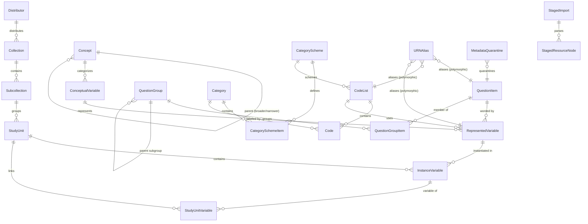

# Database Schema — DDI Model (DDI 4 / DDI-CDI / DDI-L 3.3)

> **Status:** Implementation Complete & Validated
> **Scope:** Standard-agnostic core DDI data model for the ReQuest question bank, aligned with DDI 4 (COGS model), DDI-CDI, and DDI-Lifecycle 3.3 with canonical URN-based primary keys
> **Target DB:** PostgreSQL ≥ 17 (Clean standard DDL, compatible with SQLite dev & test)

---

## 1. Entity-Relationship Diagram



---

## 2. Design Conventions

All tables in this schema follow these conventions unless stated otherwise:

| Convention | Rule |
| :--- | :--- |
| **Primary key (DDI Resources)** | `urn` — `VARCHAR(512) PRIMARY KEY` (Canonical DDI 3.3 / 4.0 URN format). |
| **Primary key (Junction & Non-DDI)** | `id` — `BigAutoField` / `BIGSERIAL PRIMARY KEY`. |
| **Foreign Keys to DDI Resources** | `*_urn` — `VARCHAR(512) REFERENCES ...(urn)` (e.g. `study_unit_urn`, `represented_variable_urn`, `conceptual_variable_urn`, `question_item_urn`, `code_list_urn`, `category_scheme_urn`, `category_urn`, `collection_urn`, `subcollection_urn`). |
| **Canonical URN Format** | Colon-separated: `urn:ddi:agency[.sub-agency]:ID:Version`.<br>• Agency-scoped: `urn:ddi:fr.sciencespo:V321:1.0.0`<br>• Maintainable-scoped: `urn:ddi:fr.sciencespo:MaintainableID.ObjectID:1.0.0` |
| **Content Hash** | `content_hash` (`CharField(64)`) & `content_hashes` (`JSONB`) — multi-algorithm digests for drift detection and deduplication. |
| **Multilingual text** | `JSONB` array of objects: `[{"lang": "fr", "value": "...", "type": "literal"}]`. Extensible attributes supported. |
| **Timestamps** | `created_at` (`auto_now_add`), `updated_at` (`auto_now`) on tables. |
| **Naming** | Table names use canonical DDI model terminology (`request_ddi_{snake_case}`). |

### 2.1 DDI Identification Mixin

Every DDI entity inherits from an abstract base providing persistent canonical URN identification:

```python
class DDIIdentifiable(models.Model):
    """Abstract mixin for DDI-Lifecycle URN identification and multi-algorithm fingerprinting."""

    urn = models.CharField(
        max_length=512,
        primary_key=True,
        help_text="Persistent canonical URN: urn:ddi:{agency}:{ID}:{version}",
    )
    content_hash = models.CharField(
        max_length=64,
        blank=True,
        default="",
        db_index=True,
        help_text="SHA-256 hex digest of primary canonical content",
    )
    content_hashes = models.JSONField(
        default=dict,
        blank=True,
        help_text="Multi-algorithm strategy hash digests",
    )
    created_at = models.DateTimeField(auto_now_add=True)
    updated_at = models.DateTimeField(auto_now=True)

    class Meta:
        abstract = True
```

---

## 3. Table Definitions

### 3.1 Organizational Hierarchy

#### Distributor
Top-level organization distributing datasets (e.g., CDSP, CESSDA). Institutional container.

| Column | Type | Constraints | Notes |
| :--- | :--- | :--- | :--- |
| `id` | `BigAutoField` | PK | Auto-incrementing identifier |
| `name` | `CharField(255)` | unique | Organization name |
| `created_at` | `DateTimeField` | auto | |
| `updated_at` | `DateTimeField` | auto | |

---

#### Collection
Logical grouping of survey series. Maps to DDI-L `<Group>`.

| Column | Type | Constraints | Notes |
| :--- | :--- | :--- | :--- |
| `urn` | `CharField(512)` | PK | Canonical DDI-L Group URN |
| `distributor_id` | `BigInt` | FK → Distributor | Institutional distributor |
| `name` | `CharField(255)` | | Series title |
| `description` | `JSONField` | nullable | Multilingual `[{"lang": "fr", "value": "..."}]` |
| `content_hash` | `CharField(64)` | indexed | Drift detection digest |
| `content_hashes`| `JSONField` | default `{}` | Multi-algorithm digests |
| `created_at` | `DateTimeField` | auto | |
| `updated_at` | `DateTimeField` | auto | |

---

#### Subcollection
Sub-series grouping. Maps to DDI-L `<SubGroup>`.

| Column | Type | Constraints | Notes |
| :--- | :--- | :--- | :--- |
| `urn` | `CharField(512)` | PK | Canonical DDI-L SubGroup URN |
| `collection_urn` | `CharField(512)` | FK → Collection(urn) | Parent series |
| `name` | `CharField(255)` | | Sub-series title |
| `content_hash` | `CharField(64)` | indexed | Drift detection digest |
| `content_hashes`| `JSONField` | default `{}` | Multi-algorithm digests |
| `created_at` | `DateTimeField` | auto | |
| `updated_at` | `DateTimeField` | auto | |

---

### 3.2 Concept Layer

#### Concept
High-level thematic domain concept from any controlled vocabulary or thesaurus (e.g. CESSDA ELSST, CESSDA Topics, DDI-CV).

| Column | Type | Constraints | Notes |
| :--- | :--- | :--- | :--- |
| `id` | `BigAutoField` | PK | Auto-incrementing identifier |
| `uri` | `CharField(512)` | unique, nullable | Controlled vocabulary concept URI (e.g. ELSST, SKOS) |
| `vocabulary` | `CharField(128)` | default `""` | Controlled vocabulary name (e.g. `'ELSST'`, `'CESSDA'`) |
| `notation` | `CharField(128)` | nullable | Standard thesaurus classification/notation code |
| `label` | `JSONField` | | Multilingual label `[{"lang": "fr", "value": "..."}]` |
| `description` | `JSONField` | default `[]` | Multilingual description |
| `definition` | `JSONField` | default `[]` | Multilingual skos:definition |
| `parent_id` | `BigInt` | FK → Concept, nullable | Parent concept for `skos:broader` hierarchical trees |
| `concept_type` | `CharField(64)` | default `'concept'` | Classification type (`'domain'`, `'concept'`) |
| `created_at` | `DateTimeField` | auto | |
| `updated_at` | `DateTimeField` | auto | |

---

#### ConceptualVariable
Abstract measurement concept (e.g., "Left-Right Political Placement"). Inherits `DDIIdentifiable`.

| Column | Type | Constraints | Notes |
| :--- | :--- | :--- | :--- |
| `urn` | `CharField(512)` | PK | Canonical URN (`urn:ddi:agency:cv-...:1.0.0`) |
| `concept_id` | `BigInt` | FK → Concept, nullable | Controlled vocabulary parent concept anchor |
| `label` | `JSONField` | | Multilingual label |
| `description` | `JSONField` | nullable | Multilingual description |
| `content_hash` | `CharField(64)` | indexed | SHA-256 digest |
| `content_hashes`| `JSONField` | default `{}` | Auxiliary digests |
| `created_at` | `DateTimeField` | auto | |
| `updated_at` | `DateTimeField` | auto | |

---

### 3.3 Representation Layer

#### QuestionItem
Standalone reusable question text with interviewer instructions. Inherits `DDIIdentifiable`.

| Column | Type | Constraints | Notes |
| :--- | :--- | :--- | :--- |
| `urn` | `CharField(512)` | PK | Canonical QuestionItem URN |
| `question_text` | `JSONField` | | Multilingual literal question text |
| `pre_question_text` | `JSONField` | nullable | Multilingual preamble text |
| `post_question_text`| `JSONField` | nullable | Multilingual post-question transition text |
| `interviewer_instructions` | `JSONField` | nullable | Multilingual interviewer guidance |
| `content_hash` | `CharField(64)` | indexed | SHA-256 digest |
| `content_hashes`| `JSONField` | default `{}` | Auxiliary digests |
| `created_at` | `DateTimeField` | auto | |
| `updated_at` | `DateTimeField` | auto | |

---

#### QuestionGroup
Grouping of related QuestionItem entities. Inherits `DDIIdentifiable`.

| Column | Type | Constraints | Notes |
| :--- | :--- | :--- | :--- |
| `urn` | `CharField(512)` | PK | Canonical QuestionGroup URN |
| `label` | `JSONField` | | Multilingual group label |
| `description` | `JSONField` | nullable | Multilingual group description |
| `parent_group_urn` | `CharField(512)` | FK → QuestionGroup(urn), nullable | Hierarchical subgroup nesting |
| `content_hash` | `CharField(64)` | indexed | SHA-256 digest |
| `content_hashes`| `JSONField` | default `{}` | Auxiliary digests |
| `created_at` | `DateTimeField` | auto | |
| `updated_at` | `DateTimeField` | auto | |

---

#### QuestionGroupItem
Junction connecting a `QuestionGroup` to member `QuestionItem` entities with explicit display ordering.

| Column | Type | Constraints | Notes |
| :--- | :--- | :--- | :--- |
| `id` | `BigAutoField` | PK | Auto-incrementing junction ID |
| `question_group_urn` | `CharField(512)` | FK → QuestionGroup(urn) | Parent group |
| `question_item_urn` | `CharField(512)` | FK → QuestionItem(urn) | Member question |
| `order` | `PositiveIntegerField` | default 0 | Display sequence |

**Unique constraint:** `(question_group_urn, question_item_urn)`

---

#### Category
Response text label (decoupled from numerical code values). Inherits `DDIIdentifiable`.

| Column | Type | Constraints | Notes |
| :--- | :--- | :--- | :--- |
| `urn` | `CharField(512)` | PK | Canonical Category URN |
| `label` | `JSONField` | | Multilingual category label |
| `content_hash` | `CharField(64)` | indexed | SHA-256 digest |
| `content_hashes`| `JSONField` | default `{}` | Auxiliary digests |
| `created_at` | `DateTimeField` | auto | |
| `updated_at` | `DateTimeField` | auto | |

---

#### CategoryScheme
Named collection of reusable categories (maps to DDI-L `CategoryScheme`). Inherits `DDIIdentifiable`.

| Column | Type | Constraints | Notes |
| :--- | :--- | :--- | :--- |
| `urn` | `CharField(512)` | PK | Canonical CategoryScheme URN |
| `name` | `JSONField` | | Multilingual scheme name |
| `description` | `JSONField` | nullable | Multilingual description |
| `content_hash` | `CharField(64)` | indexed | SHA-256 digest |
| `content_hashes`| `JSONField` | default `{}` | Auxiliary digests |
| `created_at` | `DateTimeField` | auto | |
| `updated_at` | `DateTimeField` | auto | |

---

#### CategorySchemeItem
Junction connecting a `CategoryScheme` to member `Category` entities with explicit display ordering.

| Column | Type | Constraints | Notes |
| :--- | :--- | :--- | :--- |
| `id` | `BigAutoField` | PK | Auto-incrementing junction ID |
| `category_scheme_urn` | `CharField(512)` | FK → CategoryScheme(urn) | Parent category scheme |
| `category_urn` | `CharField(512)` | FK → Category(urn) | Member category |
| `order` | `PositiveIntegerField` | default 0 | Display sequence |

**Unique constraint:** `(category_scheme_urn, category_urn)`

---

#### CodeList
Structural set of response codes linked to categories. Inherits `DDIIdentifiable`.

| Column | Type | Constraints | Notes |
| :--- | :--- | :--- | :--- |
| `urn` | `CharField(512)` | PK | Canonical CodeList URN |
| `name` | `JSONField` | nullable | Multilingual human title |
| `description` | `JSONField` | nullable | Multilingual description |
| `category_scheme_urn`| `CharField(512)` | FK → CategoryScheme(urn), nullable | Optional link to parent CategoryScheme |
| `content_hash` | `CharField(64)` | indexed | Structural SHA-256 digest |
| `content_hashes`| `JSONField` | default `{}` | Auxiliary digests |
| `created_at` | `DateTimeField` | auto | |
| `updated_at` | `DateTimeField` | auto | |

---

#### Code
Junction connecting a `CodeList` to a `Category` with a specific numerical code value (DDI Code resource).

| Column | Type | Constraints | Notes |
| :--- | :--- | :--- | :--- |
| `id` | `BigAutoField` | PK | Auto-incrementing junction ID |
| `code_list_urn` | `CharField(512)` | FK → CodeList(urn) | Parent code list |
| `category_urn` | `CharField(512)` | FK → Category(urn) | Referenced category label |
| `code_value` | `CharField(64)` | | The numerical/string code (e.g. `"1"`, `"98"`) |
| `order` | `PositiveIntegerField` | default 0 | Display order within list |
| `created_at` | `DateTimeField` | auto | |
| `updated_at` | `DateTimeField` | auto | |

**Unique constraint:** `(code_list_urn, code_value)`

---

#### RepresentedVariable
Combination of a question wording and a response code list, linked to a conceptual variable. Inherits `DDIIdentifiable`.

| Column | Type | Constraints | Notes |
| :--- | :--- | :--- | :--- |
| `urn` | `CharField(512)` | PK | Canonical RepresentedVariable URN |
| `conceptual_variable_urn` | `CharField(512)` | FK → ConceptualVariable(urn) | Parent concept |
| `question_item_urn` | `CharField(512)` | FK → QuestionItem(urn) | Reusable question text |
| `code_list_urn` | `CharField(512)` | FK → CodeList(urn), nullable | Response code structure |
| `label` | `JSONField` | nullable | Multilingual short label |
| `content_hash` | `CharField(64)` | indexed | SHA-256 compound digest |
| `content_hashes`| `JSONField` | default `{}` | Auxiliary digests |
| `created_at` | `DateTimeField` | auto | |
| `updated_at` | `DateTimeField` | auto | |

---

### 3.4 Dataset Layer

#### StudyUnit
A specific survey wave or dataset (renamed from `Survey`). Inherits `DDIIdentifiable`.

| Column | Type | Constraints | Notes |
| :--- | :--- | :--- | :--- |
| `urn` | `CharField(512)` | PK | Canonical StudyUnit URN |
| `subcollection_urn` | `CharField(512)` | FK → Subcollection(urn) | Parent series |
| `title` | `JSONField` | | Multilingual study title |
| `external_ref` | `CharField(512)` | unique, nullable | DOI or external identifier |
| `year` | `PositiveIntegerField` | nullable | Survey reference year |
| `description` | `JSONField` | nullable | Multilingual abstract |
| `content_hash` | `CharField(64)` | indexed | SHA-256 digest |
| `content_hashes`| `JSONField` | default `{}` | Auxiliary digests |
| `created_at` | `DateTimeField` | auto | |
| `updated_at` | `DateTimeField` | auto | |

---

#### InstanceVariable
Physical realization of a variable in a specific study column (renamed from `BindingSurveyRepresentedVariable`). Inherits `DDIIdentifiable`.

| Column | Type | Constraints | Notes |
| :--- | :--- | :--- | :--- |
| `urn` | `CharField(512)` | PK | Canonical InstanceVariable URN |
| `study_unit_urn` | `CharField(512)` | FK → StudyUnit(urn) | Parent study wave |
| `represented_variable_urn` | `CharField(512)` | FK → RepresentedVariable(urn) | Harmonized variable instantiated |
| `variable_name` | `CharField(255)` | | Dataset column name (e.g., `q01a`) |
| `universe` | `JSONField` | nullable | Target population description |
| `notes` | `JSONField` | nullable | Variable notes |
| `is_indexed` | `BooleanField` | default False | Elasticsearch indexing status |
| `content_hash` | `CharField(64)` | indexed | SHA-256 digest |
| `content_hashes`| `JSONField` | default `{}` | Auxiliary digests |
| `created_at` | `DateTimeField` | auto | |
| `updated_at` | `DateTimeField` | auto | |

**Unique constraint:** `(study_unit_urn, variable_name)`

---

#### StudyUnitVariable
Junction capturing the direct relationship between a `StudyUnit` and its member `InstanceVariable` entries.

| Column | Type | Constraints | Notes |
| :--- | :--- | :--- | :--- |
| `id` | `BigAutoField` | PK | Auto-incrementing junction ID |
| `study_unit_urn` | `CharField(512)` | FK → StudyUnit(urn) | Parent study wave |
| `instance_variable_urn` | `CharField(512)` | FK → InstanceVariable(urn) | Member variable |
| `order` | `PositiveIntegerField` | default 0 | Display order |

**Unique constraint:** `(study_unit_urn, instance_variable_urn)`

---

### 3.5 Normalization & Harmonization Infrastructure

#### URNAlias
Maps auto-generated/random URNs from external tools to canonical database entities.

| Column | Type | Constraints | Notes |
| :--- | :--- | :--- | :--- |
| `id` | `BigAutoField` | PK | Auto-incrementing ID |
| `alias_urn` | `CharField(512)` | unique | External / random source URN |
| `canonical_urn` | `CharField(512)` | indexed | Canonical database URN |
| `entity_type` | `CharField(64)` | | DDI entity type name |
| `hash_strategy` | `CharField(64)` | default `"v1_strict_sha256"` | Strategy used to establish link |
| `source_file` | `CharField(512)` | nullable | Originating import file |
| `created_at` | `DateTimeField` | auto | |

---

#### MetadataQuarantine
Holds incoming metadata that requires archivist review due to URN collisions or drift.

| Column | Type | Constraints | Notes |
| :--- | :--- | :--- | :--- |
| `id` | `BigAutoField` | PK | Auto-incrementing ID |
| `incoming_urn` | `CharField(512)` | | Conflicting incoming URN |
| `existing_urn` | `CharField(512)` | nullable | Conflicting existing URN |
| `entity_type` | `CharField(64)` | | Target DDI entity type |
| `incoming_content` | `JSONField` | | Full serialized incoming payload |
| `existing_content_hash` | `CharField(64)` | nullable | Hash of existing record |
| `incoming_content_hash` | `CharField(64)` | | Hash of incoming record |
| `conflict_type` | `CharField(32)` | | `"staged_urn_drift"`, `"hash_mismatch"` |
| `resolution` | `CharField(32)` | nullable | `"approved"`, `"forked"`, `"rejected"` |
| `resolved_by` | `CharField(255)` | nullable | Reviewing archivist username |
| `resolved_at` | `DateTimeField` | nullable | |
| `source_file` | `CharField(512)` | nullable | Originating file |
| `import_task_id` | `CharField(255)` | nullable | Task queue reference |
| `created_at` | `DateTimeField` | auto | |

---

### 3.6 Staging & Multi-Standard Ingestion Layer

#### StagedImport
Stores metadata and parameters for uploaded metadata file bundles and batch import jobs.

| Column | Type | Constraints | Notes |
| :--- | :--- | :--- | :--- |
| `id` | `BigAutoField` | PK | Auto-incrementing import ID |
| `source_format` | `CharField(64)` | | `"ddi-l:3.3:xml"`, `"ddi-l:4.0:json"`, `"ddi-c:2.5:xml"`, `"croissant"`, `"csv"` |
| `file_name` | `CharField(512)` | | Original uploaded filename |
| `file_path` | `FileField` | nullable | File storage path |
| `import_options` | `JSONField` | default `{}` | Batch configuration metadata |
| `total_resources` | `IntegerField` | default 0 | Total staged resource nodes |
| `processed_resources`| `IntegerField` | default 0 | Processed resource count |
| `status` | `CharField(32)` | default `"staged"` | `"staged"`, `"normalized"`, `"quarantined"`, `"failed"` |
| `import_task_id` | `CharField(255)` | nullable | Background queue ID |
| `created_at` | `DateTimeField` | auto | |
| `processed_at` | `DateTimeField` | nullable | |

---

#### StagedResourceNode
Stores individual broken-down raw element resources extracted during Stage 1 parsing.

| Column | Type | Constraints | Notes |
| :--- | :--- | :--- | :--- |
| `id` | `BigAutoField` | PK | Auto-incrementing node ID |
| `staged_import_id` | `BigInt` | FK → StagedImport | Parent staged import bundle |
| `resource_type` | `CharField(64)` | db_index | `"QuestionItem"`, `"CodeList"`, `"Category"`, `"StudyUnit"`, etc. |
| `raw_urn` | `CharField(512)` | db_index | Raw external URN from source file |
| `raw_value` | `JSONField` | | Pre-normalized raw JSON payload |
| `canonical_urn` | `CharField(512)` | nullable, db_index | Resolved canonical database URN |
| `status` | `CharField(32)` | default `"staged"` | `"staged"`, `"normalized"`, `"quarantined"`, `"failed"` |
| `created_at` | `DateTimeField` | auto | |

---

## 4. Index Strategy

| Table | Index Column(s) | Type | Purpose |
| :--- | :--- | :--- | :--- |
| _All DDI entities_ | `urn` | PRIMARY KEY (B-tree) | Direct $O(1)$ / $O(\log N)$ identity lookups & FK referencing |
| _All DDI entities_ | `content_hash` | B-tree | Fingerprint comparison & deduplication |
| `Concept` | `uri` | UNIQUE B-tree | Controlled vocabulary URI lookup |
| `Concept` | `vocabulary` | B-tree | Filter concepts by scheme |
| `Concept` | `notation` | B-tree | Notation/code lookup |
| `Code` | `(code_list_urn, code_value)` | UNIQUE composite | Code deduplication within a code list |
| `InstanceVariable` | `(study_unit_urn, variable_name)` | UNIQUE composite | Column-name uniqueness per study |
| `InstanceVariable` | `is_indexed` | Partial / B-tree | Elasticsearch sync queue |
| `QuestionGroupItem` | `(question_group_urn, question_item_urn)`| UNIQUE composite | Question grouping membership uniqueness |
| `CategorySchemeItem`| `(category_scheme_urn, category_urn)` | UNIQUE composite | Scheme membership uniqueness |
| `StudyUnitVariable` | `(study_unit_urn, instance_variable_urn)`| UNIQUE composite | Variable-to-study mapping uniqueness |
| `URNAlias` | `alias_urn` | UNIQUE B-tree | Alias resolution during ingestion |
| `URNAlias` | `canonical_urn` | B-tree | Reverse alias lookup |
| `MetadataQuarantine`| `resolution` | Partial (where null) | Pending archivist review queue |
| `StagedResourceNode`| `raw_urn`, `canonical_urn` | B-tree | Fast node matching |
