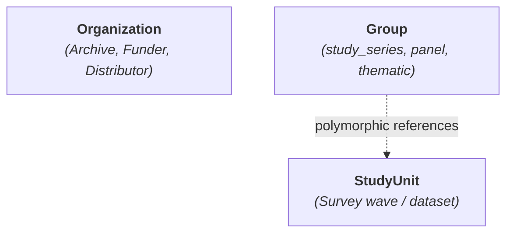
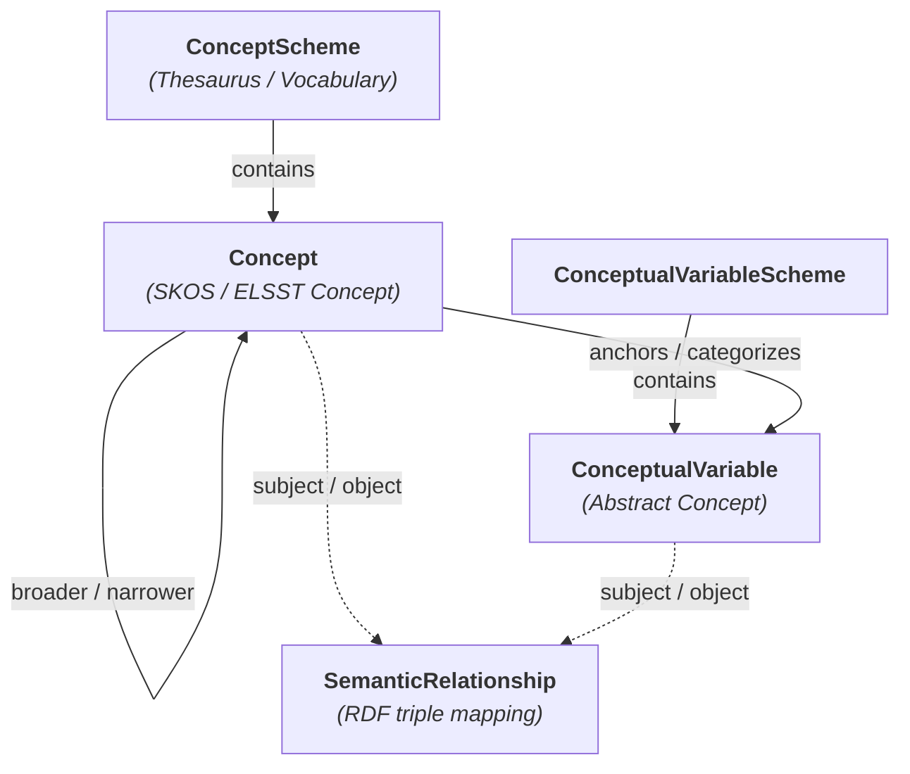
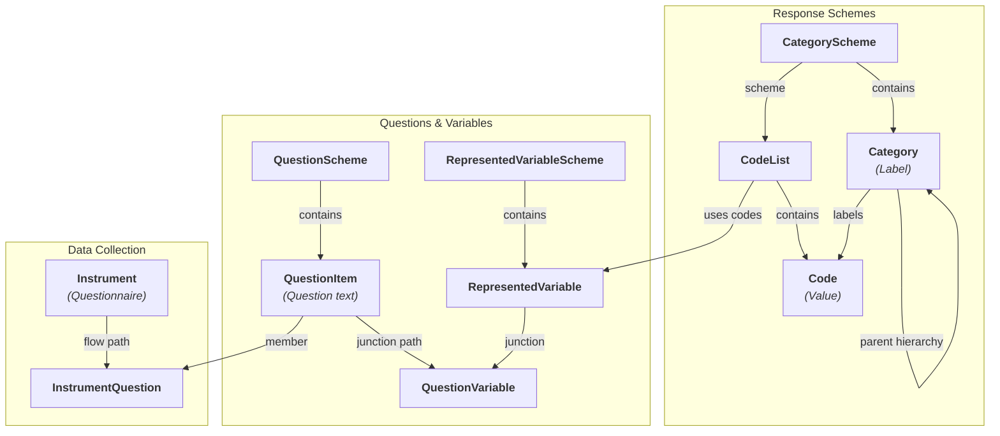
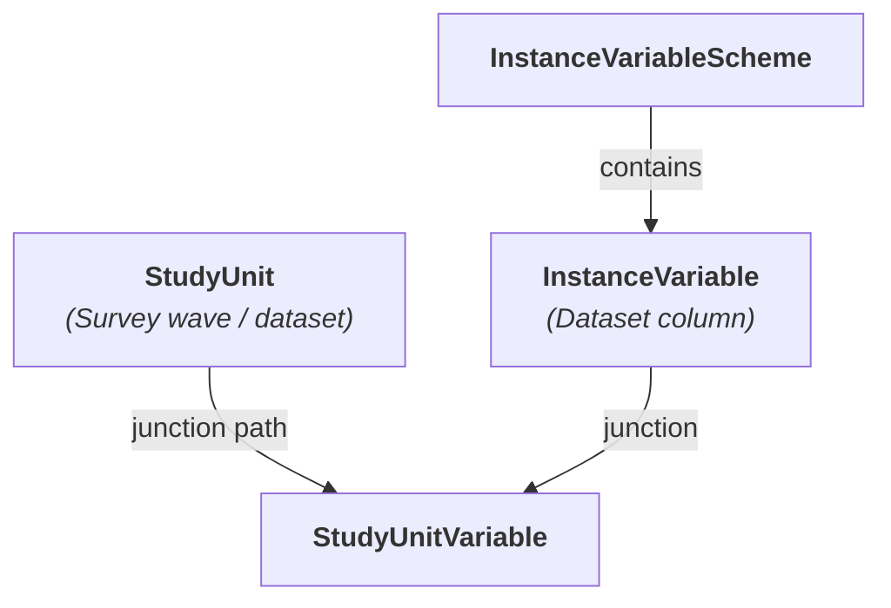
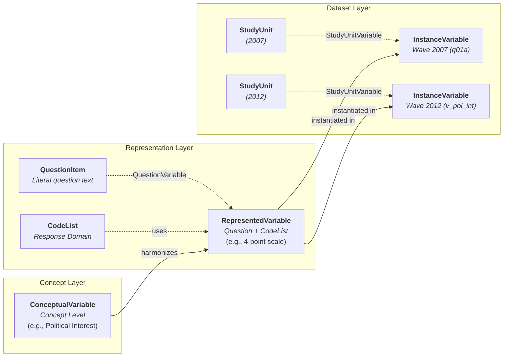
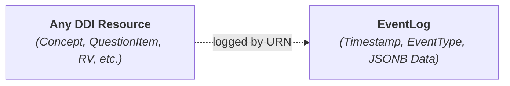
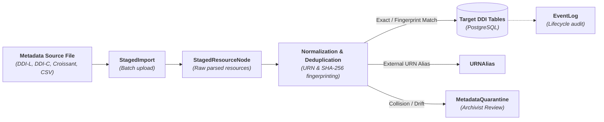

# Database Schema — DDI Model (DDI 4 / DDI-CDI / DDI-L 3.3)

> **Status:** Implementation Complete & Validated  
> **Scope:** Standard-agnostic core DDI data model for the ReQuest question bank, aligned with DDI 4 (COGS model), DDI-CDI, and DDI-Lifecycle 3.3 with canonical URN-based primary keys  
> **Target DB:** PostgreSQL ≥ 17 (ICU collations, JSONB indexing, standard SQL DDL; compatible with SQLite dev & test)

---

## 1. Architecture & Design Conventions

The FAIRwDDI architecture implements a **standard-agnostic, lightweight DDI model** optimized for social-science question banks and cross-survey harmonization. Instead of monolithic specification bloat, the data model organizes metadata into clean, decoupled layers:

1. **Organization & Study Grouping Layer:** Institutional agencies, archives, and polymorphic resource groupings (study series, panels, thematic collections).
2. **Concept Layer:** Controlled vocabularies (SKOS/ELSST), concept hierarchies, and abstract conceptual variables.
3. **Representation & Instrument Layer:** Decoupled question wording, reusable categories, coded response domains, represented variables, and data collection instruments.
4. **Dataset Layer:** Physical survey waves (`StudyUnit`) and concrete data columns (`InstanceVariable`).
5. **Cross-Layer Dynamics:** The DDI Variable Cascade (`ConceptualVariable → RepresentedVariable → InstanceVariable`) and semantic graph relationships.
6. **Infrastructure, Staging & Audit Layer:** Streaming ingestion staging, URN aliasing, metadata quarantine, and lifecycle event logging.

### 1.1 Conventions Summary

| Convention | Rule |
| :--- | :--- |
| **Primary key (DDI Resources)** | `urn` — `VARCHAR(512) PRIMARY KEY` (Canonical DDI 3.3 / 4.0 URN format). |
| **Primary key (Junction & Non-DDI)** | `id` — `BigAutoField` / `BIGSERIAL PRIMARY KEY`. |
| **Parent Scheme Foreign Keys** | `scheme_urn` — `VARCHAR(512) REFERENCES ...(urn)` (maps to `models.ForeignKey(..., db_column="scheme_urn")`). |
| **Inter-Resource Foreign Keys** | `*_urn` — `VARCHAR(512) REFERENCES ...(urn)` (e.g. `study_unit_urn`, `represented_variable_urn`, `conceptual_variable_urn`, `question_item_urn`, `code_list_urn`, `category_urn`, `instrument_urn`). |
| **Canonical URN Format** | Colon-separated: `urn:ddi:agency[.sub-agency]:ID:Version`.<br>• Agency-scoped: `urn:ddi:fr.sciencespo:V321:1.0.0`<br>• Maintainable-scoped: `urn:ddi:fr.sciencespo:MaintainableID.ObjectID:1.0.0` |
| **Unified Hashes** | `hashes` (`JSONB`) — unified key-value mapping of hash algorithm types to digests (e.g. `{"sha256": "...", "canonical_nfkc": "..."}`). |
| **Extended Attributes** | `extended_attributes` (`JSONB`) — array of objects capturing flexible provider/specification attributes (intent, interviewer guidance, notes, value domains, inclusion/exclusion) without SQL schema bloat. |
| **Multilingual Text** | `JSONB` array of objects: `[{"lang": "fr", "value": "...", "type": "literal"}]`. Extensible attributes supported. |
| **Timestamps** | `created_at` (`auto_now_add`), `updated_at` (`auto_now`) on all entity tables. |
| **Naming** | Table names use canonical DDI model terminology (`request_ddi_{snake_case}`). |

### 1.2 DDI Resource Base Models

Every DDI entity inherits from `DDIIdentifiable` providing persistent canonical URN identification. Scheme container packages inherit from `DDIScheme` (`urn`, `name`, `description`, `extended_attributes` without hashes), while versionable DDI resources inherit from `DDIResource`, where `urn` and `name` are required, multi-algorithm content `hashes` are maintained, and all entity-specific metadata fields are nullable:

```python
class DDIIdentifiable(models.Model):
    """Abstract mixin for DDI-Lifecycle URN identification."""

    urn = models.CharField(
        max_length=512,
        primary_key=True,
        help_text="Persistent canonical URN: urn:ddi:{agency}:{ID}:{version}",
    )
    created_at = models.DateTimeField(auto_now_add=True)
    updated_at = models.DateTimeField(auto_now=True)

    class Meta:
        abstract = True


class DDIScheme(DDIIdentifiable):
    """Abstract base model for all DDI scheme containers (no content hashes)."""

    name = models.JSONField(
        default=list,
        help_text="Multilingual scheme name: [{'lang': 'fr', 'value': '...' }].",
    )
    description = models.JSONField(
        default=list,
        blank=True,
        null=True,
        help_text="Multilingual description.",
    )
    extended_attributes = models.JSONField(
        default=list,
        blank=True,
        help_text="Extensible attributes list of objects.",
    )

    class Meta:
        abstract = True


class DDIResource(DDIIdentifiable):
    """Abstract base model for all top-level DDI resources requiring urn and name, with hashes."""

    name = models.JSONField(
        default=list,
        help_text="Multilingual name: [{'lang': 'fr', 'value': '...' }].",
    )
    hashes = models.JSONField(
        default=dict,
        blank=True,
        null=True,
        help_text="Unified key-value hash digests dictionary (e.g. {'sha256': '...'}).",
    )

    class Meta:
        abstract = True
```

---

## 2. Organization & Study Grouping Layer

The Organization & Grouping layer manages institutional actors (distributors, archives, funding bodies) and logical resource aggregations (longitudinal survey series, panels, thematic collections) without rigid physical foreign-key coupling.



### 2.1 Table Definitions

#### Organization
Institutional organization resource in DDI-Lifecycle (maps to DDI-L `<Organization>`). Represents archives, distributors, research centers, universities, and funding bodies. Secondary details (acronyms, contact info, URIs) are captured in `extended_attributes`. Inherits `DDIResource`.

| Column | Type | Constraints | Notes |
| :--- | :--- | :--- | :--- |
| `urn` | `CharField(512)` | PK | Canonical DDI-L Organization URN |
| `name` | `JSONField` | required | Multilingual organization name `[{"lang": "fr", "value": "..."}]` |
| `organization_type` | `CharField(64)` | default `'distributor'`, indexed | Classification type (`'archive'`, `'distributor'`, `'funder'`, etc.) |
| `extended_attributes` | `JSONField` | default `[]` | Extensible attributes array of objects |
| `hashes` | `JSONField` | default `{}` | Multi-algorithm content digests |
| `created_at` | `DateTimeField` | auto | Record creation timestamp |
| `updated_at` | `DateTimeField` | auto | Record update timestamp |

---

#### Group
Generic Group DDI resource (maps to DDI-L `<Group>` / `<SubGroup>`). Logical grouping of related resources (e.g. study series, panels, thematic collections, or longitudinal waves) referenced via polymorphic typed URN references in the `references` JSON field. Inherits `DDIResource`.

| Column | Type | Constraints | Notes |
| :--- | :--- | :--- | :--- |
| `urn` | `CharField(512)` | PK | Canonical DDI-L Group URN |
| `name` | `JSONField` | required | Multilingual group name `[{"lang": "fr", "value": "..."}]` |
| `description` | `JSONField` | nullable | Multilingual group description |
| `group_type` | `CharField(64)` | default `'study_series'`, indexed | Group classification type (`'study_series'`, `'panel'`, `'thematic'`, `'collection'`) |
| `references` | `JSONField` | default `[]` | Member resource references `[{"resource_type": "StudyUnit", "urn": "..."}]` |
| `hashes` | `JSONField` | default `{}` | Multi-algorithm content digests |
| `extended_attributes` | `JSONField` | default `[]` | Extensible attributes array of objects |
| `created_at` | `DateTimeField` | auto | Record creation timestamp |
| `updated_at` | `DateTimeField` | auto | Record update timestamp |

---

## 3. Concept Layer

The Concept layer anchors survey metadata to formal thesauri (CESSDA ELSST, CESSDA Topics, DDI-CV) and establishes high-level measurement concepts independently of question wording or dataset implementations.



### 3.1 Table Definitions

#### ConceptScheme
Named collection of reusable concepts (maps to DDI-L `ConceptScheme` / SKOS `skos:ConceptScheme`). Inherits `DDIScheme`.

| Column | Type | Constraints | Notes |
| :--- | :--- | :--- | :--- |
| `urn` | `CharField(512)` | PK | Canonical ConceptScheme URN |
| `name` | `JSONField` | required | Multilingual scheme name |
| `description` | `JSONField` | nullable | Multilingual description |
| `extended_attributes` | `JSONField` | default `[]` | Extensible attributes array of objects |
| `created_at` | `DateTimeField` | auto | Record creation timestamp |
| `updated_at` | `DateTimeField` | auto | Record update timestamp |

---

#### Concept
High-level thematic domain concept from any controlled vocabulary or thesaurus (e.g. CESSDA ELSST, CESSDA Topics, DDI-CV). Inherits `DDIIdentifiable`.

| Column | Type | Constraints | Notes |
| :--- | :--- | :--- | :--- |
| `urn` | `CharField(512)` | PK | Canonical Concept URN |
| `scheme_urn` | `CharField(512)` | FK → ConceptScheme(urn), nullable | Parent ConceptScheme defining this concept |
| `uri` | `CharField(512)` | unique, nullable | Controlled vocabulary concept URI (e.g. ELSST URI) |
| `vocabulary` | `CharField(128)` | default `""` | Controlled vocabulary name (e.g. `"ELSST"`, `"Topics"`) |
| `notation` | `CharField(128)` | nullable | Standard thesaurus notation code |
| `label` | `JSONField` | nullable | Multilingual preferred label (`skos:prefLabel`) |
| `description` | `JSONField` | default `[]` | Multilingual description |
| `definition` | `JSONField` | default `[]` | Multilingual definition (`skos:definition`) |
| `parent_urn` | `CharField(512)` | FK → Concept(urn), nullable | Parent concept for hierarchical trees (`skos:broader`) |
| `concept_type` | `CharField(64)` | default `'concept'` | Classification type (`'domain'`, `'concept'`, `'top_concept'`) |
| `hashes` | `JSONField` | default `{}` | Multi-algorithm digests |
| `extended_attributes` | `JSONField` | default `[]` | Extensible attributes array of objects |
| `created_at` | `DateTimeField` | auto | Record creation timestamp |
| `updated_at` | `DateTimeField` | auto | Record update timestamp |

---

#### ConceptualVariableScheme
Named collection of reusable conceptual variables (maps to DDI-L `ConceptualVariableScheme`). Inherits `DDIScheme`.

| Column | Type | Constraints | Notes |
| :--- | :--- | :--- | :--- |
| `urn` | `CharField(512)` | PK | Canonical ConceptualVariableScheme URN |
| `name` | `JSONField` | required | Multilingual scheme name |
| `description` | `JSONField` | nullable | Multilingual description |
| `extended_attributes` | `JSONField` | default `[]` | Extensible attributes array of objects |
| `created_at` | `DateTimeField` | auto | Record creation timestamp |
| `updated_at` | `DateTimeField` | auto | Record update timestamp |

---

#### ConceptualVariable
Abstract measurement concept (e.g., "Left-Right Political Placement", "Subjective Health"). Inherits `DDIResource`.

| Column | Type | Constraints | Notes |
| :--- | :--- | :--- | :--- |
| `urn` | `CharField(512)` | PK | Canonical URN (`urn:ddi:agency:cv-...:1.0.0`) |
| `scheme_urn` | `CharField(512)` | FK → ConceptualVariableScheme(urn), nullable | Parent ConceptualVariableScheme |
| `concept_urn` | `CharField(512)` | FK → Concept(urn), nullable | Controlled vocabulary concept anchor |
| `name` | `JSONField` | required | Multilingual / faceted conceptual variable name |
| `label` | `JSONField` | nullable | Multilingual human label |
| `description` | `JSONField` | nullable | Multilingual description |
| `hashes` | `JSONField` | default `{}` | Multi-algorithm digests |
| `extended_attributes` | `JSONField` | default `[]` | Extensible attributes array of objects |
| `created_at` | `DateTimeField` | auto | Record creation timestamp |
| `updated_at` | `DateTimeField` | auto | Record update timestamp |

---

#### SemanticRelationship
Captures RDF triple-like relationships between resources across any layer (e.g. SKOS mappings `skos:exactMatch`, `skos:broadMatch`, `skos:relatedMatch`, lineage links `prov:wasDerivedFrom`, cross-vocabulary thesaurus anchors).

| Column | Type | Constraints | Notes |
| :--- | :--- | :--- | :--- |
| `id` | `BigAutoField` | PK | Auto-incrementing identifier |
| `subject_type` | `CharField(128)` | indexed | Subject entity type (`'Concept'`, `'ConceptualVariable'`, etc.) |
| `subject_urn` | `CharField(512)` | indexed | Canonical URN or URI of the subject resource |
| `predicate` | `CharField(256)` | indexed | Semantic predicate (e.g. `'skos:exactMatch'`, `'skos:broadMatch'`) |
| `object_type` | `CharField(128)` | indexed | Target entity type (`'Concept'`, `'ConceptualVariable'`, etc.) |
| `object_urn` | `CharField(512)` | indexed | Canonical URN or URI of the target resource |
| `extended_attributes` | `JSONField` | default `[]` | Extensible attributes array of objects (confidence, tool, notes) |
| `created_at` | `DateTimeField` | auto | Record creation timestamp |
| `updated_at` | `DateTimeField` | auto | Record update timestamp |

*Constraints & Indexes:*
- Unique constraint: `(subject_urn, predicate, object_urn)`
- Indexes: `(subject_urn, predicate)`, `(object_urn, predicate)`, `(predicate)`, `(subject_type)`, `(object_type)`

---

## 4. Representation & Instrument Layer

The Representation & Instrument layer defines reusable response schemes, standalone question texts, harmonized represented variables, and data collection questionnaires.



### 4.1 Response Representation: Categories & Code Lists

#### CategoryScheme
Named collection of reusable categories (maps to DDI-L `CategoryScheme`). Inherits `DDIScheme`.

| Column | Type | Constraints | Notes |
| :--- | :--- | :--- | :--- |
| `urn` | `CharField(512)` | PK | Canonical CategoryScheme URN |
| `name` | `JSONField` | required | Multilingual scheme name |
| `description` | `JSONField` | nullable | Multilingual description |
| `extended_attributes` | `JSONField` | default `[]` | Extensible attributes array of objects |
| `created_at` | `DateTimeField` | auto | Record creation timestamp |
| `updated_at` | `DateTimeField` | auto | Record update timestamp |

---

#### Category
Response category text label (decoupled from numerical code values). Belongs to a single `CategoryScheme` and supports self-referential hierarchy. Inherits `DDIResource`.

| Column | Type | Constraints | Notes |
| :--- | :--- | :--- | :--- |
| `urn` | `CharField(512)` | PK | Canonical Category URN |
| `scheme_urn` | `CharField(512)` | FK → CategoryScheme(urn), nullable | Parent CategoryScheme defining this category |
| `concept_urn` | `CharField(512)` | FK → Concept(urn), nullable | Optional semantic concept anchor in a controlled vocabulary |
| `name` | `JSONField` | required | Technical identifier / multilingual name |
| `label` | `JSONField` | nullable | Multilingual category label |
| `parent_urn` | `CharField(512)` | FK → Category(urn), nullable | Parent category for hierarchical schemes |
| `order` | `PositiveIntegerField` | default 0 | Display order within scheme |
| `is_missing` | `BooleanField` | default `False` | Missing / non-response indicator |
| `hashes` | `JSONField` | default `{}` | Multi-algorithm digests |
| `extended_attributes` | `JSONField` | default `[]` | Category definitions, inclusions/exclusions |
| `created_at` | `DateTimeField` | auto | Record creation timestamp |
| `updated_at` | `DateTimeField` | auto | Record update timestamp |

---

#### CodeList
Structural set of response codes linked to categories. Inherits `DDIResource`.

| Column | Type | Constraints | Notes |
| :--- | :--- | :--- | :--- |
| `urn` | `CharField(512)` | PK | Canonical CodeList URN |
| `scheme_urn` | `CharField(512)` | FK → CategoryScheme(urn), nullable | Optional link to parent CategoryScheme |
| `name` | `JSONField` | required | Multilingual human title |
| `description` | `JSONField` | nullable | Multilingual description |
| `hashes` | `JSONField` | default `{}` | Multi-algorithm digests |
| `extended_attributes` | `JSONField` | default `[]` | Extensible attributes array of objects |
| `created_at` | `DateTimeField` | auto | Record creation timestamp |
| `updated_at` | `DateTimeField` | auto | Record update timestamp |

---

#### Code
Junction connecting a `CodeList` to a `Category` with a discrete code value. Inherits `DDIIdentifiable`. Supports self-referential hierarchy (`parent_urn`).

| Column | Type | Constraints | Notes |
| :--- | :--- | :--- | :--- |
| `urn` | `CharField(512)` | PK | Persistent canonical URN: `urn:ddi:{agency}:{ID}:{version}` |
| `code_list_urn` | `CharField(512)` | FK → CodeList(urn) | Parent code list |
| `category_urn` | `CharField(512)` | FK → Category(urn) | Referenced category label |
| `code_value` | `CharField(64)` | required | Numerical/string code (e.g. `"1"`, `"98"`) |
| `parent_urn` | `CharField(512)` | FK → Code(urn), nullable | Parent code for hierarchical code lists |
| `order` | `PositiveIntegerField` | default 0 | Display order within list |
| `is_missing` | `BooleanField` | default `False` | True if code represents missing/non-response (DK, Refusal, NA) |
| `hashes` | `JSONField` | default `{}` | Multi-algorithm content digests |
| `extended_attributes` | `JSONField` | default `[]` | Extensible attributes array of objects |
| `created_at` | `DateTimeField` | auto | Record creation timestamp |
| `updated_at` | `DateTimeField` | auto | Record update timestamp |

---

### 4.2 Question Representation

#### QuestionScheme
Named collection of reusable questions (maps to DDI-L `QuestionScheme`). Inherits `DDIScheme`.

| Column | Type | Constraints | Notes |
| :--- | :--- | :--- | :--- |
| `urn` | `CharField(512)` | PK | Canonical QuestionScheme URN |
| `name` | `JSONField` | required | Multilingual scheme name |
| `description` | `JSONField` | nullable | Multilingual description |
| `extended_attributes` | `JSONField` | default `[]` | Extensible attributes array of objects |
| `created_at` | `DateTimeField` | auto | Record creation timestamp |
| `updated_at` | `DateTimeField` | auto | Record update timestamp |

---

#### QuestionItem
Standalone reusable question text. Belongs to a single QuestionScheme. Inherits `DDIResource`.

| Column | Type | Constraints | Notes |
| :--- | :--- | :--- | :--- |
| `urn` | `CharField(512)` | PK | Canonical QuestionItem URN |
| `scheme_urn` | `CharField(512)` | FK → QuestionScheme(urn), nullable | Parent QuestionScheme defining this question |
| `name` | `JSONField` | required | Technical identifier / multilingual name |
| `question_text` | `JSONField` | nullable | Multilingual literal question text |
| `hashes` | `JSONField` | default `{}` | Multi-algorithm digests |
| `extended_attributes` | `JSONField` | default `[]` | Preamble, interviewer instructions, intent |
| `created_at` | `DateTimeField` | auto | Record creation timestamp |
| `updated_at` | `DateTimeField` | auto | Record update timestamp |

---

### 4.3 Represented Variables & Question Binding

#### RepresentedVariableScheme
Named collection of reusable represented variables (maps to DDI-L `RepresentedVariableScheme`). Inherits `DDIScheme`.

| Column | Type | Constraints | Notes |
| :--- | :--- | :--- | :--- |
| `urn` | `CharField(512)` | PK | Canonical RepresentedVariableScheme URN |
| `name` | `JSONField` | required | Multilingual scheme name |
| `description` | `JSONField` | nullable | Multilingual description |
| `extended_attributes` | `JSONField` | default `[]` | Extensible attributes array of objects |
| `created_at` | `DateTimeField` | auto | Record creation timestamp |
| `updated_at` | `DateTimeField` | auto | Record update timestamp |

---

#### RepresentedVariable
Combination of conceptual variable and response representation (e.g., code list, numeric range, text domain). Inherits `DDIResource`.

| Column | Type | Constraints | Notes |
| :--- | :--- | :--- | :--- |
| `urn` | `CharField(512)` | PK | Canonical RepresentedVariable URN |
| `scheme_urn` | `CharField(512)` | FK → RepresentedVariableScheme(urn), nullable | Parent RepresentedVariableScheme |
| `conceptual_variable_urn` | `CharField(512)` | FK → ConceptualVariable(urn), nullable | Parent concept |
| `code_list_urn` | `CharField(512)` | FK → CodeList(urn), nullable | Direct response code structure foreign key |
| `value_representation` | `JSONField` | default `{}` | JSON object describing value representation (`{"type": "code", "code_list_urn": "..."}`) |
| `name` | `JSONField` | required | Multilingual / faceted represented variable name |
| `label` | `JSONField` | nullable | Multilingual short label |
| `description` | `JSONField` | nullable | Multilingual description |
| `hashes` | `JSONField` | default `{}` | Multi-algorithm digests |
| `extended_attributes` | `JSONField` | default `[]` | Value domain, data type, variable characteristics |
| `created_at` | `DateTimeField` | auto | Record creation timestamp |
| `updated_at` | `DateTimeField` | auto | Record update timestamp |

---

#### QuestionVariable
Junction connecting a `QuestionItem` to a `RepresentedVariable` with referencing path.

| Column | Type | Constraints | Notes |
| :--- | :--- | :--- | :--- |
| `id` | `BigAutoField` | PK | Auto-incrementing junction ID |
| `question_item_urn` | `CharField(512)` | FK → QuestionItem(urn) | Associated question |
| `represented_variable_urn` | `CharField(512)` | FK → RepresentedVariable(urn) | Associated variable |
| `path` | `CharField(512)` | default `""` | Referencing path (e.g. XPath/DDI reference path) |
| `order` | `PositiveIntegerField` | default 0 | Association order |
| `created_at` | `DateTimeField` | auto | Record creation timestamp |
| `updated_at` | `DateTimeField` | auto | Record update timestamp |

---

### 4.4 Data Collection Instruments

#### Instrument
Data collection instrument / questionnaire in DDI-Lifecycle. Inherits `DDIResource`.

| Column | Type | Constraints | Notes |
| :--- | :--- | :--- | :--- |
| `urn` | `CharField(512)` | PK | Canonical Instrument URN |
| `name` | `JSONField` | required | Multilingual technical name |
| `label` | `JSONField` | nullable | Multilingual human title |
| `description` | `JSONField` | nullable | Multilingual description |
| `hashes` | `JSONField` | default `{}` | Multi-algorithm digests |
| `extended_attributes` | `JSONField` | default `[]` | Mode of collection, administration notes |
| `created_at` | `DateTimeField` | auto | Record creation timestamp |
| `updated_at` | `DateTimeField` | auto | Record update timestamp |

---

#### InstrumentQuestion
Junction connecting an `Instrument` to member `QuestionItem` entities with sequence/flow path.

| Column | Type | Constraints | Notes |
| :--- | :--- | :--- | :--- |
| `id` | `BigAutoField` | PK | Auto-incrementing junction ID |
| `instrument_urn` | `CharField(512)` | FK → Instrument(urn) | Parent instrument |
| `question_item_urn` | `CharField(512)` | FK → QuestionItem(urn) | Associated question |
| `path` | `CharField(512)` | default `""` | Sequencing/flow path (e.g. `/Instrument/Sequence/Q01`) |
| `order` | `PositiveIntegerField` | default 0 | Sequence display order |
| `created_at` | `DateTimeField` | auto | Record creation timestamp |
| `updated_at` | `DateTimeField` | auto | Record update timestamp |

---

## 5. Dataset Layer

The Dataset layer represents specific survey data files and their concrete physical column variables.



### 5.1 Table Definitions

#### StudyUnit
A specific survey wave or dataset (renamed from `Survey`). Inherits `DDIResource`.

| Column | Type | Constraints | Notes |
| :--- | :--- | :--- | :--- |
| `urn` | `CharField(512)` | PK | Canonical StudyUnit URN |
| `name` | `JSONField` | required | Multilingual dataset identifier / name |
| `title` | `JSONField` | nullable | Multilingual study title |
| `external_ref` | `CharField(512)` | unique, nullable | DOI or external repository identifier |
| `year` | `PositiveIntegerField` | nullable | Survey reference year |
| `description` | `JSONField` | nullable | Multilingual abstract |
| `hashes` | `JSONField` | default `{}` | Multi-algorithm digests |
| `extended_attributes` | `JSONField` | default `[]` | Methodological metadata |
| `created_at` | `DateTimeField` | auto | Record creation timestamp |
| `updated_at` | `DateTimeField` | auto | Record update timestamp |

---

#### InstanceVariableScheme
Named collection of instance variables (maps to DDI-L `InstanceVariableScheme` / `VariableScheme`). Inherits `DDIScheme`.

| Column | Type | Constraints | Notes |
| :--- | :--- | :--- | :--- |
| `urn` | `CharField(512)` | PK | Canonical InstanceVariableScheme URN |
| `name` | `JSONField` | required | Multilingual scheme name |
| `description` | `JSONField` | nullable | Multilingual description |
| `extended_attributes` | `JSONField` | default `[]` | Extensible attributes array of objects |
| `created_at` | `DateTimeField` | auto | Record creation timestamp |
| `updated_at` | `DateTimeField` | auto | Record update timestamp |

---

#### InstanceVariable
Physical realization of a variable in a specific dataset column. Inherits `DDIResource`.

| Column | Type | Constraints | Notes |
| :--- | :--- | :--- | :--- |
| `urn` | `CharField(512)` | PK | Canonical InstanceVariable URN |
| `scheme_urn` | `CharField(512)` | FK → InstanceVariableScheme(urn), nullable | Parent InstanceVariableScheme |
| `represented_variable_urn` | `CharField(512)` | FK → RepresentedVariable(urn), nullable | Harmonized variable instantiated |
| `name` | `JSONField` | required | Multilingual / faceted dataset column name (e.g., `q01a`) |
| `label` | `JSONField` | nullable | Multilingual variable label |
| `description` | `JSONField` | nullable | Multilingual description |
| `hashes` | `JSONField` | default `{}` | Multi-algorithm digests |
| `extended_attributes` | `JSONField` | default `[]` | Universe, variable notes, storage format |
| `created_at` | `DateTimeField` | auto | Record creation timestamp |
| `updated_at` | `DateTimeField` | auto | Record update timestamp |

---

#### StudyUnitVariable
Junction capturing the direct relationship between a `StudyUnit` and its member `InstanceVariable` entries with path.

| Column | Type | Constraints | Notes |
| :--- | :--- | :--- | :--- |
| `id` | `BigAutoField` | PK | Auto-incrementing junction ID |
| `study_unit_urn` | `CharField(512)` | FK → StudyUnit(urn) | Parent study wave |
| `instance_variable_urn` | `CharField(512)` | FK → InstanceVariable(urn) | Member variable |
| `path` | `CharField(512)` | default `""` | Referencing path |
| `order` | `PositiveIntegerField` | default 0 | Display order |
| `created_at` | `DateTimeField` | auto | Record creation timestamp |
| `updated_at` | `DateTimeField` | auto | Record update timestamp |

---

## 6. Cross-Layer Dynamics & The Variable Cascade

The core innovation of the upgraded FAIRwDDI architecture is the **three-tier DDI Variable Cascade**, which decouples abstract concepts from measurement representations and physical dataset storage.



### 6.1 Harmonization Cascade Mechanics

1. **Top Tier — `ConceptualVariable`:** Defines *what* is measured (e.g., "Left-Right Political Scale") anchored to a controlled thesaurus `Concept`.
2. **Middle Tier — `RepresentedVariable`:** Pairs a question text (`QuestionItem`) with a standardized response code list (`CodeList`). Across multiple longitudinal waves, whenever the identical question text and response categories are used, they reference the **same** `RepresentedVariable`.
3. **Bottom Tier — `InstanceVariable`:** Represents the concrete physical column (e.g. `q01a` in 2007, `v_pol_int` in 2012) in a specific `StudyUnit`.

---

## 7. Event Logging & Audit Trail



#### EventLog
Generic lifecycle mutation and audit log for any DDI-L resource.

| Column | Type | Constraints | Notes |
| :--- | :--- | :--- | :--- |
| `id` | `BigAutoField` | PK | Auto-incrementing ID |
| `urn` | `CharField(512)` | indexed | Canonical or source URN of target resource |
| `timestamp` | `DateTimeField` | auto, indexed | Event occurrence timestamp |
| `event_type` | `CharField(128)` | indexed | Event type (`'created'`, `'normalized'`, `'quarantined'`) |
| `event_data` | `JSONField` | default `{}` | Arbitrary payload metadata as JSONB |

---

## 8. Infrastructure, Staging & Ingestion Layer

The Ingestion layer provides a crash-proof, streaming staging pipeline for multi-standard metadata files (DDI-Lifecycle 3.3, DDI-Codebook 2.5, Croissant, CSV).



### 8.1 Table Definitions

#### UrnRegistry
Central master registry mapping canonical URNs and external URIs to their target resource types. Provides universal referential integrity and $O(1)$ URN-to-type crosswalk resolution for both DDI and non-DDI identifiers.

| Column | Type | Constraints | Notes |
| :--- | :--- | :--- | :--- |
| `urn` | `CharField(512)` | PK | Canonical URN or external identifier/URI |
| `resource_type` | `CharField(64)` | indexed, required | Target entity/resource type (`"QuestionItem"`, `"Category"`, `"Concept"`, etc.) |
| `extended_attributes` | `JSONField` | default `[]` | Extensible attributes array of objects |
| `created_at` | `DateTimeField` | auto | Record creation timestamp |
| `updated_at` | `DateTimeField` | auto | Record update timestamp |

---

#### URNAlias
Maps auto-generated/random URNs from external tools to canonical database entities.

| Column | Type | Constraints | Notes |
| :--- | :--- | :--- | :--- |
| `id` | `BigAutoField` | PK | Auto-incrementing ID |
| `alias_urn` | `CharField(512)` | unique | External / random source URN |
| `canonical_urn` | `CharField(512)` | indexed | Canonical database URN |
| `entity_type` | `CharField(64)` | required | DDI entity type name |
| `hash_strategy` | `CharField(64)` | default `"v1_strict_sha256"` | Strategy used to establish link |
| `source_file` | `CharField(512)` | nullable | Originating import file |
| `created_at` | `DateTimeField` | auto | Record creation timestamp |

---

#### MetadataQuarantine
Holds incoming metadata that requires archivist review due to URN collisions or drift.

| Column | Type | Constraints | Notes |
| :--- | :--- | :--- | :--- |
| `id` | `BigAutoField` | PK | Auto-incrementing ID |
| `incoming_urn` | `CharField(512)` | required | Conflicting incoming URN |
| `existing_urn` | `CharField(512)` | nullable | Conflicting existing URN |
| `entity_type` | `CharField(64)` | required | Target DDI entity type |
| `incoming_content` | `JSONField` | required | Full serialized incoming payload |
| `existing_content_hash` | `CharField(64)` | nullable | Hash of existing record |
| `incoming_content_hash` | `CharField(64)` | required | Hash of incoming record |
| `conflict_type` | `CharField(32)` | required | `"staged_urn_drift"`, `"hash_mismatch"` |
| `resolution` | `CharField(32)` | nullable | `"approved"`, `"forked"`, `"rejected"` |
| `resolved_by` | `CharField(255)` | nullable | Reviewing archivist username |
| `resolved_at` | `DateTimeField` | nullable | Review timestamp |
| `source_file` | `CharField(512)` | nullable | Originating file |
| `import_task_id` | `CharField(255)` | nullable | Task queue reference |
| `created_at` | `DateTimeField` | auto | Record creation timestamp |

---

#### StagedImport
Stores metadata and parameters for uploaded metadata file bundles and batch import jobs.

| Column | Type | Constraints | Notes |
| :--- | :--- | :--- | :--- |
| `id` | `BigAutoField` | PK | Auto-incrementing import ID |
| `source_format` | `CharField(64)` | required | `"ddi-l:3.3:xml"`, `"ddi-l:4.0:json"`, `"ddi-c:2.5:xml"`, `"croissant"`, `"csv"` |
| `file_name` | `CharField(512)` | required | Original uploaded filename |
| `file_path` | `FileField` | nullable | File storage path |
| `import_options` | `JSONField` | default `{}` | Batch configuration metadata |
| `total_resources` | `IntegerField` | default 0 | Total staged resource nodes |
| `processed_resources`| `IntegerField` | default 0 | Processed resource count |
| `status` | `CharField(32)` | default `"staged"` | `"staged"`, `"normalized"`, `"quarantined"`, `"failed"` |
| `import_task_id` | `CharField(255)` | nullable | Background queue ID |
| `created_at` | `DateTimeField` | auto | Record creation timestamp |
| `processed_at` | `DateTimeField` | nullable | Completion timestamp |

---

#### StagedResourceNode
Stores individual broken-down raw element resources extracted during Stage 1 parsing.

| Column | Type | Constraints | Notes |
| :--- | :--- | :--- | :--- |
| `id` | `BigAutoField` | PK | Auto-incrementing node ID |
| `staged_import_id` | `BigInt` | FK → StagedImport | Parent staged import bundle |
| `resource_type` | `CharField(64)` | db_index | `"QuestionItem"`, `"CodeList"`, `"Category"`, `"StudyUnit"`, etc. |
| `raw_urn` | `CharField(512)` | db_index | Raw external URN from source file |
| `raw_value` | `JSONField` | required | Pre-normalized raw JSON payload |
| `canonical_urn` | `CharField(512)` | nullable, db_index | Resolved canonical database URN |
| `status` | `CharField(32)` | default `"staged"` | `"staged"`, `"normalized"`, `"quarantined"`, `"failed"` |
| `created_at` | `DateTimeField` | auto | Record creation timestamp |

---

## 9. Index Strategy & Performance

| Table | Index Column(s) | Type | Purpose |
| :--- | :--- | :--- | :--- |
| _All DDI entities_ | `urn` | PRIMARY KEY (B-tree) | Direct $O(1)$ / $O(\log N)$ identity lookups & FK referencing |
| `Concept` | `uri` | UNIQUE B-tree | Controlled vocabulary URI lookup |
| `Concept` | `vocabulary` | B-tree | Filter concepts by scheme |
| `Concept` | `notation` | B-tree | Notation/code lookup |
| `Code` | `(code_list_urn, code_value)` | UNIQUE composite | Code uniqueness within a code list |
| `QuestionVariable` | `(question_item_urn, represented_variable_urn)`| UNIQUE composite | Question to variable association uniqueness |
| `InstrumentQuestion`| `(instrument_urn, question_item_urn, path)` | UNIQUE composite | Instrument question sequencing uniqueness |
| `StudyUnitVariable` | `(study_unit_urn, instance_variable_urn)`| UNIQUE composite | Variable-to-study mapping uniqueness |
| `EventLog` | `(urn, timestamp)` | Composite B-tree | Chronological audit log lookups by resource URN |
| `EventLog` | `event_type` | B-tree | Filter audit events by classification |
| `UrnRegistry` | `resource_type` | B-tree | Fast polymorphic resource type filtering |
| `URNAlias` | `alias_urn` | UNIQUE B-tree | Alias resolution during ingestion |
| `URNAlias` | `canonical_urn` | B-tree | Reverse alias lookup |
| `MetadataQuarantine`| `resolution` | Partial (where null) | Pending archivist review queue |
| `StagedResourceNode`| `raw_urn`, `canonical_urn` | B-tree | Fast node matching |
