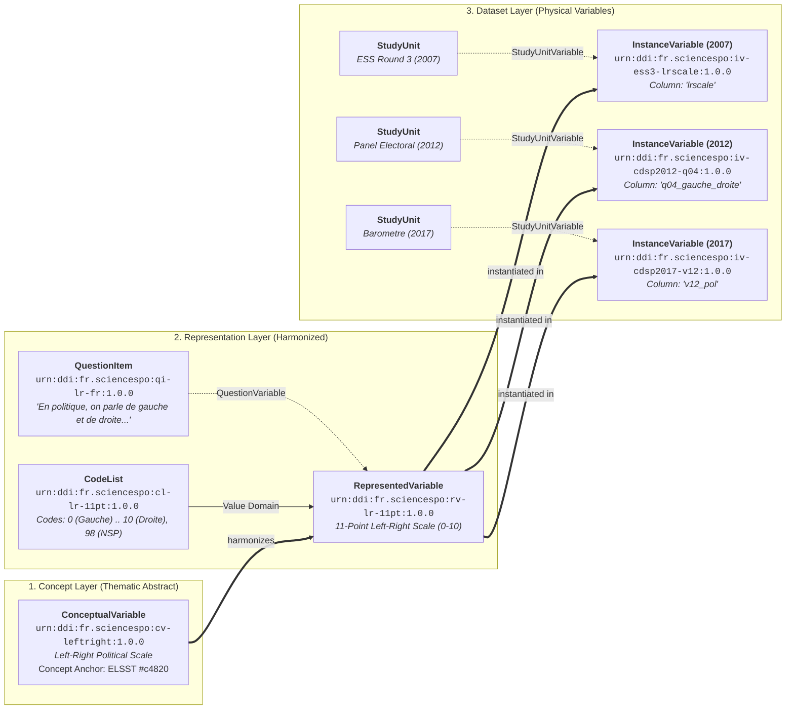

# FAIRwDDI Database Schema — Complete Mermaid Diagrams

> **Companion Sidecar Document** to [`database.md`](file:///Users/pascal/git-plgah/fairwddi-lifecycle/deliverables/research/database.md)  
> **Interactive Explorer:** [`database_explorer.html`](file:///Users/pascal/git-plgah/fairwddi-lifecycle/deliverables/research/database_explorer.html)  
> **Raw Mermaid File:** [`database_diagram.mmd`](file:///Users/pascal/git-plgah/fairwddi-lifecycle/deliverables/research/database_diagram.mmd)

---

## 1. Full Layered Architecture & Cascade Graph

This comprehensive architecture diagram illustrates all 24 entities across the six decoupled layers of the FAIRwDDI database, including the **DDI Variable Cascade** (`ConceptualVariable → RepresentedVariable → InstanceVariable`), scheme encapsulation, response structures, and ingestion infrastructure.

```mermaid
graph TD
    %% Styling Classes
    classDef orgLayer fill:#3b82f6,stroke:#1d4ed8,stroke-width:2px,color:#ffffff;
    classDef conceptLayer fill:#8b5cf6,stroke:#6d28d9,stroke-width:2px,color:#ffffff;
    classDef repLayer fill:#10b981,stroke:#047857,stroke-width:2px,color:#ffffff;
    classDef datasetLayer fill:#f59e0b,stroke:#d97706,stroke-width:2px,color:#ffffff;
    classDef infraLayer fill:#64748b,stroke:#334155,stroke-width:2px,color:#ffffff;
    classDef junction fill:#0ea5e9,stroke:#0284c7,stroke-width:1.5px,color:#ffffff,stroke-dasharray: 4 2;

    %% 1. Organization Layer
    subgraph Organization_Layer ["1. Organization & Grouping Layer"]
        Org["<b>Organization</b><br/><code>urn (PK)</code><br/><i>Archive, Distributor, Funder</i>"]:::orgLayer
        Grp["<b>Group</b><br/><code>urn (PK)</code><br/><i>Study Series, Panel, Thematic</i>"]:::orgLayer
    end

    %% 2. Concept Layer
    subgraph Concept_Layer ["2. Concept Layer (Thesauri & Concepts)"]
        CS["<b>ConceptScheme</b><br/><code>urn (PK)</code>"]:::conceptLayer
        C["<b>Concept</b><br/><code>urn (PK)</code><br/><i>SKOS / ELSST Concept</i>"]:::conceptLayer
        CVS["<b>ConceptualVariableScheme</b><br/><code>urn (PK)</code>"]:::conceptLayer
        CV["<b>ConceptualVariable</b><br/><code>urn (PK)</code><br/><i>Cascade Tier 1 (Abstract Concept)</i>"]:::conceptLayer
        SR["<b>SemanticRelationship</b><br/><code>id (PK)</code><br/><i>RDF Triple Mappings</i>"]:::conceptLayer

        CS -->|contains| C
        C -->|broader / narrower| C
        CVS -->|contains| CV
        C -->|semantic anchor| CV
        C -.->|subject / object| SR
        CV -.->|subject / object| SR
    end

    %% 3. Representation Layer
    subgraph Representation_Layer ["3. Representation & Instrument Layer"]
        subgraph Response_Domain ["Response Structures"]
            CatS["<b>CategoryScheme</b><br/><code>urn (PK)</code>"]:::repLayer
            Cat["<b>Category</b><br/><code>urn (PK)</code><br/><i>Text Label</i>"]:::repLayer
            CL["<b>CodeList</b><br/><code>urn (PK)</code><br/><i>Code Structure</i>"]:::repLayer
            Code["<b>Code</b><br/><code>urn (PK)</code><br/><i>Value Junction</i>"]:::repLayer

            CatS -->|contains| Cat
            Cat -->|parent hierarchy| Cat
            CatS -.->|scheme| CL
            CL -->|contains| Code
            Cat -->|labels| Code
            Code -->|parent hierarchy| Code
            C -.->|categorizes| Cat
        end

        subgraph Questions_RepresentedVars ["Questions & Harmonized Variables"]
            QS["<b>QuestionScheme</b><br/><code>urn (PK)</code>"]:::repLayer
            QI["<b>QuestionItem</b><br/><code>urn (PK)</code><br/><i>Literal Text & Domain</i>"]:::repLayer
            RVS["<b>RepresentedVariableScheme</b><br/><code>urn (PK)</code>"]:::repLayer
            RV["<b>RepresentedVariable</b><br/><code>urn (PK)</code><br/><i>Cascade Tier 2 (Harmonized)</i>"]:::repLayer
            QV["<b>QuestionVariable</b><br/><code>id (PK)</code>"]:::junction

            QS -->|contains| QI
            RVS -->|contains| RV
            QI -->|associates| QV
            RV -->|binds| QV
            CL -.->|response domain| QI
            CL -->|value representation| RV
        end

        subgraph Instruments ["Questionnaires & Flow"]
            Inst["<b>Instrument</b><br/><code>urn (PK)</code><br/><i>Questionnaire</i>"]:::repLayer
            IQ["<b>InstrumentQuestion</b><br/><code>id (PK)</code>"]:::junction

            Inst -->|contains| IQ
            QI -->|ordered item| IQ
        end
    end

    %% 4. Dataset Layer
    subgraph Dataset_Layer ["4. Dataset Layer (Physical Survey Waves & Columns)"]
        SU["<b>StudyUnit</b><br/><code>urn (PK)</code><br/><i>Survey Wave / Dataset</i>"]:::datasetLayer
        IVS["<b>InstanceVariableScheme</b><br/><code>urn (PK)</code>"]:::datasetLayer
        IV["<b>InstanceVariable</b><br/><code>urn (PK)</code><br/><i>Cascade Tier 3 (Physical Column)</i>"]:::datasetLayer
        SUV["<b>StudyUnitVariable</b><br/><code>id (PK)</code>"]:::junction

        IVS -->|contains| IV
        SU -->|contains| SUV
        IV -->|column binding| SUV
        Grp -.->|polymorphic reference| SU
    end

    %% Variable Cascade Connections
    CV ==>|Harmonizes Concept| RV
    RV ==>|Instantiated In Column| IV

    %% 5. Infrastructure & Staging Layer
    subgraph Infrastructure_Layer ["5. Infrastructure, Staging & Ingestion Layer"]
        StagedImp["<b>StagedImport</b><br/><code>id (PK)</code><br/><i>Batch Ingestion Job</i>"]:::infraLayer
        StagedNode["<b>StagedResourceNode</b><br/><code>id (PK)</code><br/><i>Extracted Raw Node</i>"]:::infraLayer
        UrnReg["<b>UrnRegistry</b><br/><code>urn (PK)</code><br/><i>Universal Type Crosswalk</i>"]:::infraLayer
        UrnAlias["<b>URNAlias</b><br/><code>id (PK)</code><br/><i>Alias -> Canonical Map</i>"]:::infraLayer
        MetaQuar["<b>MetadataQuarantine</b><br/><code>id (PK)</code><br/><i>Archivist Drift Review</i>"]:::infraLayer

        StagedImp -->|parses to| StagedNode
        StagedNode -.->|resolves canonical| UrnReg
        StagedNode -.->|links external URN| UrnAlias
        StagedNode -.->|flags collision/drift| MetaQuar
    end

    %% 6. Audit Layer
    subgraph Audit_Layer ["6. Event & Audit Layer"]
        EvLog["<b>EventLog</b><br/><code>id (PK)</code><br/><i>Append-only Lifecycle Audit</i>"]:::infraLayer
    end

    %% Audit Log associations
    Org -.->|logged| EvLog
    QI -.->|logged| EvLog
    RV -.->|logged| EvLog
    IV -.->|logged| EvLog
    MetaQuar -.->|logged| EvLog
```

---

## 2. Complete Entity-Relationship (ER) Diagram

```mermaid
erDiagram
    Organization {
        string urn PK
        jsonb name
        string organization_type
        jsonb extended_attributes
        jsonb hashes
        timestamp created_at
        timestamp updated_at
    }

    Group {
        string urn PK
        jsonb name
        jsonb description
        string group_type
        jsonb references
        jsonb extended_attributes
        jsonb hashes
        timestamp created_at
        timestamp updated_at
    }

    ConceptScheme {
        string urn PK
        jsonb name
        jsonb description
        jsonb extended_attributes
        timestamp created_at
        timestamp updated_at
    }

    Concept {
        string urn PK
        string scheme_urn FK
        string uri
        string vocabulary
        string notation
        jsonb label
        jsonb description
        jsonb definition
        string parent_urn FK
        string concept_type
        jsonb extended_attributes
        jsonb hashes
        timestamp created_at
        timestamp updated_at
    }

    ConceptualVariableScheme {
        string urn PK
        jsonb name
        jsonb description
        jsonb extended_attributes
        timestamp created_at
        timestamp updated_at
    }

    ConceptualVariable {
        string urn PK
        string scheme_urn FK
        string concept_urn FK
        jsonb name
        jsonb label
        jsonb description
        jsonb extended_attributes
        jsonb hashes
        timestamp created_at
        timestamp updated_at
    }

    SemanticRelationship {
        bigint id PK
        string subject_type
        string subject_urn
        string predicate
        string object_type
        string object_urn
        jsonb extended_attributes
        timestamp created_at
        timestamp updated_at
    }

    CategoryScheme {
        string urn PK
        jsonb name
        jsonb description
        jsonb extended_attributes
        timestamp created_at
        timestamp updated_at
    }

    Category {
        string urn PK
        string scheme_urn FK
        string concept_urn FK
        string parent_urn FK
        jsonb name
        jsonb label
        integer order
        boolean is_missing
        jsonb extended_attributes
        jsonb hashes
        timestamp created_at
        timestamp updated_at
    }

    CodeList {
        string urn PK
        string scheme_urn FK
        jsonb name
        jsonb description
        jsonb extended_attributes
        jsonb hashes
        timestamp created_at
        timestamp updated_at
    }

    Code {
        string urn PK
        string code_list_urn FK
        string category_urn FK
        string parent_urn FK
        string code_value
        integer order
        boolean is_missing
        jsonb extended_attributes
        jsonb hashes
        timestamp created_at
        timestamp updated_at
    }

    QuestionScheme {
        string urn PK
        jsonb name
        jsonb description
        jsonb extended_attributes
        timestamp created_at
        timestamp updated_at
    }

    QuestionItem {
        string urn PK
        string scheme_urn FK
        string code_list_urn FK
        jsonb response_domain
        jsonb name
        jsonb question_text
        jsonb extended_attributes
        jsonb hashes
        timestamp created_at
        timestamp updated_at
    }

    RepresentedVariableScheme {
        string urn PK
        jsonb name
        jsonb description
        jsonb extended_attributes
        timestamp created_at
        timestamp updated_at
    }

    RepresentedVariable {
        string urn PK
        string scheme_urn FK
        string conceptual_variable_urn FK
        string code_list_urn FK
        jsonb value_representation
        jsonb name
        jsonb label
        jsonb description
        jsonb extended_attributes
        jsonb hashes
        timestamp created_at
        timestamp updated_at
    }

    QuestionVariable {
        bigint id PK
        string question_item_urn FK
        string represented_variable_urn FK
        string path
        integer order
        timestamp created_at
        timestamp updated_at
    }

    Instrument {
        string urn PK
        jsonb name
        jsonb label
        jsonb description
        jsonb extended_attributes
        jsonb hashes
        timestamp created_at
        timestamp updated_at
    }

    InstrumentQuestion {
        bigint id PK
        string instrument_urn FK
        string question_item_urn FK
        string path
        integer order
        timestamp created_at
        timestamp updated_at
    }

    StudyUnit {
        string urn PK
        jsonb name
        jsonb title
        string external_ref
        integer year
        jsonb description
        jsonb extended_attributes
        jsonb hashes
        timestamp created_at
        timestamp updated_at
    }

    InstanceVariableScheme {
        string urn PK
        jsonb name
        jsonb description
        jsonb extended_attributes
        timestamp created_at
        timestamp updated_at
    }

    InstanceVariable {
        string urn PK
        string scheme_urn FK
        string represented_variable_urn FK
        jsonb name
        jsonb label
        jsonb description
        jsonb extended_attributes
        jsonb hashes
        timestamp created_at
        timestamp updated_at
    }

    StudyUnitVariable {
        bigint id PK
        string study_unit_urn FK
        string instance_variable_urn FK
        string path
        integer order
        timestamp created_at
        timestamp updated_at
    }

    UrnRegistry {
        string urn PK
        string resource_type
        jsonb extended_attributes
        timestamp created_at
        timestamp updated_at
    }

    URNAlias {
        bigint id PK
        string alias_urn
        string canonical_urn
        string entity_type
        string hash_strategy
        string source_file
        timestamp created_at
    }

    MetadataQuarantine {
        bigint id PK
        string incoming_urn
        string existing_urn
        string entity_type
        jsonb incoming_content
        string existing_content_hash
        string incoming_content_hash
        string conflict_type
        string resolution
        string resolved_by
        timestamp resolved_at
        string source_file
        string import_task_id
        timestamp created_at
    }

    StagedImport {
        bigint id PK
        string source_format
        string file_name
        string file_path
        jsonb import_options
        integer total_resources
        integer processed_resources
        string status
        string import_task_id
        timestamp created_at
        timestamp processed_at
    }

    StagedResourceNode {
        bigint id PK
        bigint staged_import_id FK
        string resource_type
        string raw_urn
        jsonb raw_value
        string canonical_urn
        string status
        timestamp created_at
    }

    %% Relationships
    ConceptScheme ||--o{ Concept : "contains"
    Concept ||--o{ Concept : "hierarchy"
    ConceptualVariableScheme ||--o{ ConceptualVariable : "contains"
    Concept ||--o{ ConceptualVariable : "anchors"

    CategoryScheme ||--o{ Category : "contains"
    Category ||--o{ Category : "hierarchy"
    Concept ||--o{ Category : "categorizes"
    CategoryScheme ||--o{ CodeList : "contains"
    CodeList ||--o{ Code : "contains"
    Category ||--o{ Code : "labels"
    Code ||--o{ Code : "hierarchy"

    QuestionScheme ||--o{ QuestionItem : "contains"
    CodeList ||--o{ QuestionItem : "response_domain"
    RepresentedVariableScheme ||--o{ RepresentedVariable : "contains"
    ConceptualVariable ||--o{ RepresentedVariable : "harmonizes"
    CodeList ||--o{ RepresentedVariable : "value_rep"
    QuestionItem ||--o{ QuestionVariable : "associates"
    RepresentedVariable ||--o{ QuestionVariable : "binds"

    Instrument ||--o{ InstrumentQuestion : "flows"
    QuestionItem ||--o{ InstrumentQuestion : "sequences"

    InstanceVariableScheme ||--o{ InstanceVariable : "contains"
    RepresentedVariable ||--o{ InstanceVariable : "instantiates"
    StudyUnit ||--o{ StudyUnitVariable : "contains"
    InstanceVariable ||--o{ StudyUnitVariable : "binds"

    %% Supertype & Infrastructure
    UrnRegistry ||--o{ URNAlias : "canonical_urn"
    UrnRegistry ||--o{ SemanticRelationship : "triples"
    UrnRegistry ||--o{ EventLog : "logged_for"
    StagedImport ||--o{ StagedResourceNode : "extracts"
```

---

## 3. The DDI Variable Cascade Walkthrough

