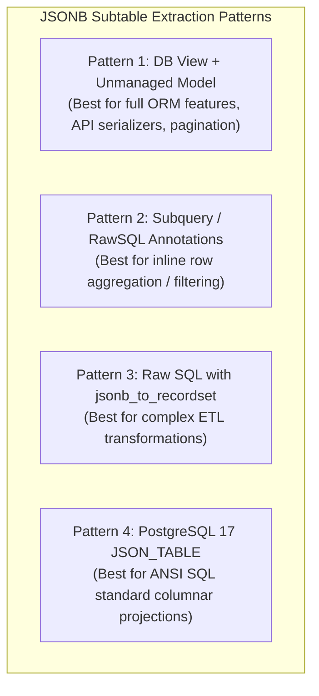
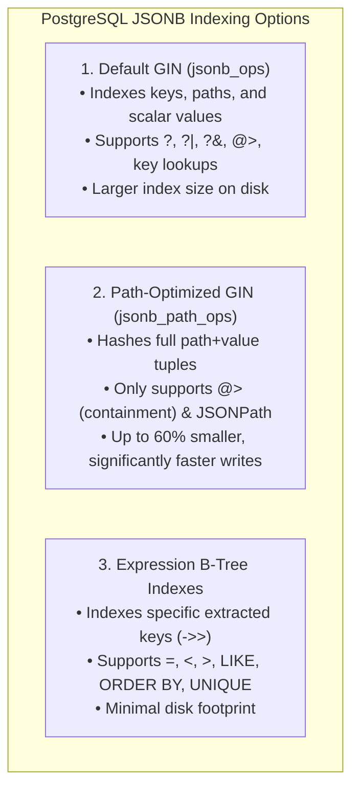
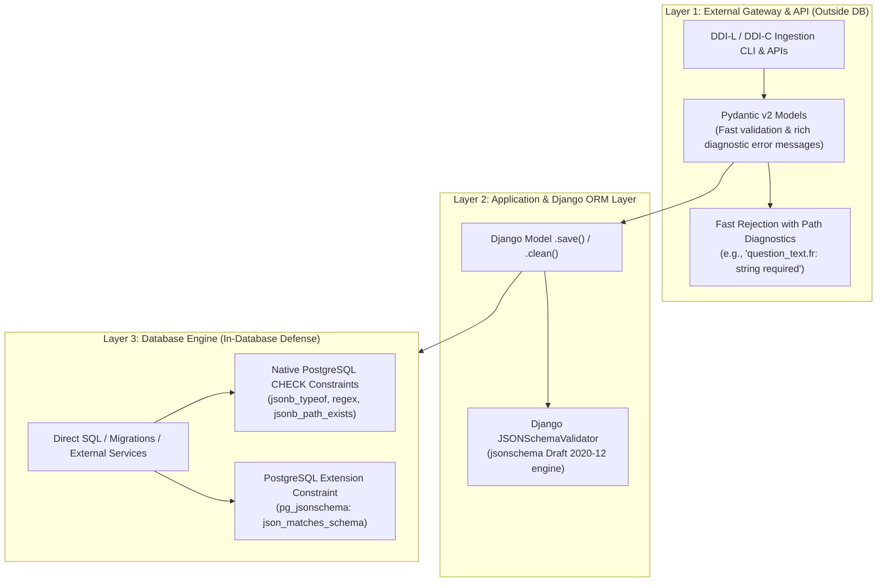
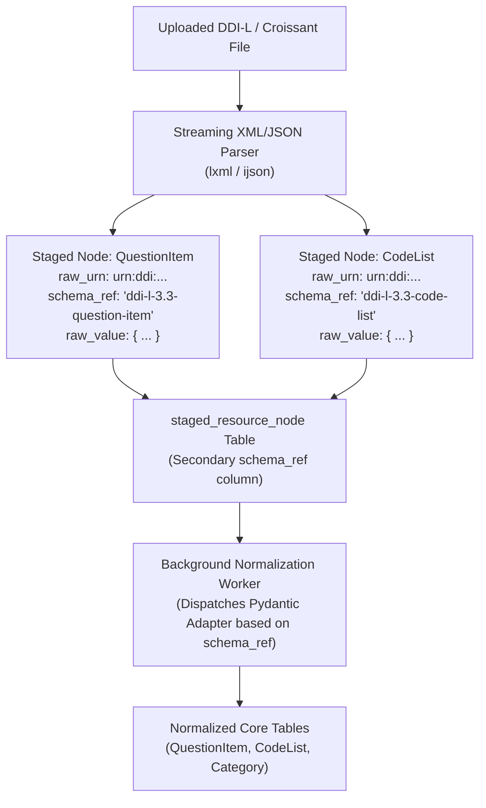

# PostgreSQL & Django JSONB Architecture, Expressions & Subtable Querying

> **Project:** FAIRwDDI WP3 ST3 — Implementation of DDI Architecture for ReQuest  
> **Status:** In-Depth Research Specification Deliverable  
> **Target Environment:** PostgreSQL ≥ 17 (psycopg v3) / Django ≥ 5.1 / Python 3.12+  
> **Document Reference:** `deliverables/research/postgres_django_json.md`

---

## 1. Executive Summary & Context

In modern metadata architectures like the **CDSP ReQuest** standard-agnostic DDI platform (DDI 4 / DDI-CDI / DDI-Lifecycle 3.3), traditional relational schemas frequently collide with semi-structured and polymorphic requirements:
- **Multilingual Content:** Entities such as `QuestionItem`, `Category`, `StudyUnit`, and `ConceptualVariable` require arbitrary language translations (`xml:lang` keys e.g., `{"fr": "...", "en": "..."}`).
- **Two-Stage Ingestion Pipeline:** Intermediate, unnormalized DDI-XML, DDI-JSON, Croissant JSON-LD, or Dataverse CSV structures are staged as raw payloads (`StagedResourceNode.raw_value`) before asynchronous normalization.
- **Dynamic Hashes & Integrity Digests:** Multi-algorithm digests (`content_hashes`) require flexible key-value maps (`{"sha256": "...", "short_hex": "..."}`).
- **Extensible Attributes & Provenance:** Non-core study metadata, collector notes, and provenance trails vary widely between data providers.

PostgreSQL's **`JSONB`** (Binary JSON) combined with **Django's `models.JSONField`** and PostgreSQL-specific ORM extensions provides an optimal hybrid document-relational model. It combines the schema flexibility of document stores with the ACID transactions, relational integrity, complex join capability, and indexing power of a relational database.

This document provides an exhaustive reference on:
1. PostgreSQL's internal `JSONB` architecture, operators, functions, and SQL/JSON (JSONPath / `JSON_TABLE`) support.
2. Django ORM capabilities: native field options, lookups, transformations (`KT`), annotations, and query construction.
3. Techniques for querying JSON structures as **relational subtables** (unnesting arrays and object mappings via `jsonb_to_recordset`, `jsonb_each`, unmanaged Django models, and lateral joins).
4. Performance tuning, GIN/B-Tree expression indexing, TOAST compression, and storage optimization.
5. **JSON Schema validation and documentation strategies** (in-database CHECK constraints, `pg_jsonschema`, Pydantic v2, inline vs. secondary column vs. URL registry referencing).
6. Application patterns in the ReQuest standard-agnostic DDI architecture.

---

## 2. PostgreSQL JSON Architecture: `json` vs. `jsonb`

PostgreSQL offers two native data types for storing JSON data: `json` and `jsonb`.

```mermaid
flowchart TD
    subgraph RawInput ["Client JSON Input"]
        Raw["{\"fr\": \"Vote\", \"en\": \"Vote\"}"]
    end

    subgraph JsonType ["type: json (Textual JSON)"]
        Raw --> StoreExact["Stored as exact text copy\n(Preserves whitespace, duplicate keys, key order)"]
        StoreExact --> ParseOnRead["Parsed on every query / read operation\n(Slower execution, no GIN indexing)"]
    end

    subgraph JsonbType ["type: jsonb (Decomposed Binary Format)"]
        Raw --> ParseOnWrite["Parsed on INSERT/UPDATE\n(Strikes whitespace, deduplicates keys, sorts keys)"]
        ParseOnWrite --> BinaryStorage["Stored in decomposed binary format\n(Fast random access, GIN/JSONPath indexing)"]
    end
```

### 2.1 Technical Comparison

| Dimension | `json` | `jsonb` (Standard in FAIRwDDI) |
| :--- | :--- | :--- |
| **Storage Format** | Exact textual representation | Decomposed binary format (`jsonb`) |
| **Write Performance** | Faster (minimal parsing overhead) | Slightly slower on write (full syntax validation & binary encoding) |
| **Read Performance** | Slower (re-parsed on every execution) | **Significantly faster** (direct key/index lookups without re-parsing) |
| **Whitespace & Formatting**| Preserved exactly | Stripped (normalized) |
| **Key Ordering** | Preserved as entered | Sorted internally (canonical ordering) |
| **Duplicate Keys** | Preserved (last key wins semantically) | Deduplicated at write (last key value kept) |
| **Indexing** | Only functional B-Tree indexes on expressions | **Full GIN Indexing**, `jsonb_path_ops`, B-Tree on extracted keys |
| **Operators & Containment**| Basic extraction only (`->`, `->>`) | **Full operator suite** (`@>`, `<@`, `?`, `?|`, `?&`, `#>`, `jsonb_path_*`) |

> [!IMPORTANT]
> In FAIRwDDI, **always use `jsonb`**. Django's `models.JSONField` automatically maps to `jsonb` on PostgreSQL backends.

---

## 3. PostgreSQL JSONB Operators & Functions Reference

### 3.1 Extraction Operators

| Operator | Left Type | Right Type | Return Type | Description | Example |
| :--- | :--- | :--- | :--- | :--- | :--- |
| `->` | `jsonb` | `text` | `jsonb` | Extract JSON sub-object by key | `question_text -> 'fr'` |
| `->` | `jsonb` | `integer` | `jsonb` | Extract JSON array element (0-indexed, negative values count from end) | `tags -> 0` |
| `->>` | `jsonb` | `text` | `text` | Extract JSON value as plain SQL `text` | `question_text ->> 'fr'` |
| `->>` | `jsonb` | `integer` | `text` | Extract array element as plain SQL `text` | `tags ->> 0` |
| `#>` | `jsonb` | `text[]` | `jsonb` | Extract nested sub-object at specified path | `metadata #> '{collector, org}'` |
| `#>>` | `jsonb` | `text[]` | `text` | Extract nested sub-object as plain `text` | `metadata #>> '{collector, org}'` |

### 3.2 Containment, Existence & Matching Operators

| Operator | Left Type | Right Type | Return Type | Description | Indexable via GIN |
| :--- | :--- | :--- | :--- | :--- | :---: |
| `@>` | `jsonb` | `jsonb` | `boolean` | Does left JSONB contain right JSONB? | **Yes** |
| `<@` | `jsonb` | `jsonb` | `boolean` | Is left JSONB contained within right JSONB? | **Yes** |
| `?` | `jsonb` | `text` | `boolean` | Does the top-level string key exist? | **Yes** |
| `?\|` | `jsonb` | `text[]` | `boolean` | Do *any* of the array string keys exist? | **Yes** |
| `?&` | `jsonb` | `text[]` | `boolean` | Do *all* of the array string keys exist? | **Yes** |
| `@?` | `jsonb` | `jsonpath` | `boolean` | Does JSONPath return any item? (PostgreSQL 12+) | **Yes** |
| `@@` | `jsonb` | `jsonpath` | `boolean` | Does JSONPath predicate evaluate to true? | **Yes** |

### 3.3 Mutation, Modification & Concatenation

| Function / Operator | Signature | Description |
| :--- | :--- | :--- |
| `\|\|` | `(jsonb, jsonb) -> jsonb` | Concatenates/merges two JSONB objects (shallow merge). |
| `-` | `(jsonb, text) -> jsonb` | Deletes a key from a JSONB object (or string element from array). |
| `-` | `(jsonb, integer) -> jsonb` | Deletes an array element by index. |
| `#-` | `(jsonb, text[]) -> jsonb` | Deletes the field or array element at the specified path. |
| `jsonb_set()` | `(target jsonb, path text[], new_value jsonb, create_if_missing boolean)` | Updates or inserts a value at a specified path. |
| `jsonb_insert()` | `(target jsonb, path text[], new_value jsonb, insert_after boolean)` | Inserts a new element into an array at a path. |
| `jsonb_strip_nulls()` | `(jsonb) -> jsonb` | Recursively removes all object fields whose values are JSON `null`. |

### 3.4 Table-Valued & Unnesting Functions (Subtables)

PostgreSQL includes specialized set-returning functions to transform JSONB structures into relational rows and columns:

```sql
-- 1. Unnest array of scalar elements
SELECT * FROM jsonb_array_elements_text('["fr", "en", "de"]'::jsonb);

-- 2. Unnest key/value dictionary into rows
SELECT key, value FROM jsonb_each('{"fr": "Bonjour", "en": "Hello"}'::jsonb);

-- 3. Decompose array of JSON objects into structured tabular columns
SELECT * FROM jsonb_to_recordset(
    '[{"code": 1, "label": "Oui"}, {"code": 2, "label": "Non"}]'::jsonb
) AS (code int, label text);
```

---

## 4. PostgreSQL SQL/JSON Path & `JSON_TABLE` (PostgreSQL 12–17+)

Modern PostgreSQL implements the ISO/IEC 9075-2 (SQL:2016) standard for JSON querying.

### 4.1 JSONPath Expressions

JSONPath expressions specify paths through JSON structures with filtering and projection predicates:

```sql
-- Check if any category has code > 5
SELECT jsonb_path_exists(
    metadata, 
    '$.categories[*] ? (@.code > 5)'
) FROM question_item;

-- Extract matching elements directly
SELECT jsonb_path_query(
    metadata, 
    '$.categories[*] ? (@.code > 5).label'
) FROM question_item;
```

### 4.2 Native `JSON_TABLE` (PostgreSQL 17+)

PostgreSQL 17 introduces the standard `JSON_TABLE` function, allowing declarative tabular transformation of JSONB payloads:

```sql
SELECT q.id, jt.code, jt.label, jt.is_missing
FROM question_item q,
JSON_TABLE(
    q.metadata,
    '$.categories[*]'
    COLUMNS (
        code INT PATH '$.code',
        label TEXT PATH '$.label',
        is_missing BOOLEAN PATH '$.missing' DEFAULT 'false' ON EMPTY
    )
) AS jt;
```

---

## 5. Django ORM Support for PostgreSQL JSONB

### 5.1 Model Definition & Field Configuration

Django's `django.db.models.JSONField` provides seamless serialization, deserialization, and schema generation for PostgreSQL `jsonb`:

```python
from django.db import models
from django.core.serializers.json import DjangoJSONEncoder
from django.contrib.postgres.indexes import GinIndex

class StagedResourceNode(models.Model):
    urn = models.CharField(max_length=255, unique=True)
    raw_urn = models.CharField(max_length=255)
    # JSONB field storing parsed, unnormalized intermediate representation
    raw_value = models.JSONField(
        default=dict,
        encoder=DjangoJSONEncoder, # Supports UUIDs, Decimals, Dates
        blank=True
    )
    # Multi-algorithm content hashes
    content_hashes = models.JSONField(default=dict, blank=True)

    class Meta:
        db_table = "staged_resource_node"
        indexes = [
            # Standard GIN index for keys and paths
            GinIndex(fields=["raw_value"], name="idx_staged_node_raw_gin"),
            # Optimized GIN index for @> containment queries
            GinIndex(fields=["content_hashes"], opclasses=["jsonb_path_ops"], name="idx_staged_node_hashes_gin"),
        ]
```

---

## 6. Querying JSON Expressions in Django ORM

Django translates double-underscore `__` path syntax into PostgreSQL JSON operators automatically.

### 6.1 Basic & Nested Key Lookups

```python
# PostgreSQL: (raw_value -> 'agency' ->> 'id') = 'fr.cdsp'
nodes = StagedResourceNode.objects.filter(raw_value__agency__id="fr.cdsp")

# PostgreSQL: (raw_value -> 'languages' -> 0) = '"fr"'
french_first = StagedResourceNode.objects.filter(raw_value__languages__0="fr")
```

### 6.2 Standard Lookups on JSON Values

Any standard Django field lookup can be chained to the end of a JSON path:

```python
# Case-insensitive substring match
StagedResourceNode.objects.filter(raw_value__label__fr__icontains="politique")

# Regex pattern match on nested JSON value
StagedResourceNode.objects.filter(raw_value__identifier__regex=r"^Q\d{2,4}$")

# Numeric comparisons
StagedResourceNode.objects.filter(raw_value__question_order__gte=10)

# Null / existence check on specific key
StagedResourceNode.objects.filter(raw_value__interview_instructions__isnull=False)
```

### 6.3 PostgreSQL-Specific JSON Lookups

Django provides dedicated lookups for PostgreSQL's containment and key-testing operators:

```python
# 1. Contains (@>): checks if a JSON object or array subset exists inside the field
StagedResourceNode.objects.filter(
    content_hashes__contains={"sha256": "e7f2b1c4a9d8e5b2"}
)

# 2. Contained By (<@): checks if field is a subset of the target object
StagedResourceNode.objects.filter(
    raw_value__languages__contained_by=["fr", "en", "de", "es"]
)

# 3. Has Key (?): checks if a top-level key exists
StagedResourceNode.objects.filter(raw_value__has_key="pre_question_text")

# 4. Has Keys (?&): checks if ALL specified keys exist
StagedResourceNode.objects.filter(raw_value__has_keys=["fr", "en"])

# 5. Has Any Keys (?|): checks if AT LEAST ONE key exists
StagedResourceNode.objects.filter(raw_value__has_any_keys=["instructions", "interviewer_guidance"])
```

### 6.4 Key Transformations (`KT`), `F` Expressions & Database Functions

Django 5.0+ allows transforming JSON keys into first-class query expressions using `KT` or `F` for sorting, grouping, and function composition:

```python
from django.db.models import F, Value, CharField
from django.db.models.fields.json import KT
from django.db.models.functions import Lower, Coalesce, Concat

# Extract JSON key as text for sorting and formatting
qs = StagedResourceNode.objects.annotate(
    label_fr=KT("raw_value__label__fr"),
    label_en=KT("raw_value__label__en"),
    # Language fallback: use French if available, otherwise English, otherwise 'Untitled'
    effective_label=Coalesce(
        KT("raw_value__label__fr"),
        KT("raw_value__label__en"),
        Value("Sans titre"),
        output_field=CharField()
    )
).filter(
    # Case-insensitive filtering on annotated text
    effective_label__icontains="élection"
).order_by("effective_label")
```

### 6.5 Custom Database Functions for SQL/JSON Path Operations

You can create custom Django `Func` subclasses to invoke any PostgreSQL JSON function:

```python
from django.db.models import Func, Value, BooleanField, JSONField as DjangoJSONField

class JsonbPathExists(Func):
    """PostgreSQL jsonb_path_exists(target, path) -> boolean"""
    function = 'jsonb_path_exists'
    output_field = BooleanField()

class JsonbPathQuery(Func):
    """PostgreSQL jsonb_path_query(target, path) -> jsonb"""
    function = 'jsonb_path_query'
    output_field = DjangoJSONField()

class JsonbSet(Func):
    """PostgreSQL jsonb_set(target, path, new_value, create_missing) -> jsonb"""
    function = 'jsonb_set'
    output_field = DjangoJSONField()

# Usage in QuerySets:
nodes = StagedResourceNode.objects.annotate(
    has_valid_item=JsonbPathExists(
        F('raw_value'), 
        Value('$.categories[*] ? (@.code >= 1 && @.code <= 10)')
    )
).filter(has_valid_item=True)
```

---

## 7. Querying JSONB as Relational Subtables in Django

When JSONB fields store nested collections (such as arrays of response choices, interviewer instructions, or translation tables), developers often need to query, join, and paginate them as if they were standalone database tables.

Here are the **four standard patterns** for achieving this in Django and PostgreSQL.



---

### Pattern 1: Database View + Unmanaged Django Model (*Recommended for ReQuest*)

This is the cleanest architectural pattern. A PostgreSQL view expands the JSONB array or key-value map using `LATERAL` set-returning functions. An unmanaged Django model (`managed = False`) maps to this view, allowing standard Django ORM querying, filtering, ordering, pagination, and `django-ninja` / DRF serialization.

#### Step 1: Create the PostgreSQL View in a Django Migration

```python
# migrations/0002_create_json_subtable_views.py
from django.db import migrations

CREATE_VIEW_SQL = """
CREATE OR REPLACE VIEW v_question_response_categories AS
SELECT
    q.id AS question_id,
    q.urn AS question_urn,
    (elem.value->>'code')::INT AS code,
    elem.value->'label' AS label_multilingual,
    elem.value->'label'->>'fr' AS label_fr,
    elem.value->'label'->>'en' AS label_en,
    COALESCE((elem.value->>'missing')::BOOLEAN, FALSE) AS is_missing,
    elem.ordinality AS sort_order
FROM question_item q
CROSS JOIN LATERAL jsonb_array_elements(q.metadata->'categories') WITH ORDINALITY AS elem;
"""

DROP_VIEW_SQL = "DROP VIEW IF EXISTS v_question_response_categories CASCADE;"

class Migration(migrations.Migration):
    dependencies = [("core", "0001_initial")]
    operations = [
        migrations.RunSQL(sql=CREATE_VIEW_SQL, reverse_sql=DROP_VIEW_SQL)
    ]
```

#### Step 2: Define the Unmanaged Django Model

```python
class QuestionResponseCategory(models.Model):
    # Composite or synthetic primary key mapping
    id = models.BigAutoField(primary_key=True)
    question = models.ForeignKey(
        'QuestionItem', 
        on_delete=models.DO_NOTHING, 
        db_column='question_id',
        related_name='expanded_categories'
    )
    question_urn = models.CharField(max_length=255)
    code = models.IntegerField()
    label_multilingual = models.JSONField()
    label_fr = models.TextField(null=True, blank=True)
    label_en = models.TextField(null=True, blank=True)
    is_missing = models.BooleanField(default=False)
    sort_order = models.IntegerField()

    class Meta:
        managed = False
        db_table = "v_question_response_categories"
        ordering = ["question", "sort_order"]
```

#### Step 3: Query with 100% Native Django ORM

```python
# Filter unnested rows directly
categories = QuestionResponseCategory.objects.filter(
    label_fr__icontains="satisfait",
    is_missing=False
).select_related("question")

# Aggregate across unnested JSON elements
from django.db.models import Count
stats = QuestionResponseCategory.objects.values("code").annotate(
    usage_count=Count("id")
).order_by("-usage_count")
```

---

### Pattern 2: `Subquery` and `RawSQL` Inline Annotations

If you need to unnest elements dynamically without creating a database view, use correlated subqueries or `RawSQL`:

```python
from django.db.models.expressions import RawSQL

# Annotate each QuestionItem with an array of category codes extracted from JSONB
questions_with_codes = QuestionItem.objects.annotate(
    valid_codes=RawSQL(
        """
        SELECT array_agg((elem->>'code')::int)
        FROM jsonb_array_elements(metadata->'categories') AS elem
        WHERE (elem->>'missing')::boolean IS NOT TRUE
        """,
        ()
    )
).filter(valid_codes__contains=[1])
```

---

### Pattern 3: Raw SQL Execution with `jsonb_to_recordset`

For complex reporting or batch ETL tasks, execute SQL with `jsonb_to_recordset` directly:

```python
from core.models import QuestionItem

query = """
    SELECT 
        q.id AS id,
        q.urn AS urn,
        r.code AS code,
        r.label AS label
    FROM question_item q,
    LATERAL jsonb_to_recordset(q.metadata->'categories') AS r(
        code INT, 
        label TEXT
    )
    WHERE r.code = %s
"""

# Returns QuestionItem model instances populated with extra dynamic fields
results = QuestionItem.objects.raw(query, [99])
for item in results:
    print(item.urn, item.code, item.label)
```

---

### Pattern 4: Key-Value Expansion via `jsonb_each()`

To unnest multilingual key-value dictionaries (e.g., `{"fr": "Texte", "en": "Text", "de": "Text"}`) into separate rows:

```sql
SELECT 
    q.urn,
    lang.key AS language_code,
    lang.value #>> '{}' AS localized_text
FROM question_item q
CROSS JOIN LATERAL jsonb_each(q.question_text) AS lang;
```

---

## 8. Indexing Strategies & Performance Tuning

JSONB columns require deliberate indexing strategies to maintain sub-millisecond query performance at scale (e.g. CDSP's 65,000+ variables).



### 8.1 Default GIN (`jsonb_ops`) vs. Fast GIN (`jsonb_path_ops`)

| Feature | `jsonb_ops` (Django Default) | `jsonb_path_ops` |
| :--- | :--- | :--- |
| **Indexed Structure** | Separate entries for every key, path, and value | Single hash entry for each complete path + value |
| **Supported Operators** | `?`, `?|`, `?&`, `@>`, `<@`, `@?`, `@@` | `@>`, `@?`, `@@` (Containment & JSONPath only) |
| **Index Size** | Large | **Small (40–60% reduction)** |
| **Build & Insert Speed** | Moderate | **Fast** |
| **Best For** | Dynamic key existence checks (`has_key`) | Large JSON documents queried via containment (`@>`) |

#### Django Index Declaration:
```python
from django.contrib.postgres.indexes import GinIndex

class Meta:
    indexes = [
        # Optimized for @> containment queries on content hashes
        GinIndex(
            fields=["content_hashes"],
            opclasses=["jsonb_path_ops"],
            name="idx_hashes_path_ops_gin"
        ),
        # Optimized for key existence queries on multilingual fields
        GinIndex(
            fields=["question_text"],
            name="idx_qtext_default_gin"
        ),
    ]
```

### 8.2 Targeted B-Tree Expression Indexes for Specific Keys

For high-frequency filter or sorting paths (e.g. French question text or primary status codes), an expression B-Tree index is far more compact and faster than a full GIN index:

```python
from django.db import models
from django.db.models.fields.json import KT

class QuestionItem(models.Model):
    question_text = models.JSONField(default=dict)
    metadata = models.JSONField(default=dict)

    class Meta:
        indexes = [
            # B-Tree index on French question text for sorting and prefix searching
            models.Index(
                KT("question_text__fr"),
                name="idx_qtext_fr_btree"
            ),
            # B-Tree index on a nested status code with partial filter
            models.Index(
                KT("metadata__status"),
                name="idx_active_items_btree",
                condition=models.Q(metadata__status="ACTIVE")
            ),
        ]
```

In raw PostgreSQL DDL:
```sql
CREATE INDEX idx_qtext_fr_btree ON question_item (((question_text->>'fr')));
CREATE INDEX idx_active_items_btree ON question_item (((metadata->>'status'))) WHERE (metadata->>'status') = 'ACTIVE';
```

### 8.3 TOAST Storage and Compression (PostgreSQL 14–17+)

Large JSONB payloads (>2 KB) are automatically moved out-of-line into PostgreSQL's **TOAST** (The Oversized-Attribute Storage Technique) table.

```sql
-- Set LZ4 compression for JSONB columns in PostgreSQL 14+ for faster decompression
ALTER TABLE staged_resource_node ALTER COLUMN raw_value SET COMPRESSION lz4;

-- Keep frequently queried small JSONB inline if desired
ALTER TABLE question_item ALTER COLUMN question_text SET STORAGE MAIN;
```

---

## 9. JSON Schema for Documentation & Validation (In & Outside Database)

While PostgreSQL `JSONB` provides dynamic schema flexibility, production social-science infrastructures require **strict contract guarantees**, **machine-readable documentation**, and **data-integrity validation**. 

Without validation, JSON fields are susceptible to schema drift, missing required translation keys, malformed data types, and corrupted hash dictionaries. **JSON Schema (Draft 2020-12 / Draft 7)** establishes a shared contract across Python ingestion workers, Django REST/Ninja APIs, OpenAPI documentation, and PostgreSQL storage.



---

### 9.1 Multi-Tier Validation Architecture (Defense-in-Depth)

Validation should follow a **defense-in-depth** strategy where each layer provides appropriate guarantees and error ergonomics:

1. **Ingestion & API Layer (Outside Database):** High-level validation with **Pydantic v2** providing detailed line-and-column diagnostic error reports for human archivists.
2. **Application / ORM Layer (Django):** Model-level and field-level validation via `models.JSONField(validators=[...])` enforcing schema compliance before SQL execution.
3. **Database Layer (In-Database PostgreSQL):** Hard constraints (`CHECK` constraints or triggers) that prevent data corruption from out-of-band SQL migrations, manual DBA scripts, or external ETL workers.

---

### 9.2 In-Database PostgreSQL Validation Strategies

PostgreSQL offers two primary mechanisms for validating JSONB payloads directly inside the database engine: **Native SQL CHECK Constraints** and **JSON Schema Extension Functions**.

#### Strategy A: Native PostgreSQL CHECK Constraints (Zero-Extension Architecture)

Native CHECK constraints use built-in PostgreSQL functions (`jsonb_typeof()`, `jsonb_path_exists()`, key existence operators `?`, and regex matches `~`). This approach requires **zero external C or Rust extensions**, works across all cloud providers (AWS RDS, GCP Cloud SQL, Azure, Neon), and has negligible performance overhead.

##### 1. Multilingual Dictionary Constraint (`question_text`, `category_name`)
Ensures the column is a JSON object, all keys are valid ISO 639-1 language codes (e.g. `fr`, `en`, `de`), and all values are non-empty strings:

```sql
ALTER TABLE question_item 
ADD CONSTRAINT chk_question_text_multilingual_schema 
CHECK (
    -- Must be a JSON Object (not array, scalar, or null)
    jsonb_typeof(question_text) = 'object'
    AND
    -- At least one translation key must exist
    question_text <> '{}'::jsonb
    AND
    -- Every key must match an ISO 639-1 language code regex
    NOT EXISTS (
        SELECT 1 
        FROM jsonb_each(question_text) AS kv
        WHERE kv.key !~ '^[a-z]{2}(-[A-Z]{2})?$' 
           OR jsonb_typeof(kv.value) <> 'string'
           OR length(kv.value #>> '{}') = 0
    )
);
```

##### 2. Content Hash Dictionary Constraint (`content_hashes`)
Ensures `sha256` is present, correctly formatted as a 64-character lowercase hex string, and that auxiliary hashes follow naming rules:

```sql
ALTER TABLE question_item 
ADD CONSTRAINT chk_content_hashes_schema 
CHECK (
    jsonb_typeof(content_hashes) = 'object'
    AND
    -- Required 'sha256' key
    content_hashes ? 'sha256'
    AND
    -- Must be exactly 64 hexadecimal characters
    (content_hashes->>'sha256') ~ '^[0-9a-f]{64}$'
    AND
    -- Optional short_hex must be 16 hex characters if present
    (
        NOT (content_hashes ? 'short_hex') 
        OR (content_hashes->>'short_hex') ~ '^[0-9a-f]{16}$'
    )
);
```

##### 3. Structured Array Constraint (Response Choice List in JSONB)
Ensures `categories` is an array of objects where each item has an integer `code` and a string or object `label`:

```sql
ALTER TABLE code_list 
ADD CONSTRAINT chk_items_array_schema 
CHECK (
    jsonb_typeof(items_json) = 'array'
    AND
    -- Validate all array elements via SQL/JSON path
    NOT EXISTS (
        SELECT 1 
        FROM jsonb_array_elements(items_json) AS elem
        WHERE jsonb_typeof(elem) <> 'object'
           OR NOT (elem ? 'code')
           OR jsonb_typeof(elem->'code') <> 'number'
    )
);
```

---

#### Strategy B: In-Database JSON Schema Extensions (`pg_jsonschema`)

For complex, deeply nested JSON structures where SQL CHECK expressions become unwieldy, PostgreSQL extensions allow validating directly against complete JSON Schema specifications (Draft 2020-12).

##### 1. `pg_jsonschema` (Rust-based C-extension)
`pg_jsonschema` (maintained by Supabase) uses Rust's `jsonschema` crate for compiled, high-speed validation:

```sql
-- Enable extension
CREATE EXTENSION IF NOT EXISTS pg_jsonschema;

-- Define table with JSON Schema CHECK constraint
ALTER TABLE question_item
ADD CONSTRAINT chk_question_schema
CHECK (
    json_matches_schema(
        schema := '{
            "$schema": "https://json-schema.org/draft/2020-12/schema",
            "type": "object",
            "required": ["fr"],
            "properties": {
                "fr": {"type": "string", "minLength": 1},
                "en": {"type": "string", "minLength": 1},
                "de": {"type": "string", "minLength": 1}
            },
            "additionalProperties": false
        }'::jsonb,
        instance := question_text
    )
);
```

##### 2. `postgres-json-schema` (Pure PL/pgSQL Function)
When compiled extensions cannot be installed on a managed database, the pure PL/pgSQL function `is_jsonb_valid()` validates JSON Schema Draft 4/7 without external binaries:

```sql
ALTER TABLE question_item
ADD CONSTRAINT chk_question_schema_plpgsql
CHECK (is_jsonb_valid(schema_json, question_text));
```

---

### 9.3 Schema Referencing, Storage & Versioning Architectures

When managing metadata across thousands of variables, studies, and multiple ingestion formats, organizations must decide **where schemas are stored** and **how data records link to their schemas**.

```mermaid
flowchart TD
    subgraph Opt1 ["Pattern A: Embedded $schema in JSON (Per-Record Flavor Tag)"]
        Doc1["Record A: Matrix Question\n{\"$schema\": \"https://.../flavors/matrix_grid.json\", \"rows\": [...] }"]
        Doc2["Record B: Geolocation Question\n{\"$schema\": \"https://.../flavors/geo_polygon.json\", \"coordinates\": [...] }"]
    end

    subgraph Opt2 ["Pattern B: Secondary Column Schema Ref"]
        ColData["raw_value (JSONB)"]
        ColSchema["schema_ref (VARCHAR)\n'urn:ddi:schema:question_item:1.0'"]
    end

    subgraph Opt3 ["Pattern C: Centralized Schema Registry Table"]
        Registry["json_schema_registry\n• schema_urn (PK)\n• version\n• schema_json (JSONB)"]
        StagedNode["staged_resource_node\n• raw_value (JSONB)\n• schema_ref (FK)"]
        Registry -->|FK Reference| StagedNode
    end
```

---

#### 9.3.1 Pattern A: Embedded `$schema` inside JSON Payload (Self-Describing Content & Flavor Identification)

In this pattern, the JSON payload itself carries the authoritative schema URI via the standard `"$schema"` property:

```json
{
  "$schema": "https://schemas.cdsp.sciences-po.fr/ddi/flavors/matrix_grid_question.json",
  "flavor": "matrix_grid",
  "version": "1.2.0",
  "grid_dimensions": {"rows": 5, "columns": 7},
  "sub_questions": [
    {"code": "Q1_a", "label": {"fr": "Santé publique", "en": "Public Health"}},
    {"code": "Q1_b", "label": {"fr": "Éducation nationale", "en": "National Education"}}
  ]
}
```

##### 1. Dual Role: Schema Validation + Content "Flavor" Identification
When JSON content **varies per record** within the same database column (e.g. heterogeneous question types such as Likert scales, open numeric ranges, ranking tasks, interactive maps, or matrix grids), embedding `$schema` serves a crucial dual purpose:
1. **Automated Validation:** Validation engines (Pydantic, `jsonschema`, IDEs) resolve the URL to validate payload syntax and type constraints.
2. **Polymorphic "Flavor" Discrimination:** Downstream consumers (API consumers, UI rendering components, export serializers) inspect `data["$schema"]` to immediately identify the content's structural "flavor". It tells the system *how to interpret and render the record* without relying on trial-and-error heuristic parsing.

##### 2. Querying and Indexing Embedded Flavors in PostgreSQL & Django
PostgreSQL allows direct indexing and querying of the embedded `$schema` flavor:

```sql
-- Query all records of a specific question flavor
SELECT id, urn, metadata->>'grid_dimensions'
FROM question_item
WHERE metadata->>'$schema' = 'https://schemas.cdsp.sciences-po.fr/ddi/flavors/matrix_grid_question.json';

-- High-speed B-Tree expression index on the embedded flavor
CREATE INDEX idx_qitem_flavor_btree ON question_item (((metadata->>'$schema')));
```

In Django ORM:
```python
from django.db.models.fields.json import KT

# Filter by content flavor using standard lookups
matrix_questions = QuestionItem.objects.filter(
    metadata___schema="https://schemas.cdsp.sciences-po.fr/ddi/flavors/matrix_grid_question.json"
)

# Annotate content flavor for polymorphic serialization
QuestionItem.objects.annotate(
    flavor_uri=KT("metadata__$schema")
).values("urn", "flavor_uri")
```

##### 3. Trade-Offs of Pattern A
- **Advantages:** Completely self-describing; zero extra database columns; adheres to standard JSON Schema specifications; portable across external APIs and file exports; enables per-record structural variability.
- **Disadvantages:** Adds minor storage overhead per record; hashing engines must explicitly decide whether to include or strip `"$schema"` when calculating content digests.

---

#### 9.3.2 Pattern B: Secondary Column Schema Reference (`schema_ref` / `schema_version`)

In this pattern, the schema URI is stored in a separate relational column beside the JSONB payload:

```sql
CREATE TABLE staged_resource_node (
    id BIGSERIAL PRIMARY KEY,
    urn VARCHAR(255) NOT NULL,
    resource_type VARCHAR(50) NOT NULL, -- e.g. 'QuestionItem', 'CodeList'
    schema_ref VARCHAR(255) NOT NULL,    -- e.g. 'https://schemas.cdsp.../ddi33_question.json'
    raw_value JSONB NOT NULL
);
```

##### Trade-Offs of Pattern B
- **Advantages:** Clean separation of data payload from metadata; high-speed B-Tree indexing on `schema_ref` without JSON parsing; enables strict database relational integrity and foreign keys.
- **Disadvantages:** Requires an additional table column; external systems receiving only the JSON payload lose the schema reference unless explicitly wrapped.

---

#### 9.3.3 Pattern C: Centralized Schema Registry Table

For enterprise metadata infrastructures with hundreds of versioned schemas, a dedicated registry table stores the canonical schemas:

```sql
CREATE TABLE json_schema_registry (
    schema_urn VARCHAR(255) PRIMARY KEY, -- 'urn:cdsp:schema:matrix_grid:1.2.0'
    version VARCHAR(32) NOT NULL,
    flavor_name VARCHAR(100) NOT NULL,
    draft_spec VARCHAR(50) DEFAULT 'draft-2020-12',
    schema_definition JSONB NOT NULL,
    is_deprecated BOOLEAN DEFAULT FALSE,
    created_at TIMESTAMPTZ DEFAULT NOW()
);
```

Application workers and database triggers fetch schema definitions dynamically from the registry to validate payloads.

---

#### 9.3.4 Pattern D: Static Column-Bound Schema (DDL / Migration)

The schema is hardcoded directly into database CHECK constraints or Django model definitions. Best for invariant core columns where every row strictly adheres to the exact same structure (e.g. `QuestionItem.question_text` multilingual dictionary).

---

#### Summary Comparison of Schema Referencing Patterns

| Architecture Pattern | How It Works | Per-Record Variability & Flavor Identification | Advantages | Disadvantages | Best Used For |
| :--- | :--- | :---: | :--- | :--- | :--- |
| **A. Embedded `$schema` in JSON Payload** | Payload contains `"$schema": "https://..."` key. | **Excellent** (Self-describing flavor tag per record) | • Universal JSON standard.<br>• Self-contained payloads.<br>• Drives polymorphic UI rendering. | • Minor storage overhead.<br>• Must be managed during content hashing. | Heterogeneous question types, polymorphic metadata extensions, public API exports. |
| **B. Secondary Column Schema Reference** | Table contains `data JSONB` and `schema_ref VARCHAR` columns. | **Excellent** (Explicit relational column per row) | • Fast relational indexing.<br>• Clean separation of data and schema. | • Extra database column.<br>• Lost if JSON is extracted in isolation. | **`StagedResourceNode` (multi-standard ingestion staging)**. |
| **C. Centralized Schema Registry Table** | Database `json_schema_registry` stores versions and definitions. | **Very Good** (Versioned registry lookup) | • Single source of truth.<br>• Full schema audit trail & deprecation flags. | • Join or cache lookup required during validation. | Enterprise metadata catalogs, multi-tenant DDI repositories. |
| **D. Static Column-Bound Schema (DDL)** | Hardcoded into table CHECK constraints or Django model clean. | **None** (Uniform structure across all rows) | • Maximum performance.<br>• Zero storage overhead. | • Schema changes require database migration.<br>• No polymorphic shapes in same column. | **Core DDI entities (`question_text`, `content_hashes`)**. |

---

### 9.4 Outside-of-Database Validation: Django & Pydantic v2

Validating payloads before they reach PostgreSQL provides immediate feedback, clear error messages, and eliminates database rollback overhead.

#### 1. Code-First JSON Schema Generation with Pydantic v2

Pydantic v2 models define the canonical Python schema and automatically generate JSON Schema Draft 2020-12 specifications:

```python
from pydantic import BaseModel, Field, ConfigDict
from typing import Optional, Dict

class MultilingualTextSchema(BaseModel):
    """Canonical schema for multilingual text fields in FAIRwDDI."""
    model_config = ConfigDict(extra="forbid")

    fr: Optional[str] = Field(None, min_length=1, description="French translation (primary)")
    en: Optional[str] = Field(None, min_length=1, description="English translation")
    de: Optional[str] = Field(None, min_length=1, description="German translation")
    es: Optional[str] = Field(None, min_length=1, description="Spanish translation")
    it: Optional[str] = Field(None, min_length=1, description="Italian translation")

class ContentHashesSchema(BaseModel):
    """Schema for multi-algorithm content hashes."""
    model_config = ConfigDict(extra="forbid")

    sha256: str = Field(..., pattern=r"^[0-9a-f]{64}$", description="Primary 64-hex SHA-256 digest")
    short_hex: Optional[str] = Field(None, pattern=r"^[0-9a-f]{16}$", description="16-hex short URN identifier")
    canonical_hash: Optional[str] = Field(None, description="Set-theoretic normalized hash")

# Export standard JSON Schema dictionary:
MULTILINGUAL_JSON_SCHEMA = MultilingualTextSchema.model_json_schema()
```

#### 2. Custom Django Model Field Validator

Attach reusable JSON Schema validators to Django `models.JSONField` definitions:

```python
import jsonschema
from django.core.exceptions import ValidationError
from django.utils.deconstruct import deconstructible
from django.db import models

@deconstructible
class JSONSchemaValidator:
    """Validates a JSONField against a JSON Schema Draft 2020-12 specification."""
    def __init__(self, schema: dict):
        self.schema = schema
        self.validator_cls = jsonschema.Draft202012Validator
        self.validator_cls.check_schema(schema)

    def __call__(self, value):
        validator = self.validator_cls(self.schema)
        errors = list(validator.iter_errors(value))
        if errors:
            formatted_errors = [
                f"Path '{'/'.join(map(str, err.path))}': {err.message}"
                for err in errors
            ]
            raise ValidationError(
                f"JSON Schema validation failed: {'; '.join(formatted_errors)}"
            )

# Model integration:
class QuestionItem(models.Model):
    urn = models.CharField(max_length=255, unique=True)
    question_text = models.JSONField(
        default=dict,
        validators=[JSONSchemaValidator(MULTILINGUAL_JSON_SCHEMA)]
    )
    content_hashes = models.JSONField(
        default=dict,
        validators=[JSONSchemaValidator(ContentHashesSchema.model_json_schema())]
    )
```

#### 3. OpenAPI 3.1 & Interactive Documentation Generation

When using `django-ninja` or FastAPI for the ReQuest API layer, Pydantic JSON Schemas automatically populate the OpenAPI 3.1 specification, providing interactive Swagger documentation with validation rules:

```python
from ninja import Router
from core.models import QuestionItem
from core.schemas import MultilingualTextSchema

router = Router()

@router.post("/questions/{urn}/translations", response=MultilingualTextSchema)
def update_question_translations(request, urn: str, payload: MultilingualTextSchema):
    """
    Update multilingual translations for a QuestionItem.
    Payload is automatically validated against MultilingualTextSchema before reaching view code.
    """
    question = QuestionItem.objects.get(urn=urn)
    # Pydantic model dump produces clean, validated dictionary
    question.question_text.update(payload.model_dump(exclude_unset=True))
    question.full_clean()  # Triggers Django model validators
    question.save()
    return question.question_text
```

---

### 9.5 Polymorphic Ingestion Architecture in FAIRwDDI (`StagedResourceNode`)

In the FAIRwDDI two-stage ingestion architecture, raw incoming files contain diverse, unnormalized nodes (QuestionItems, CodeLists, VariableGroups, Concepts). The staging table uses **Pattern B (Secondary Column Schema Ref)** combined with a **Central Schema Registry**:



#### Django Staging Model with Polymorphic Schema Validation:

```python
class StagedResourceNode(models.Model):
    RESOURCE_SCHEMAS = {
        "DDI33_QUESTION": "https://schemas.cdsp.sciences-po.fr/staging/ddi33_question.json",
        "DDI33_CODELIST": "https://schemas.cdsp.sciences-po.fr/staging/ddi33_codelist.json",
        "DDI4_VARIABLE": "https://schemas.cdsp.sciences-po.fr/staging/ddi4_variable.json",
        "CROISSANT_RECORD": "https://schemas.cdsp.sciences-po.fr/staging/croissant_record.json",
    }

    import_bundle = models.ForeignKey("StagedImport", on_delete=models.CASCADE, related_name="nodes")
    raw_urn = models.CharField(max_length=255)
    resource_type = models.CharField(max_length=50)
    schema_ref = models.CharField(max_length=255)
    raw_value = models.JSONField(default=dict)

    class Meta:
        db_table = "staged_resource_node"
        indexes = [
            models.Index(fields=["resource_type", "schema_ref"]),
            GinIndex(fields=["raw_value"]),
        ]

    def clean(self):
        """Dispatches validation according to the row's schema_ref."""
        super().clean()
        validator = get_cached_schema_validator(self.schema_ref)
        if validator:
            validator(self.raw_value)
```

---

### 9.6 Architectural Decision & Trade-Offs Matrix

| Validation Strategy | Performance | Portability | Error Diagnostics | Migration / Evolution Ease | Recommended Use in ReQuest |
| :--- | :--- | :--- | :--- | :--- | :--- |
| **Native PostgreSQL CHECK Constraints** | **Highest (<0.1 ms)** | **100% (Zero dependencies, all cloud DBs)** | Moderate (SQL error message) | Moderate (Requires `ALTER TABLE` to change) | **Mandatory on all core JSONB columns** (`question_text`, `content_hashes`). |
| **PostgreSQL `pg_jsonschema`** | High (~0.5 ms) | Requires compiled Rust extension | Good (JSONPath error detail) | High (Update schema JSON in constraint) | Optional for self-hosted PostgreSQL instances with complex structures. |
| **Application Pydantic v2 Validation** | **Highest in Python** | **100% Python** | **Best (Exact line, column, expected type)** | **Highest (Python code updates)** | **Mandatory at API boundaries and Ingestion CLI**. |
| **Django Model Field Validators** | Fast | 100% Python | Excellent | High | **Mandatory before `.save()` execution**. |
| **Secondary `schema_ref` Column** | Negligible overhead | 100% standard SQL | N/A (Storage mechanism) | **Highest (Allows mixed schema versions per row)** | **Mandatory on `StagedResourceNode`**. |
| **Embedded `$schema` in JSON** | Minor payload bloat | 100% JSON standard | N/A (Self-describing discriminator) | **Highest (Drives per-record flavor identification & dynamic UI mapping)** | **Used for heterogeneous question items, metadata extensions, & interchange formats** (DDI-JSON, Croissant). |

---

## 10. FAIRwDDI / ReQuest Specific Implementation Patterns

### 10.1 Multilingual Text Pattern (`xml:lang` Handling)

All entity labels and texts in the target DDI architecture use canonical language dictionaries:

```json
{
  "fr": "Dans quelle mesure faites-vous confiance à l'Assemblée nationale ?",
  "en": "To what extent do you trust the National Assembly?"
}
```

#### Deterministic Language Fallback Query:
```python
def get_localized_questions(lang_priority=["fr", "en"]):
    """Returns QuestionItem queryset with prioritized language resolution."""
    return QuestionItem.objects.annotate(
        resolved_text=Coalesce(
            KT(f"question_text__{lang_priority[0]}"),
            KT(f"question_text__{lang_priority[1]}"),
            Value("[No translation available]"),
            output_field=models.CharField()
        )
    )
```

### 10.2 Content Hash Verification & Metadata Drift Detection

The `content_hashes` JSONB column stores multi-algorithm digests to detect upstream metadata drift:

```json
{
  "sha256": "e7f2b1c4a9d8e5b2c1f3a4b5c6d7e8f9a0b1c2d3e4f5a6b7c8d9e0f1a2b3c4d5",
  "short_hex": "e7f2b1c4a9d8e5b2",
  "algo": "sha256-nfkc-v1"
}
```

#### Fast Drift Identification Query:
```python
def find_drifted_records(urn: str, current_digest: str):
    """
    Checks if a record exists with the same URN but a different content digest.
    If true, triggers archivist quarantine workflow.
    """
    return QuestionItem.objects.filter(
        urn=urn
    ).exclude(
        content_hashes__sha256=current_digest
    )
```

---

## 11. Summary Reference & Decision Matrix

| Requirement | Recommended PostgreSQL Technique | Recommended Django ORM Technique | JSON Schema / Validation Strategy |
| :--- | :--- | :--- | :--- |
| **Multilingual fields (`fr`, `en`)** | `jsonb` column | `models.JSONField(default=dict)` + `KT()` | Native SQL CHECK (`^[a-z]{2}$`) + Pydantic `MultilingualTextSchema` |
| **Check key existence (`has_key`)** | `?`, `?\|`, `?&` operators | `filter(field__has_key="fr")` | Required properties in JSON Schema |
| **Nested value filtering** | `->>` text extraction | `filter(field__nested__key="value")` | Pydantic nested sub-model |
| **Containment / subset matching** | `@>` operator with `jsonb_path_ops` GIN index | `filter(field__contains={"status": "active"})` | JSON Schema `const` / `enum` validation |
| **SQL/JSON path search** | `jsonb_path_query()` / `jsonb_path_exists()` | Custom `Func` subclass or `RawSQL` | JSONPath pattern validation |
| **Unnest JSON array to rows** | `jsonb_array_elements()` / `jsonb_to_recordset()` | **PostgreSQL View + Unmanaged Model (`managed=False`)** | Array of items JSON Schema |
| **Unnest JSON object to key-value rows** | `jsonb_each()` / `jsonb_each_text()` | **PostgreSQL View + Unmanaged Model (`managed=False`)** | Object `additionalProperties` JSON Schema |
| **Polymorphic staging records** | `raw_value JSONB` + `schema_ref VARCHAR` | Indexed secondary column lookup | Secondary `schema_ref` dispatched validator |
| **High-speed sorting/filtering on 1 key** | Expression B-Tree index `((field->>'key'))` | `models.Index(KT("field__key"))` | Targeted field in JSON Schema |
| **Large payload storage** | TOAST with `lz4` compression | Handled transparently by PostgreSQL 14+ | Monitored via payload size constraints |
