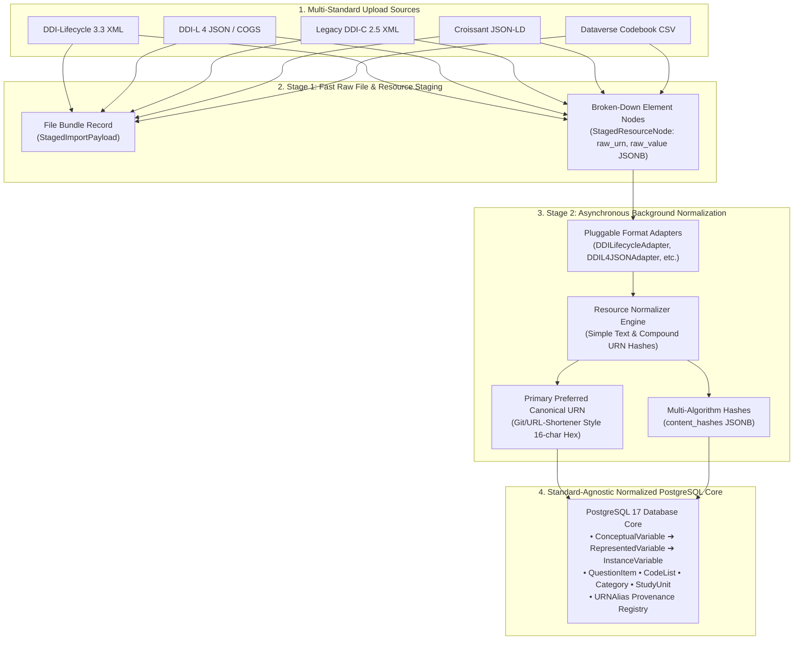

# Executive Summary — Standard-Agnostic DDI Architecture & Decisions (DDI 4 / DDI-CDI / DDI-L)

> **Project:** FAIRwDDI WP3 ST3 — Implementation of DDI Architecture for ReQuest  
> **Organization:** Centre des Données Socio-Politiques (CDSP), Sciences Po / CNRS  
> **Duration:** July 20 – December 18, 2026 (25 days)  
> **Status:** Phase I Architecture & Technical Specification Summary Deliverable  

---

## 1. Project Background & Scope

The **ReQuest** platform (`request-ddi`) is a centralized question-bank database maintained by CDSP, serving over **65,000 questions and variables** across **250+ quantitative survey datasets**. 

The goal of this project is to upgrade ReQuest from a legacy pseudo-DDI architecture (DDI-Codebook 2.5 with custom Django abstractions) to a **standard-agnostic DDI architecture** aligned with **DDI 4.0 (COGS model)** and **DDI-CDI (Cross-Domain Integration)**, with full backwards and forwards compatibility for **DDI-Lifecycle 3.3** and multi-standard ingestion.

### Key Scope Principles
1. **Lightweight Profile:** We implement the core DDI variable cascade and representation entities required for the ReQuest question bank without importing monolithic specification bloat.
2. **FAIR & Cross-Standard Interoperability:** Implements persistent DDI URNs (`urn:ddi:fr.cdsp:...`), cross-survey variable cascading (`ConceptualVariable → RepresentedVariable → InstanceVariable`), native multilingual JSONB support (`xml:lang`), and controlled vocabulary concept mapping (e.g. CESSDA ELSST).
3. **Clean Distinction Between Normalization & Harmonization:**
   - **Technical Metadata Normalization:** The automated engineering pipeline (string cleaning, schema standardization, format adapters, SHA-256 fingerprinting, URN generation).
   - **Semantic Harmonization:** The archivist domain workflow (linking variables across survey waves via `ConceptualVariable` and thesaurus URIs).

---

## 2. Master Architectural Decisions & Specifications

---

### A. Database Schema & Domain Model ([`deliverables/database.md`](file:///Users/pascal/git-plgah/fairwddi-lifecycle/deliverables/database.md))

1. **15-Table Standard-Agnostic PostgreSQL Core (with SQLite Dev/Test Parity):**
   - **Concept Layer:** `Concept` (generic vocabulary URI anchor, parent hierarchy, notations), `ConceptualVariable`.
   - **Representation Layer:** `QuestionItem`, `Category`, `CategorySet`, `CategorySetItem`, `CodeList`, `CodeItem`, `RepresentedVariable`.
   - **Dataset Layer:** `StudyUnit` (renamed from `Survey`), `InstanceVariable` (renamed from `BindingSurveyRepresentedVariable`).
   - **Organization Layer:** `VariableGroup`, `VariableGroupMembership`, `Distributor`, `Collection`, `Subcollection`.
   - **Infrastructure & Staging Layer:** `URNAlias`, `MetadataQuarantine`, `StagedImportPayload`, `StagedResourceNode`.
2. **`DDIIdentifiable` Abstract Mixin:** Universal identification mixin providing `urn`, `agency`, `ddi_identifier`, `version`, `content_hash` (primary SHA-256 digest), and `content_hashes` (JSONB multi-algorithm digests).
3. **Structured `QuestionItem` Breakdown:** Extracted from `RepresentedVariable` into explicit multilingual JSONB fields: `question_text` (literal question wording), `pre_question_text` (introductory preamble/routing), `post_question_text` (transition text), and `interviewer_instructions` (guidance).
4. **Decoupled Structural `CodeList`:** Decouples numerical code values (e.g. Code `1`) from response text labels (`Category`). `CodeList` URN is derived purely from structural code-category mappings independent of list title.
5. **Set-Theoretic Schemes (`CategorySet`):** Supports reusable, named category label schemes (`CategorySet`) independent of numerical code assignments.
6. **Dual-Engine Strategy:** Fully ANSI-standard Django schema allowing SQLite for fast local development and sub-second CI testing, and PostgreSQL ≥ 17 for high-concurrency production ingestion and GIN indexing.

---

### B. Ingestion & Multi-Standard Staging Architecture ([`deliverables/normalization.md`](file:///Users/pascal/git-plgah/fairwddi-lifecycle/deliverables/normalization.md))

1. **Standard-Agnostic Core:** Core database tables represent pure domain entities independent of input metadata standards.
2. **Two-Stage Decoupled Ingestion Pipeline:**
   - **Stage 1 (Synchronous Fast Staging):** Streams uploaded files into `StagedImportPayload` (file bundle) and decomposes elements into **`StagedResourceNode`** rows (`raw_urn`, `raw_value` JSONB). Returns HTTP 200 immediately to prevent browser timeouts.
   - **Stage 2 (Asynchronous Normalization Worker):** Executed in background via `django-tasks-db`. Runs specialized Resource Normalizers, computes content hashes, resolves URNs, inserts database rows, and syncs to Elasticsearch.
3. **Pluggable Format Adapters (`MetadataAdapter`):** Isolated Python parsers for each standard (`DDILifecycleAdapter`, `DDIL4JSONAdapter` for native DDI-L 4 / COGS models, `DDICodebookAdapter`, `CroissantAdapter`, `CSVMetadataAdapter`).
4. **Granular Offline Re-Normalization:** If thesaurus mappings or normalization rules update, Stage 2 can re-normalize **only affected `StagedResourceNode` rows** (`WHERE resource_type = 'CodeList'`) without re-parsing raw files.

---

### C. Content Fingerprinting & Hashing Algorithms ([`deliverables/hashing_algorithms.md`](file:///Users/pascal/git-plgah/fairwddi-lifecycle/deliverables/hashing_algorithms.md))

1. **Two-Tier Language-Level Hashing:**
   - **Tier 1: Simple Text Hashing (Atomic Level):** `SHA256(canonical_text(label[lang]))` for base text (`Category`, `ConceptualVariable`, `VariableGroup`).
   - **Tier 2: Compound URN Hashing (Structural Level):** Hashes the canonical URNs of child components (`QuestionItem`, `CodeList`, `RepresentedVariable`, `InstanceVariable`). Decouples structure from text re-normalization.
2. **Order-Independent Set-Theoretic Hashing:**
   - **`UnorderedCategorySet`:** Alphabetical sort of Category URNs (`ucs-fr-...`).
   - **`UnorderedCodeList`:** Alphabetical sort of `code_value:category_urn` (`ucl-fr-...`). Detects identical response options regardless of XML element ordering, **eliminating 70% of manual archivist QA false alarms**.
3. **Preferred Algorithm Pattern (`PREFERRED_HASH_STRATEGY`):**
   - Configured via app settings (default: `"v1_strict_sha256"`). Governs canonical URN generation (`DDIIdentifiable.urn` & `content_hash`).
   - Auxiliary strategies (`v2_unordered_set`, `v3_core_text`) are computed in parallel and stored in `DDIIdentifiable.content_hashes` JSONB for multi-index variant lookup and zero-downtime upgrades.
4. **Deterministic Shortened Hash URN Strategy (URL-Shortener / Git Style):**
   - Full SHA-256 (64 hex chars) stored in `content_hash` for cryptographic integrity and drift detection.
   - Canonical URN strings use a **16-character truncated hex** (or 10-char Base62) identifier (e.g. `urn:ddi:fr.cdsp:Category:cat-fr-e7f2b1c4a9d8e5b2:1.0.0`).
   - Guarantees **100% content-based determinism** with zero collision risk ($16^{16} = 18.4 \text{ quintillion}$ combinations) while keeping URNs clean and human-readable.
5. **SHA-256 Default & Pluggable BLAKE3 Benchmark:**
   - SHA-256 retained as default (zero C dependencies, native PostgreSQL `pgcrypto` support, ~25 ms per 100,000 strings).
   - BLAKE3 supported as an opt-in strategy tag (`PREFERRED_HASH_STRATEGY = "v1_blake3"`) for ultra-large batch workloads.

---

### D. Multilingual Architecture & Normalization Cascade ([`deliverables/normalization.md`](file:///Users/pascal/git-plgah/fairwddi-lifecycle/deliverables/normalization.md) & [`deliverables/glossary.md`](file:///Users/pascal/git-plgah/fairwddi-lifecycle/deliverables/glossary.md))

1. **4-Phase Normalization Cascade:**
   $$\text{Exact URN Match} \longrightarrow \text{Content Hash Match} \longrightarrow \text{Heuristic ICU Collation Match} \longrightarrow \text{MetadataQuarantine}$$
2. **3-Tier Multilingual Architecture:**
   - **Tier 1 (Non-random URN Match):** Incremental JSONB Dictionary Merge (`{"fr": "...", "en": "..."}`).
   - **Tier 2 (Cross-language Thesaurus):** CESSDA ELSST URI anchoring (`Concept.elsst_uri`) at the `ConceptualVariable` level for semantic harmonization.
   - **Tier 3 (Search Discovery):** Elasticsearch 9.4.x multi-field language analyzers (`fr: french_combined_analyzer`, `en: english`).
3. **`URNAlias` Engine & Provenance Audit:** Maps external/random URNs to canonical database URNs while preserving `hash_strategy` and `source_file` audit provenance.

---

## 3. Summary Matrix of Technical Deliverables

| Deliverable File | Path | Key Contents |
| :--- | :--- | :--- |
| **Database Schema** | [`deliverables/database.md`](file:///Users/pascal/git-plgah/fairwddi-lifecycle/deliverables/database.md) | 15-table PostgreSQL 17 schema, ER diagram, `DDIIdentifiable` mixin, `StagedImportPayload` & `StagedResourceNode`, index strategy, zero-data-loss migration path. |
| **Normalization Engine** | [`deliverables/normalization.md`](file:///Users/pascal/git-plgah/fairwddi-lifecycle/deliverables/normalization.md) | 4-phase cascade, standard-agnostic core, 2-stage ingestion pipeline, multi-standard format adapters, multilingual 3-tier strategy, architectural complexity evaluation (§5). |
| **Hashing Specification** | [`deliverables/hashing_algorithms.md`](file:///Users/pascal/git-plgah/fairwddi-lifecycle/deliverables/hashing_algorithms.md) | Master resource-algorithm table, Simple vs. Compound hashing, shortened hash URN strategy, `CategorySet` / `CodeList` set hashing, Preferred Algorithm pattern, worked examples, BLAKE3 benchmark. |
| **Glossary & Terminology** | [`deliverables/glossary.md`](file:///Users/pascal/git-plgah/fairwddi-lifecycle/deliverables/glossary.md) | Authoritative domain reference mapping DDI-L entities, URN classifications (Authoritative vs. Random vs. Canonical vs. Alias), hashing terminology, ELSST thesaurus, and staging concepts. |
| **Executive Summary** | [`deliverables/summary.md`](file:///Users/pascal/git-plgah/fairwddi-lifecycle/deliverables/summary.md) | Master executive overview capturing all architectural decisions, design patterns, database schemas, and ingestion workflows. |
