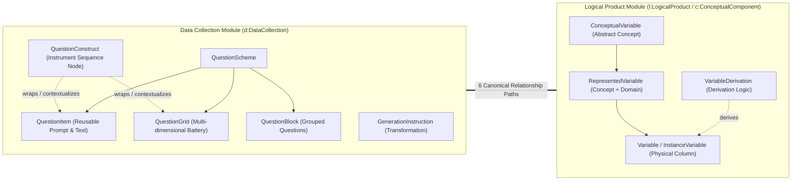
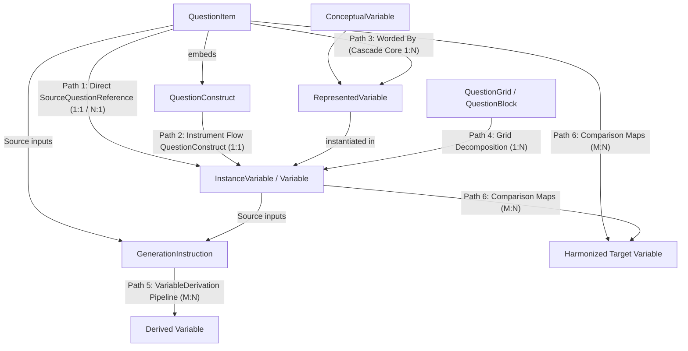
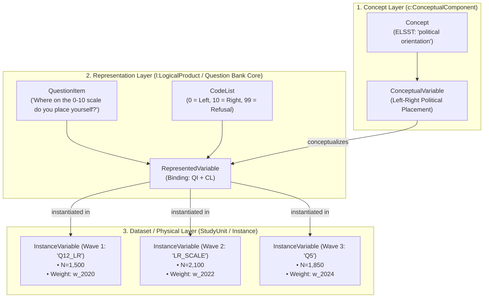
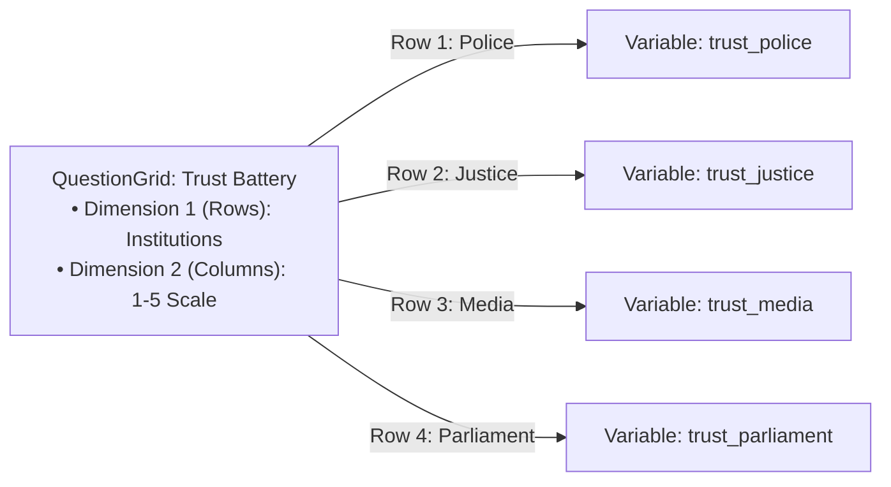
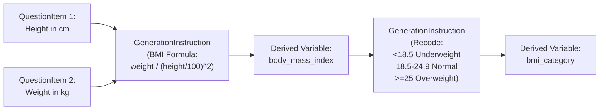
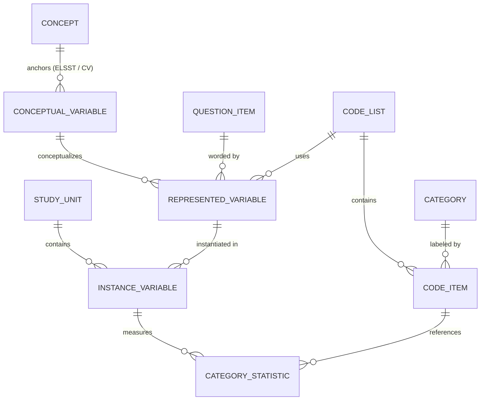
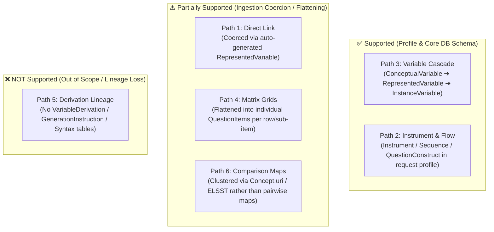

# DDI-Lifecycle Relationships Between Variables and Questions

> **Project:** FAIRwDDI WP3 ST3 — Implementation of DDI Architecture for ReQuest  
> **Organization:** Centre des Données Socio-Politiques (CDSP), Sciences Po / CNRS  
> **Standards:** DDI-Lifecycle 3.3, DDI 4.0 (COGS), DDI-CDI, DDI-Codebook 2.5  
> **Deliverable:** Technical Architecture & Relationship Specification  

---

## 1. Architectural Foundations: Module Separation in DDI-Lifecycle

In flat metadata specifications (such as **DDI-Codebook 2.5**), survey questions and dataset variables are tightly coupled into a single XML element (`<var>` containing an inline `<qstn><qstnLit>` string). 

In contrast, **DDI-Lifecycle 3.x (3.2 / 3.3)** and **DDI 4.0 / DDI-CDI** establish a strict structural decoupling between the **act of data collection** and the **logical organization of collected data**:



### Why Decouple Questions from Variables?

1. **One-to-Many Relationships ($1:N$):** A single tabular matrix question (`QuestionGrid`), roster, or multi-response question produces multiple dataset variables (e.g., column per item or column per checkbox).
2. **Many-to-One Relationships ($M:1$ / $M:N$):** Derived variables (composite scales, socioeconomic classifications, recoded brackets, imputed values) are computed from multiple source questions and intermediate variables.
3. **Question Reusability:** The identical question wording (`QuestionItem`) and response scale can be administered across longitudinal waves or cross-national rounds without duplicating metadata.
4. **Instrument & Flow Independence:** Decouples the substantive question wording (`QuestionItem`) from its execution context, skip patterns, interviewer prompts, and routing conditions in a specific questionnaire instrument (`QuestionConstruct`).
5. **Cross-Standard Ingestion:** Enables standard-agnostic question banks (like **ReQuest**) to ingest simple flat DDI-Codebook files, complex DDI-L instrument flows, and DDI-CDI datasets into a unified variable cascade.

---

## 2. The Six Canonical Relationship Paths

The table below outlines the six distinct architectural pathways in DDI-Lifecycle linking questions and variables:



---

### Path 1: Direct Variable-to-Question Linkage (`SourceQuestionReference`)

The most straightforward relationship path, typical of flat or simple quantitative datasets. The logical `<l:Variable>` directly cites the URN of the `<d:QuestionItem>` that captured the observation.

* **DDI-Lifecycle Mechanism:** The `<l:Variable>` element in a `VariableScheme` declares an `<r:SourceQuestionReference>` (or `<r:QuestionReference>`) containing the persistent URN of a `<d:QuestionItem>` or `<d:QuestionGrid>`.
* **Cardinality:** `1:1` (one question generates one variable) or `N:1` (multiple variables reference the same standard question).
* **When Used:** Simple survey exports, direct question-and-answer data capture, flat DDI-Codebook migrations.

#### DDI-L 3.3 XML Example
```xml
<!-- DataCollection Module -->
<d:QuestionScheme xmlns:d="ddi:datacollection:3_3" xmlns:r="ddi:reusable:3_3">
  <r:URN>urn:ddi:fr.cdsp:QuestionScheme:QS_POLITICS:1.0.0</r:URN>
  <d:QuestionItem>
    <r:URN>urn:ddi:fr.cdsp:QuestionItem:QI_LR_SCALE:1.0.0</r:URN>
    <d:QuestionItemName>Q_LEFT_RIGHT</d:QuestionItemName>
    <d:QuestionText>
      <d:LiteralText>
        <d:Text xml:lang="fr">En politique, on parle de gauche et de droite. Où vous situez-vous ?</d:Text>
        <d:Text xml:lang="en">In politics, people talk about left and right. Where would you place yourself?</d:Text>
      </d:LiteralText>
    </d:QuestionText>
  </d:QuestionItem>
</d:QuestionScheme>

<!-- LogicalProduct Module -->
<l:VariableScheme xmlns:l="ddi:logicalproduct:3_3" xmlns:r="ddi:reusable:3_3">
  <r:URN>urn:ddi:fr.cdsp:VariableScheme:VS_ELIPSS_2022:1.0.0</r:URN>
  <l:Variable>
    <r:URN>urn:ddi:fr.cdsp:Variable:VAR_LR_2022:1.0.0</r:URN>
    <l:VariableName>lr_self</l:VariableName>
    <!-- Direct link to QuestionItem -->
    <r:SourceQuestionReference>
      <r:URN>urn:ddi:fr.cdsp:QuestionItem:QI_LR_SCALE:1.0.0</r:URN>
      <r:TypeOfObject>QuestionItem</r:TypeOfObject>
    </r:SourceQuestionReference>
  </l:Variable>
</l:VariableScheme>
```

---

### Path 2: Questionnaire Control Flow & Instrument Routing (`QuestionConstruct`)

In complex Computer-Assisted Interviewing (CAPI/CATI/CAWI) surveys, questions are administered under dynamic conditions (filters, skip logic, loops, randomizations). DDI-L separates the *reusable question text* (`QuestionItem`) from its *contextual invocation* (`QuestionConstruct`).

* **DDI-Lifecycle Mechanism:**
  1. `<d:QuestionItem>` holds the text and response domain.
  2. `<d:QuestionConstruct>` (in a `d:ControlConstructScheme`) references the `QuestionItem` and is sequenced inside a `<d:Instrument>` / `<d:Sequence>`.
  3. `<l:Variable>` references the `<d:QuestionConstruct>` via `<r:SourceQuestionReference>`.
  4. Alternatively, `<d:QuestionConstruct>` or `<d:ResponseDomainInMixed>` specifies an explicit `<r:VariableReference>` pointing outward to the target variable.
* **Cardinality:** `1:1` or `N:1`.
* **When Used:** Complex questionnaire instruments where routing conditions, branch logic (`IfThenElse`), and loop counters (`Loop`) are essential to understanding why certain respondents answered the question.

#### DDI-L 3.3 XML Example
```xml
<!-- Control Construct Scheme in DataCollection -->
<d:ControlConstructScheme xmlns:d="ddi:datacollection:3_3" xmlns:r="ddi:reusable:3_3">
  <r:URN>urn:ddi:fr.cdsp:ControlConstructScheme:CCS_MAIN:1.0.0</r:URN>
  
  <d:QuestionConstruct>
    <r:URN>urn:ddi:fr.cdsp:QuestionConstruct:QC_VOTE_INTENTION:1.0.0</r:URN>
    <r:ConstructName>QC_VoteIntention</r:ConstructName>
    <!-- References QuestionItem -->
    <r:QuestionReference>
      <r:URN>urn:ddi:fr.cdsp:QuestionItem:QI_VOTE_INTENTION:1.0.0</r:URN>
      <r:TypeOfObject>QuestionItem</r:TypeOfObject>
    </r:QuestionReference>
    <!-- External variable reference binding -->
    <r:VariableReference>
      <r:URN>urn:ddi:fr.cdsp:Variable:VAR_VOTE_INT:1.0.0</r:URN>
      <r:TypeOfObject>Variable</r:TypeOfObject>
    </r:VariableReference>
  </d:QuestionConstruct>
</d:ControlConstructScheme>
```

---

### Path 3: The DDI Variable Cascade (`ConceptualVariable` ➔ `RepresentedVariable` ➔ `InstanceVariable`)

The **Variable Cascade** is the primary standard-agnostic pattern defined in DDI-Lifecycle, DDI 4 (COGS), DDI-CDI, and GSIM. It separates conceptual, representational, and physical dataset layers:



* **DDI-Lifecycle Mechanism:**
  1. **`ConceptualVariable`**: Defines the substantive concept (independent of question wording or measurement scale).
  2. **`RepresentedVariable`**: Combines a specific reusable `QuestionItem` with a specific reusable `CodeList` / representation domain. It is dataset-independent.
  3. **`InstanceVariable`** (or `Variable`): Represents the concrete column in a specific `StudyUnit` (wave), inheriting the question wording and code list from `RepresentedVariable` while recording dataset-specific frequencies (`CategoryStatistic`), missing value treatments, and physical storage metadata.
* **Cardinality:** `1:N` (`QuestionItem` is bound to `RepresentedVariable`, which is instantiated across $N$ survey waves).
* **When Used:** Centralized Question Banks (such as **ReQuest**), longitudinal survey series (ELIPSS, ESS, GIP), and cross-survey search indexes.

---

### Path 4: Multi-Item & Matrix Grid Decomposition (`QuestionGrid` / `QuestionBlock`)

In quantitative surveys, battery questions are commonly formatted as multi-dimensional matrices (e.g., *"How much do you trust the following institutions? [Police, Justice, Media, Parliament] on a scale of 1 to 5"*).



* **DDI-Lifecycle Mechanism:**
  * A `<d:QuestionGrid>` defines grid dimensions (e.g., `<d:GridDimension rank="1">` for sub-items/rows and `<d:GridDimension rank="2">` for response code lists).
  * Alternatively, a `<d:QuestionBlock>` groups multiple sub-questions under a single shared stimulus text.
  * Individual `<l:Variable>` elements each reference the parent `QuestionGrid` via `<r:SourceQuestionReference>` and identify their cell or row coordinate using `<d:GridDimension>`.
* **Cardinality:** `1:N` (1 Question Grid generates $N$ Variables).
* **When Used:** Battery items, Likert scales, household roster matrices, time-use matrices.

#### DDI-L 3.3 XML Example
```xml
<d:QuestionGrid xmlns:d="ddi:datacollection:3_3" xmlns:r="ddi:reusable:3_3">
  <r:URN>urn:ddi:fr.cdsp:QuestionGrid:QG_TRUST_INST:1.0.0</r:URN>
  <d:QuestionText>
    <d:LiteralText>
      <d:Text xml:lang="fr">Quel est votre niveau de confiance envers les institutions suivantes ?</d:Text>
    </d:LiteralText>
  </d:QuestionText>
  <d:GridDimension rank="1" displayLabel="Institution">
    <d:CodeListReference>
      <r:URN>urn:ddi:fr.cdsp:CodeList:CL_INSTITUTIONS:1.0.0</r:URN>
      <r:TypeOfObject>CodeList</r:TypeOfObject>
    </d:CodeListReference>
  </d:GridDimension>
  <d:GridDimension rank="2" displayLabel="Response Scale">
    <d:CodeListReference>
      <r:URN>urn:ddi:fr.cdsp:CodeList:CL_TRUST_SCALE:1.0.0</r:URN>
      <r:TypeOfObject>CodeList</r:TypeOfObject>
    </d:CodeListReference>
  </d:GridDimension>
</d:QuestionGrid>
```

---

### Path 5: Processing & Derivation Pipelines (`VariableDerivation` & `GenerationInstruction`)

Variables in a curated dataset are frequently not raw 1:1 question responses, but calculated or recoded transformations (e.g., standard age groups, BMI calculated from height/weight, psychometric composite scores like CES-D).



* **DDI-Lifecycle Mechanism:**
  * The derived `<l:Variable>` embeds an `<l:VariableDerivation>`.
  * The derivation references a `<d:GenerationInstruction>` (or `ProcessingInstruction`).
  * The `GenerationInstruction` documents:
    * Multiple `<r:SourceQuestionReference>` elements (all input questions).
    * Multiple `<r:SourceVariableReference>` elements (all input variables).
    * `<r:CommandCode>` containing executable syntax (SPSS, R, Stata, Python, SQL) or mathematical algorithms.
* **Cardinality:** `M:N` (Multiple source questions and variables combine into one or more derived variables).
* **When Used:** Scale aggregation, data harmonization recodes, index generation, imputation algorithms.

#### DDI-L 3.3 XML Example
```xml
<l:Variable xmlns:l="ddi:logicalproduct:3_3" xmlns:r="ddi:reusable:3_3" xmlns:d="ddi:datacollection:3_3">
  <r:URN>urn:ddi:fr.cdsp:Variable:VAR_BMI_CALC:1.0.0</r:URN>
  <l:VariableName>bmi</l:VariableName>
  <l:VariableDerivation>
    <d:GenerationInstruction>
      <r:URN>urn:ddi:fr.cdsp:GenerationInstruction:GI_BMI:1.0.0</r:URN>
      <d:Description>
        <r:Content xml:lang="en">Computed Body Mass Index from height and weight items.</r:Content>
      </d:Description>
      <!-- Source Questions -->
      <r:SourceQuestionReference>
        <r:URN>urn:ddi:fr.cdsp:QuestionItem:QI_HEIGHT:1.0.0</r:URN>
        <r:TypeOfObject>QuestionItem</r:TypeOfObject>
      </r:SourceQuestionReference>
      <r:SourceQuestionReference>
        <r:URN>urn:ddi:fr.cdsp:QuestionItem:QI_WEIGHT:1.0.0</r:URN>
        <r:TypeOfObject>QuestionItem</r:TypeOfObject>
      </r:SourceQuestionReference>
      <!-- Syntax Definition -->
      <r:CommandCode>
        <r:ProgramLanguage>Python</r:ProgramLanguage>
        <r:CommandContent>weight_kg / ((height_cm / 100.0) ** 2)</r:CommandContent>
      </r:CommandCode>
    </d:GenerationInstruction>
  </l:VariableDerivation>
</l:Variable>
```

---

### Path 6: Comparison & Harmonization Mapping (`cm:Comparison`)

In cross-national archives (e.g., CESSDA ERIC, European Social Survey, SHARE, EVS), questions are translated, adapted, or measured with national peculiarities across countries and survey waves.

* **DDI-Lifecycle Mechanism:**
  * DDI-Lifecycle provides the `cm:Comparison` module.
  * `<cm:QuestionSchemeMap>` maps equivalence, correspondence, and translation differences between source `<d:QuestionItem>` elements.
  * `<cm:VariableSchemeMap>` defines the mapping rules translating source variables into a standardized target harmonized variable.
* **Cardinality:** `M:N` across independent studies.
* **When Used:** Ex-post comparative data integration across European social science data archives.

---

## 3. Comparative Summary Matrix

| Path | Source Question Entity | Intermediate Entity | Target Variable Entity | DDI-L XML Elements | Cardinality | Primary Scenario |
| :--- | :--- | :--- | :--- | :--- | :---: | :--- |
| **1. Direct Link** | `QuestionItem` | — | `Variable` | `<l:Variable>` ➔ `<r:SourceQuestionReference>` | `1:1` / `N:1` | Standard survey codebooks, simple single-item variables. |
| **2. Instrument Construct** | `QuestionItem` | `QuestionConstruct` | `Variable` | `<d:Instrument>` ➔ `<d:QuestionConstruct>` ➔ `<l:Variable>` | `1:1` | CAPI/CAWI routing, conditional questionnaire execution. |
| **3. Variable Cascade** | `QuestionItem` | `RepresentedVariable` | `InstanceVariable` | `ConceptualVariable` ➔ `RepresentedVariable` ➔ `InstanceVariable` | `1:N` | ReQuest Question Bank, longitudinal reuse across waves. |
| **4. Grid / Matrix** | `QuestionGrid` / `QuestionBlock` | `GridDimension` | Multiple `Variable` instances | `<d:QuestionGrid>` ➔ `<l:Variable>` + `<d:GridDimension>` | `1:N` | Item batteries, Likert matrices, respondent rosters. |
| **5. Derivation / Lineage** | Multiple `QuestionItem`s | `GenerationInstruction` | Derived `Variable` | `<l:VariableDerivation>` ➔ `<d:GenerationInstruction>` | `M:N` | Recoded categories, composite scales, computed indices. |
| **6. Comparison Map** | Source `QuestionItem`s | `Comparison` Maps | Target Harmonized `Variable` | `<cm:QuestionSchemeMap>` + `<cm:VariableSchemeMap>` | `M:N` | Cross-national and longitudinal ex-post harmonization. |

---

## 4. ReQuest & FAIRwDDI Implementation Architecture

The CDSP **ReQuest** platform uses the **Lightweight Standard-Agnostic Profile** ([`profiles/request.yaml`](file:///Users/pascal/git-plgah/fairwddi-lifecycle/profiles/request.yaml)) to operationalize these relationships.

### PostgreSQL 17 Core Implementation



### Ingestion Mapping Rules for Multi-Standard Inputs

1. **Path 3 (Variable Cascade Core):**
   * Raw question texts are parsed into standalone `QuestionItem` records with multilingual JSONB (`question_text`, `pre_question_text`, `post_question_text`, `interviewer_instructions`).
   * `RepresentedVariable` binds `QuestionItem` + `CodeList`.
   * `InstanceVariable` represents the dataset column in `StudyUnit`.

2. **Path 1 & Path 2 Fallback Ingestion:**
   * When importing DDI-L 3.3 XML with `<r:SourceQuestionReference>` or `<d:QuestionConstruct>`, the normalizer extracts the referenced `QuestionItem`, builds the compound URN hash, and binds it to the corresponding `RepresentedVariable`.
   * When importing legacy **DDI-Codebook 2.5** (`<var>` + `<qstnLit>`), the ingestion adapter extracts the inline question string into a new or deduplicated `QuestionItem` row in PostgreSQL.

3. **Compound URN Hashing for Structural Provenance:**
   * `QuestionItem`: `SHA-256(canonical_text(question_text) + "|" + canonical_text(instructions))`
   * `RepresentedVariable`: `SHA-256(question_item.urn + "|" + code_list.urn)`
   * `InstanceVariable`: `SHA-256(represented_variable.urn + "|" + study_unit.urn + "|" + variable_name)`

---

## 5. Database Model Support & Unsupported Paths Analysis

The standard-agnostic core schema for **ReQuest** ([`deliverables/database.md`](file:///Users/pascal/git-plgah/fairwddi-lifecycle/deliverables/database.md) and [`src/fairwddi/models/`](file:///Users/pascal/git-plgah/fairwddi-lifecycle/src/fairwddi/models/)) is intentionally architected as a **Lightweight Question-Bank Profile** ([`profiles/request.yaml`](file:///Users/pascal/git-plgah/fairwddi-lifecycle/profiles/request.yaml)). It prioritizes searchability, multilingual harmonization, and question reuse over the complete, monolithic DDI-Lifecycle specification.

The matrix below documents the exact support status, architectural rationale, and ingestion handling for each path in the current database schema:

| Path | Relationship Mechanism | Database Support Status | Relational Schema Implementation & Architectural Gaps |
| :--- | :--- | :---: | :--- |
| **Path 1** | Direct Link (`Variable` ➔ `QuestionItem`) | ⚠️ **Partially Supported (Indirect)** | **No direct foreign key:** `InstanceVariable` does not have a `question_item_id` column. Flat 1:1 question-variable links are coerced through an intermediate (auto-generated) `RepresentedVariable`. |
| **Path 2** | Questionnaire Control Flow (`QuestionConstruct`) | ✅ **Supported in Profile & Staging** | **Profile Support Enabled:** `Instrument`, `Sequence`, `ControlConstructScheme`, `QuestionConstruct`, `IfThenElse`, and `Loop` are included in `profiles/request.yaml`. Staged in `StagedResourceNode` and parsed into `QuestionItem` with interviewer instructions and pre-conditions. |
| **Path 3** | Variable Cascade Core | ✅ **FULLY Supported (Native Core)** | **Complete 1:1 relational parity:** `ConceptualVariable` ➔ `RepresentedVariable` (binding `QuestionItem` + `CodeList`) ➔ `InstanceVariable` (`StudyUnit`). First-class citizen with compound URN hashing and multilingual JSONB. |
| **Path 4** | Grid / Matrix Decomposition (`QuestionGrid`) | ⚠️ **Partially Supported (Flattened at Ingestion)** | **No grid container entity:** No `QuestionGrid`, `QuestionBlock`, or `GridDimension` tables exist. Multi-item battery matrices are decomposed during Stage 1/2 ingestion into individual `QuestionItem` records per sub-item. The 2D matrix structure is not preserved relationally. |
| **Path 5** | Derivation / Processing Pipeline (`GenerationInstruction`) | ❌ **NOT Supported (Lineage & Code Loss)** | **No derivation/lineage tables:** No `VariableDerivation`, `GenerationInstruction`, or `CommandCode` tables exist. Derived variables are stored only as final `InstanceVariable` columns; the $M:N$ provenance graph and computation scripts (SPSS/R syntax) connecting them back to source questions are lost. |
| **Path 6** | Comparison / Harmonization Maps (`cm:Comparison`) | ⚠️ **Conceptually Supported via Thesaurus; No Comparison Scheme Tables** | **No pairwise mapping tables:** `<cm:QuestionSchemeMap>` and `<cm:VariableSchemeMap>` are not modeled as relational tables. Semantic harmonization is achieved via Concept Layer clustering (`ConceptualVariable` ➔ `Concept.uri` with CESSDA ELSST) rather than pairwise entity-to-entity equivalence matrices. |

---

### In-Depth Analysis of Gaps and Unsupported Paths



#### 1. Path 2: Questionnaire Routing & Execution Flow (Profile Supported)
* **Profile Configuration:** `Instrument`, `InstrumentScheme`, `ControlConstructScheme`, `Sequence`, `QuestionConstruct`, `IfThenElse`, `Loop`, and `ComputationItem` are included in `profiles/request.yaml`.
* **Staging & Processing:** The streaming parser stages all instrument flow elements into `StagedResourceNode` rows. References from `<l:Variable>` to `<d:QuestionConstruct>` are dereferenced to identify the underlying `<d:QuestionItem>`, preserving preamble text and interviewer guidance into `QuestionItem.pre_question_text` and `QuestionItem.interviewer_instructions`.


#### 2. Path 5: Variable Derivation & Generation Instructions (Unsupported)
* **Gap:** When a variable is derived from 5 other questions (e.g. a socioeconomic index or depression score), DDI-L records the algorithmic syntax (`<r:CommandCode>`) and input links (`<r:SourceQuestionReference>`).
* **Current DB Behavior:** The database stores the resulting variable as a standard `InstanceVariable` with its name, label, and code list, but discards the input question references and computation script.
* **Potential Future Extension:** If variable provenance tracking becomes a requirement in Phase II/III, a lightweight `VariableDerivation` table or JSONB field (`InstanceVariable.derivation_metadata`) could be introduced without breaking the core cascade.

#### 3. Path 4: Multi-Dimensional Matrix Grids (Flattened)
* **Gap:** Tabular batteries (e.g., 10 trust questions sharing a single Likert header) do not have a dedicated `QuestionGrid` parent table in PostgreSQL.
* **Current DB Behavior:** The format adapter creates 10 separate `QuestionItem` rows (e.g., combining the stimulus header with each row item) and 10 `RepresentedVariable` rows. While search and variable-level harmonization work perfectly, the UI cannot natively reconstruct the original 2D matrix layout from relational foreign keys alone.

#### 4. Path 1: Direct Linkage Coercion
* **Gap:** In simple DDI-Codebook files (`<var>` with `<qstnLit>`), there is no concept of a reusable `RepresentedVariable`.
* **Current DB Behavior:** The ingestion adapter automatically synthesizes a `RepresentedVariable` joining the extracted `QuestionItem` and `CodeList` to maintain strict variable cascade integrity across the database.

---

## 6. Cross-References & Related Deliverables

* [`deliverables/database.md`](file:///Users/pascal/git-plgah/fairwddi-lifecycle/deliverables/database.md) — Relational PostgreSQL DDL and entity models.
* [`deliverables/normalization.md`](file:///Users/pascal/git-plgah/fairwddi-lifecycle/deliverables/normalization.md) — Technical normalization pipeline and adapter architecture.
* [`deliverables/hashing_algorithms.md`](file:///Users/pascal/git-plgah/fairwddi-lifecycle/deliverables/hashing_algorithms.md) — Multi-algorithm fingerprinting and URN derivation.
* [`deliverables/glossary.md`](file:///Users/pascal/git-plgah/fairwddi-lifecycle/deliverables/glossary.md) — DDI canonical vocabulary and entity definitions.
* [`deliverables/summary.md`](file:///Users/pascal/git-plgah/fairwddi-lifecycle/deliverables/summary.md) — Executive architecture summary and deliverable catalog.

