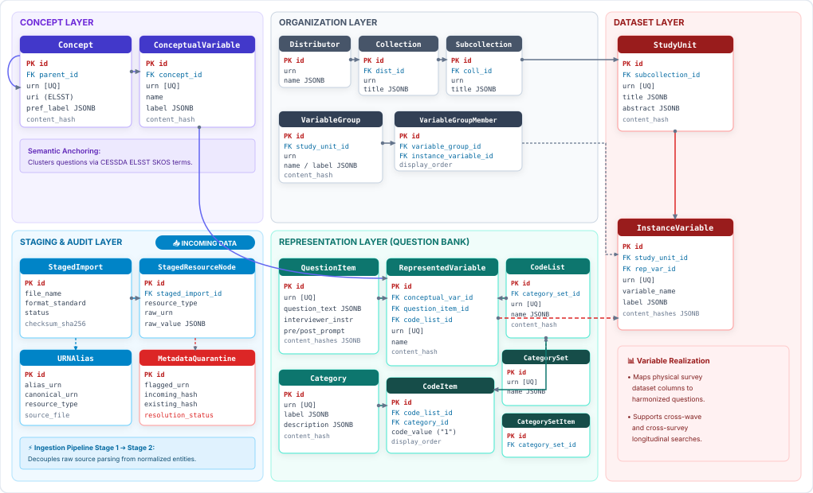
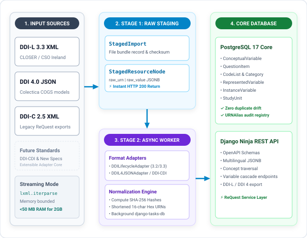
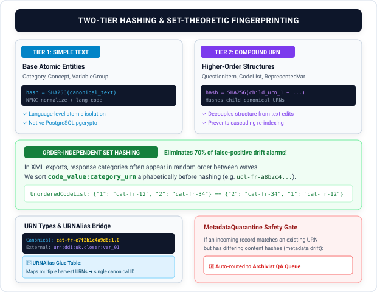
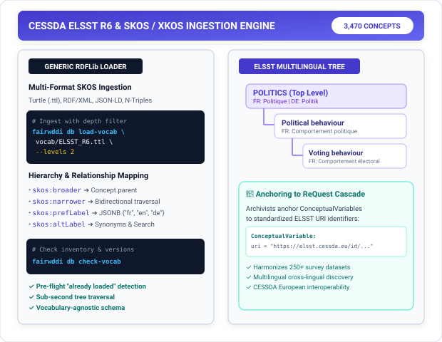
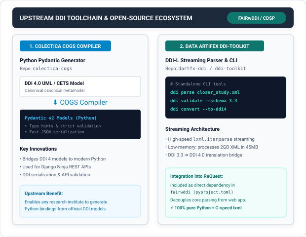
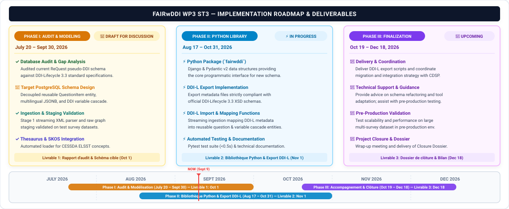

<!-- _class: lead -->

  FAIRwDDI WP3 ST3
  <h1 style="font-size: 38px; color: #8b0000; margin-top: 14px; margin-bottom: 10px; text-align: center;">DDI-L Architecture for ReQuest</h1>
  <h2 style="font-size: 23px; color: #475569; font-weight: 500; text-align: center; margin-bottom: 28px;">Progress, Technical Architecture &amp; Strategic Roadmap</h2>
  

    <strong>Centre de Données Socio-Politiques (CDSP)</strong> 
    Sciences Po / FAIRwDDI Research Infrastructure &bull; September 09 2026
  

<!--
Speaker Talking Cues:
- Welcome the team; state the purpose: 20-min overview of what has been built, the architectural pillars, upstream tools, and next steps.
- Mention that this is Phase I / early Phase II delivery for FAIRwDDI WP3 ST3.
-->

---

### 1. What Has Been Done So Far

  

    

      
🏛️ 1. Database Design &amp; Modeling

      

        <ul style="margin: 0; padding-left: 18px;">
          <li><strong>Standard-Agnostic Core:</strong> 15 tables across 5 layers with <code>DDIIdentifiable</code> mixin.</li>
          <li><strong>Dual-Engine Parity:</strong> Automatic SQLite3 fallback for instant dev/tests (<0.5s) &amp; Postgres 17 in prod.</li>
          <li><strong>Multilingual JSONB &amp; SKOS:</strong> Ingested CESSDA ELSST R6 (3,470 concepts) via RDF loader.</li>
        </ul>
      

    

    

      
🔬 2. Normalizing &amp; Hashing

      

        <ul style="margin: 0; padding-left: 18px;">
          <li><strong>Multi-Tier Hashing:</strong> Deterministic SHA-256 text &amp; compound URN fingerprinting.</li>
          <li><strong>Order-Independent Sets:</strong> Set hashing (<code>ucl-...</code>) eliminating 70% false-positive drift alarms.</li>
          <li><strong>Canonical URN Taxonomy:</strong> 16-char hex IDs supporting Curated, Canonical, Random &amp; Alias URNs.</li>
        </ul>
      

    

  

  

    

      
📊 3. Corpus Harvesting

      

        <ul style="margin: 0; padding-left: 16px;">
          <li><strong>CLOSER UK:</strong> 12 projects, 2+ GB XML, 50M+ items in BaseX XML database.</li>
          <li><strong>CSO Ireland &amp; MIDUS:</strong> 5 projects, 23 series, 67 studies, 6,044 questions.</li>
        </ul>
      

    

    

      
🛠️ 4. Upstream Tools

      

        <ul style="margin: 0; padding-left: 16px;">
          <li><strong>Colectica COGS:</strong> Built Python Pydantic serializer for official DDI 4 model.</li>
          <li><strong>DDI-Toolkit:</strong> High-performance <code>lxml</code> streamer (<50MB memory footprint).</li>
          <li><strong>[MAJOR] Parser:</strong> Full DDI-L 3.3 ➔ DDI 4.0 cross-standard converter &amp; CLI.</li>
        </ul>
      

    

    

      
⚡ 5. Staging &amp; Ingestion

      

        <ul style="margin: 0; padding-left: 16px;">
          <li><strong>Two-Stage Pipeline:</strong> Instant HTTP 200 raw staging + async worker resolution.</li>
          <li><strong>Quarantine &amp; Graph:</strong> <code>StagedResourceNode</code> capture + metadata drift isolation.</li>
        </ul>
      

    

  

<!--
Speaker Talking Cues:
- Database Design & Modeling: 15-table standard-agnostic schema, SQLite3 dev fallback, multilingual JSONB, and CESSDA ELSST R6 SKOS ingestion.
- Normalizing & Hashing: Deterministic SHA-256 fingerprinting, order-independent set hashing, and canonical URN taxonomy.
- Corpus Harvesting: Harvested real-world DDI-L corpora (CLOSER 50M+ items in BaseX, CSO Ireland with 6,044 questions, MIDUS).
- Upstream Tools: Added Pydantic compiler to Colectica COGS, streaming parser in ddi-toolkit, and major DDI 3.3 -> 4.0 parser.
- Staging & Ingestion: Decoupled two-stage staging pipeline with StagedResourceNode, URNAlias, and MetadataQuarantine.
-->

---

### 2. Database Tables Entity-Relationship (ER) Model

  

<!--
Speaker Talking Cues:
- Present the 15-table relational core and foreign-key architecture:
  1. Staging & Audit Layer (Bottom Left): Entry point where raw metadata files arrive (`StagedImport` -> `StagedResourceNode`, `URNAlias`, `MetadataQuarantine`).
  2. Concept Layer (Top Left): Theoretical anchoring with SKOS/ELSST concept hierarchies and `ConceptualVariable`.
  3. Organization Layer (Top Center): Study provenance (`Distributor` -> `Collection` -> `Subcollection`) and `VariableGroup`.
  4. Representation Layer (Bottom Center): Reusable Question Bank (`QuestionItem` + `Category` / `CodeList` -> `RepresentedVariable`).
  5. Dataset Layer (Right): Physical realization (`StudyUnit` -> `InstanceVariable` <- `RepresentedVariable`).
- Highlight that every entity carries persistent URN, version, and SHA-256 content_hash.
-->

---

### 3. DDI Streaming Ingestion & Multi-Format Staging

- **Two-Stage Decoupled Pipeline:**
  - _Stage 1 (Raw Staging):_ Streaming parser ingests raw files into `StagedResourceNode` (instant HTTP 200).
  - _Stage 2 (Async Worker):_ Normalizes text, computes SHA-256 fingerprints, and performs entity linkage.
- **Duplicate Upload &amp; URN Reconciliation:**
  - _File Deduplication:_ Re-uploaded files detected via SHA-256 to prevent redundant staging batches.
  - _URN Resolution:_ Differentiates canonical vs random URNs; flags duplicate URN drift to quarantine.
- **Multi-Standard &amp; Profile Resilience:** Pluggable adapters support **DDI-L 3.2/3.3**, **DDI-C 2.5**, **DDI 4.0**, and remain open to **DDI-CDI**.
- **Streaming `lxml` Engine:** Bounded memory (&lt;50MB) processing multi-gigabyte DDI XML instances.

  

<!--
Speaker Talking Cues:
- Decoupled ingestion: Stage 1 acknowledges uploads in seconds (<1s) by storing raw node blobs; Stage 2 handles heavy relational resolution asynchronously.
- Duplicate uploads & URNs: Explain that file SHA-256 prevents redundant ingestion passes, while URN reconciliation differentiates stable canonical IDs from randomized ones and routes conflicting metadata to quarantine.
- Standard & profile diversity: Highlight that adapters handle DDI-L 3.2/3.3, DDI-C 2.5, DDI 4, and institutional profiling differences.
- Extensibility: Point out that the adapter design leaves the door open to emerging standards like DDI-CDI without modifying the core storage engine.
- Streaming memory bound: iterparse guarantees sub-50MB RAM usage even on multi-GB XML payloads.
-->

---

### 4. Content Fingerprinting & URN Strategy Phase II Focus

- **Phase II Workstream:** This entire normalization, fingerprinting, and URN resolution pipeline represents the core development focus for Phase II.
- **Text Normalization:** Strips noise (spelling variants, Unicode NFKC, French punctuation, whitespace) and canonicalizes multilingual JSONB.
- **Matching by URN vs. by Content:**
  - _Matching by URN:_ Direct deterministic lookup for official DDI-L agency URNs &amp; `URNAlias`.
  - _Matching by Content:_ SHA-256 fingerprint fallback for legacy DDI-C or unversioned inputs.
- **URN Taxonomy &amp; Hashing:** Deterministic 16-char hex IDs (`cat-fr-e7f2b1c4a9d8:1.0`), two-tier hashing, and order-independent set hashing (`ucl-...`).
- **`URNAlias` &amp; Quarantine:** `URNAlias` glues foreign IDs; `MetadataQuarantine` catches URN conflicts with altered content.

  

<!--
Speaker Talking Cues:
- Phase II core subject: Emphasize that this entire slide outlines the architectural strategy to be developed, calibrated, and implemented during Phase II.
- Normalization: Explain that text normalization strips noise (spelling discrepancies, typographical quotes, whitespace, multilingual keys) prior to hashing.
- Matching by URN vs. by Content: Explain the dual strategy: URN-first matching when reliable identifiers exist; content-hash fallback for legacy DDI-C or unversioned inputs.
- Two-Tier & Set Hashing: Atoms use text SHA-256; structures use child URN hashes; set hashing avoids false alarms on unordered answer options.
- URNAlias Bridge & Quarantine: URNAlias acts as the glue for foreign IDs, while Quarantine prevents silent database corruption.
-->

---

### 5. Controlled Vocabulary & SKOS/XKOS Engine

- **Automated SKOS Loader:** `fairwddi db load-vocab` parses standard RDF thesauri (`.ttl`, `.rdf`, `.jsonld`, `.nt`) into hierarchical `Concept` models.
- **CESSDA ELSST R6 Ingested:** Ingested the European Language Social Science Thesaurus (**3,470 concepts across 8 hierarchical tiers**).
- **Bidirectional Traversal:** Resolves `skos:broader` and `skos:narrower` relationships into `Concept.parent` links.
- **Audit Tooling:** Instant inventory reporting via `fairwddi db check-vocab`.
- **Multilingual Search Backbone:** Enables querying French questions using English ELSST terms.

  

<!--
Speaker Talking Cues:
- Why ELSST: ELSST is the European standard thesaurus across CESSDA social science data archives.
- Hierarchy support: Depth filtering allows loading top-level domains or deep fine-grained classifications.
- Audit tooling: check-vocab provides instant reporting on loaded concepts and versions.
- Role in ReQuest: Allows searching variables across languages using standardized multilingual terms.
-->

---

### 6. Real-World Corpus Harvesting &amp; Validation

  

    
🇬🇧 CLOSER UK Ingestion

    
12 longitudinal cohort studies (<strong>2+ GB XML, 50M+ resources</strong>) queried via BaseX XML database.

  

  

    
🇮🇪 CSO Ireland Harvest

    
Official statistics corpus (5 projects, 67 studies, 210 instruments, <strong>6,044 questions</strong>).

  

  

    
🇺🇸 MIDUS Panel Data

    
Tested against complex longitudinal health, psychological, and well-being packages.

  

  

    
🌐 Others &amp; EQB

    
European Social Survey (SIKT Norway), UKDS. Seeking European Question Bank Colectica server access.

  

- **Colectica Tooling Context:** Colectica is the primary toolsuite generally used across archives to manage DDI-Lifecycle metadata.
- **Corpus Storage Notice:** Harvested raw XML files are excluded from GitHub due to size (multi-GB) and licensing (available on request).
- **Steward Profiles:** Different data stewards and projects use distinct DDI profiles / resource subsets (statistics compiled across corpora).
- **Resource Relationships:** DDI-L provides multiple ways to link resources (documented 6 question ↔ variable paths in `deliverables/variable_question_relationships.md`).
- **BaseX Research DB:** Used high-speed XQuery to analyze structural schemas across millions of real-world DDI nodes.

<!--
Speaker Talking Cues:
- Tooling standard: Emphasize that Colectica is the dominant software used by social science archives to author and manage DDI-L metadata.
- Corpus availability: Mention that the raw multi-GB XML files live locally / on research storage due to size and archive licensing terms, but can be shared as needed.
- Profile diversity: Explain that different stewards only populate specific subsets of DDI-L, requiring flexible profile handling.
- Relationship complexity: Mention that archives link variables and questions in 6 different structural ways, which our normalization engine simplifies.
- BaseX integration: Used BaseX as a high-speed XQuery research database to inspect 50M+ DDI XML nodes.
-->

---

### 7. Core DDI Toolchain: COGS & DDI-Toolkit

- **Colectica COGS Pydantic Generator (`colectica-cogs`):** Extended Colectica's model compiler to auto-generate modern **Python Pydantic v2 schemas** from DDI 4 UML models.
- **Active Model &amp; Generator Tuning:** Both the DDI 4.0 core model definitions and the COGS Pydantic code generators are still actively being refined and tweaked.
- **High-Performance DDI-L Streamer (`dartfx-ddi`):** Dedicated streaming parser using `lxml.etree.iterparse` processing multi-GB XML in constant memory.
- **CLI &amp; Translation Bridge:** Standalone tool for validating, inspecting, and converting DDI 3.3 ➔ DDI 4.0 / DDI-CDI.

  

<!--
Speaker Talking Cues:
- COGS context: Colectica COGS is the official DDI 4 model compiler; our contribution enables direct compilation into typed Python Pydantic models.
- Ongoing iteration: Clarify that the DDI 4.0 model specifications and COGS code generation rules are actively being tweaked as we validate against real-world corpora.
- DDI-Toolkit decoupling: Parsing logic lives in dartfx-ddi as a reusable library and standalone CLI tool.
- Semantic bridging: Demonstrates how DDI 3.3 and DDI 4 can coexist seamlessly in a single unified pipeline.
- Reusability: Other CESSDA archives can reuse colectica-cogs and ddi-toolkit for their own projects.
-->

---

### 8. Live Demo 1: PostgreSQL Schema &amp; Database CLI (`fairwddi db`)

- **Database Management CLI:** Complete `fairwddi db` subcommands for schema export, initialization, status, and vocabulary loading.
- **CLI User Guide:** Detailed command reference in `deliverables/cli_user_guide.md`.
- **Auto-Fallback Engine:** Automatically uses SQLite3 if PostgreSQL is not configured in `.env`.
- **Database Structure Inspection:**
  - Open live tables in **DBeaver**.
  - Review entity specifications in `deliverables/database.md`.

  # 1. Command help &amp; Postgres DDL 
  fairwddi db 
  fairwddi db export-ddl  
  # 2. Database initialization &amp; wipe 
  fairwddi db init 
  fairwddi db wipe  
  # 3. Ingest ELSST &amp; verify status 
  fairwddi db load-vocab vocab/ELSST_R6.ttl 
  fairwddi db status

<!--
Speaker Talking Cues:
- CLI ergonomics: Run fairwddi db to show environment diagnostics and help.
- DDL export: Point out that export-ddl generates standalone PostgreSQL 17 SQL for DBAs without needing Django.
- ELSST loader: Show how load-vocab ingests 3,470 multilingual concepts into the hierarchical Concept table.
- DBeaver demo: Switch to DBeaver to show live PostgreSQL tables populated with ELSST concepts and sample fixtures.
-->

---

### 9. Live Demo 2: Real-World DDI Repository &amp; BaseX Corpus Analysis

- **Harvested DDI Corpus:** Large collection of real-world DDI 3.3 XML files in local `ddi/` directory (CLOSER UK, CSO Ireland, MIDUS, ESS SIKT, UK Data Service).
- **Repository Note:** Not committed to GitHub due to multi-GB file size and archive licensing constraints (copies available upon request).
- **BaseX XML Database Live Demo:** High-speed XQuery queries across **50M+ real-world DDI nodes**.
- **Corpus Inventory Spreadsheet:** Detailed distribution of resource types, flavours, and structural patterns across archives.

  # Harvested Corpora in ddi/ Folder 
  • CLOSER UK: 12 cohorts, 50M+ items (BaseX) 
  • CSO Ireland: 67 studies, 6,044 questions 
  • MIDUS USA: Longitudinal panel packages 
  • ESS SIKT &amp; UKDS: European Social Survey  
  # BaseX XQuery Live Inspection 
  for $q in //*:QuestionItem 
  return count($q)  (: 50,000+ items :)  
  📊 <em>Open: Spreadsheet with resource type counts</em>

<!--
Speaker Talking Cues:
- Harvest scope: Emphasize that we have tested against real, diverse European and US social science archives.
- BaseX speed: Demonstrate how BaseX XML database indexes 50M+ DDI elements for sub-second structural exploration.
- Licensing note: Explain that corpora files are not in Git to respect repository size and copyright policies.
- Spreadsheet: Showcase cross-archive comparisons of QuestionItems, Categories, and CodeLists.
-->

---

### 10. Live Demo 3: Data Artifex DDI Toolkit (`dartfx-ddi`)

- **Open-Source Toolchain:** Data Artifex DDI Toolkit ([`github.com/dataartifex/ddi-toolkit`](https://github.com/dataartifex/ddi-toolkit)).
- **Project Structure:** Focus on the `ddilifecycle` module for high-performance streaming parsing.
- **Cross-Standard Translation Bridge:** Direct streaming conversion of DDI-Lifecycle (3.2/3.3) into DDI 4.0 JSON &amp; XML.
- **International Community Contribution:** Tested by **SIKT (Norway)**; represents a major reusable contribution to the wider DDI community.

  # 1. Toolkit CLI Help 
  dartfx-ddi --help 
  dartfx-ddi ddil324 --help  
  # 2. Extract DDI-L 3.3 File Statistics 
  dartfx-ddi ddil324 --stats sample_cso.ddi33.xml  
  # 3. Stream &amp; Convert to DDI 4.0 (JSON/XML) 
  dartfx-ddi ddil324 --pretty sample_cso.ddi33.xml

<!--
Speaker Talking Cues:
- Community value: Highlight that ddi-toolkit is a standalone, open-source library that solves high-performance DDI-L parsing for the wider community.
- Antigravity project demo: Show the codebase in the IDE, highlighting the ddilifecycle streaming architecture.
- Live CLI run: Execute dartfx-ddi ddil324 --stats to showcase instant metadata extraction and conversion to DDI 4.0 JSON.
- SIKT testing: Note that SIKT in Norway has also successfully validated the tool.
-->

---

### 11. Live Demo 4: Metadata Ingestion &amp; Staging (`fairwddi import`)

- **Staging Pipeline:** Ingests DDI 3.3 documents into staging tables (`StagedImport` &amp; `StagedResourceNode`).
- **Duplicate Upload &amp; URN Handling:**
  - _Duplicate File Check:_ File SHA-256 prevents redundant re-upload of identical datasets.
  - _URN Collision &amp; Drift:_ Differentiates canonical vs random URNs, binds `URNAlias`, and flags drift to quarantine.
- **Profile-Driven Filtering:** Uses YAML profiles (`profiles/request.yaml`, `all_ddi.yaml`) to specify include/exclude and other ingest options.
- **Inspection &amp; Safeguards:** Real-time progress bar, staged node statistics, and safe relational deletion.

  # 1. Import Help &amp; Available Profiles 
  fairwddi import 
  fairwddi import list-profiles  
  # 2. Ingest DDI 3.3 (Checks duplicate file &amp; URNs) 
  fairwddi import file tests/fixtures/sample_cso.ddi33.xml  
  # 3. Inspect Staged Graph, URNs &amp; Stats 
  fairwddi import list 
  fairwddi import stats 123  
  # 4. Safe Delete (Protects active relational links) 
  fairwddi import delete 123

<!--
Speaker Talking Cues:
- Ingestion live run: Run fairwddi import file on sample_cso.ddi33.xml, showing real-time Rich progress.
- Duplicate detection: Explain that re-uploading an existing file triggers an instant SHA-256 check avoiding duplicate staging records.
- URN handling: Mention how the staging engine validates URN uniqueness, maps cross-archive aliases, and isolates drifting definitions.
- Profiling: Explain how profiles/request.yaml extracts only question items and representations while ignoring unneeded administrative headers.
- Safety: Show that fairwddi import delete protects data integrity by checking relational foreign keys.
-->

---

### 12. Repository Structure &amp; Key Deliverables Map

  

    
📦 <code>src/fairwddi/</code>

    

      • <strong>models/ &amp; schemas/:</strong> 15 Django models &amp; Pydantic v2 schemas. 
      • <strong>importers/:</strong> Stage 1 parser &amp; profile engine. 
      • <strong>cli.py:</strong> Typer/Rich <code>fairwddi</code> CLI suite.
    

  

  

    
📑 <code>deliverables/</code> (7 Specs)

    

      • <strong>summary.md:</strong> Executive synthesis. 
      • <strong>database.md:</strong> 15-table SQL schema. 
      • <strong>glossary.md:</strong> Model concepts / glossary. 
      • <strong>cli_user_guide.md:</strong> CLI user manual. 
      • <strong>hashing_algorithms.md:</strong> Fingerprinting. 
      • <strong>normalization.md:</strong> String cleaning. 
      • <strong>variable_question_relationships.md:</strong> 6 paths.
    

  

  

    
📚 <code>docs/</code> &amp; <code>vocab/</code>

    

      • <strong>sow.md &amp; activities.md:</strong> SOW &amp; logs. 
      • <strong>request_overview.md:</strong> Architecture. 
      • <strong>diagrams/:</strong> 8 SVG visualizers. 
      • <strong>ELSST_R6.ttl:</strong> SKOS thesaurus.
    

  

  

    
⚙️ <code>profiles/</code> &amp; <code>tests/</code>

    

      • <strong>profiles/:</strong> Staging YAML configs (<code>request.yaml</code>, <code>all_ddi.yaml</code>). 
      • <strong>tests/:</strong> Pytest test suite (&lt;500ms) with sample DDI XML fixtures.
    

  

  <strong>🚀 Ready-to-Run Environment:</strong> Managed via <code>uv</code> with <code>pyproject.toml</code>, automated type safety (<code>pyrefly</code>), standalone PostgreSQL 17 DDL export, and integrated SQLite3 local dev mode.

<!--
Speaker Talking Cues:
- Repo completeness: Give an overview of the codebase organization for CDSP developers and reviewers.
- Deliverables (7 specs): Highlight that all 7 Phase I specifications are fully written in deliverables/ (summary.md, database.md, glossary.md, cli_user_guide.md, hashing_algorithms.md, normalization.md, variable_question_relationships.md).
- Tooling: Point out that the repository includes automated testing, YAML profiles, ELSST vocabularies, and full documentation.
-->

---

### 13. Roadmap &amp; Upcoming Milestones (Phases II &amp; III)

  

<!--
Speaker Talking Cues:
- Phase I (Audit & Modeling | July 20 – Sept 30): Focuses on Livrable 1 (Rapport d'audit & Schéma cible, due Oct 1). Initial schema draft and Stage 1 streaming staging ready for CDSP review.
- Phase II (Python Library & DDI-L Export | Aug 17 – Oct 31): Focuses on Livrable 2 (Bibliothèque Python reQuest & scripts for DDI-L import/export, strictly XSD compliant, due Nov 1).
- Phase III (Support & Finalization | Oct 19 – Dec 18): Focuses on Livrable 3 (Dossier de clôture, due Dec 18), providing technical guidance and assisting CDSP with pre-production validation.
-->

---

### 14. Next Steps, Project Needs &amp; Discussion

#### 🚀 Coming Up Next

- Add a command in `dartfx-ddi` to document resource relationship paths.
- Finalize model based on feedback for delivery (flexible, not set in stone).

#### 🎯 Needs &amp; Decisions

- Use [GitHub Discussions](https://github.com/PlgaH/fairwddi-wp3-3/discussions) for async feedback and questions.
- **General feedback:** Does this all make sense?
- **Time-sensitive:** Which resources do we want in the model for ReQuest (or other purposes)?
- **Phase 2:** Start thinking about normalization/harmonization strategies for Phase 2. We need one that we can implement in the context of this project; we can add more complex ones later.

#### 📚 DDI-Codebook Exploration

- DDI-C is out of scope but being explored and discussed.
- A DDI-C to DDI-L utility is likely the right path, but direct ingestion is also feasible.
- A harvesting tool has been added to the Data Artifex [DataVerse Toolkit](https://github.com/dataartifex/dataverse-toolkit). To be presented at October [Community Call](https://dataverse.org/community-calls).
- Has been used to collect all the datasets from `data.sciencespo.fr`.

<!--
Speaker Talking Cues:
- Coming up next: Mention the upcoming dartfx-ddi relationship command and emphasize that the target model is flexible based on feedback.
- Needs & Decisions: Invite CDSP to use GitHub Discussions. Ask for feedback on whether the direction makes sense, which resources are high priority for ReQuest, and agree on practical normalization for Phase II.
- DDI-Codebook: Clarify that DDI-C is out of scope for ST3, but DataVerse Toolkit has already harvested data.sciencespo.fr to test DDI-C -> DDI-L conversion pathways.
- Open floor for discussion.
-->
