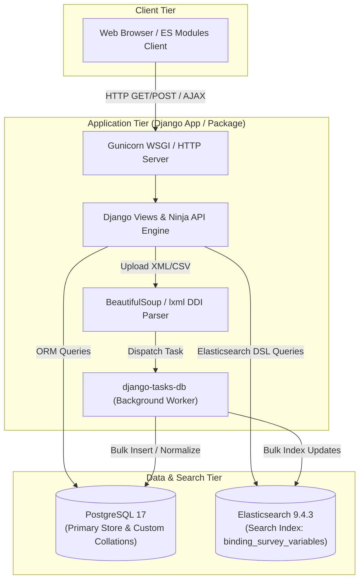
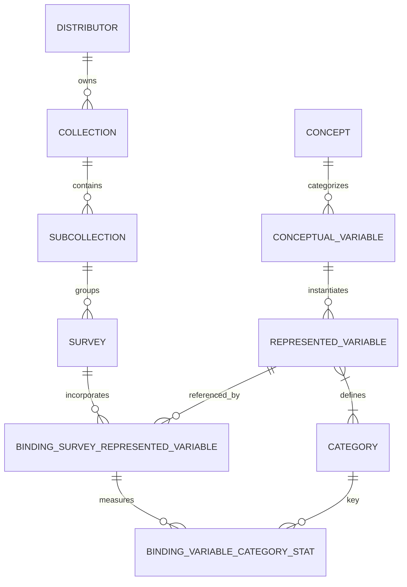
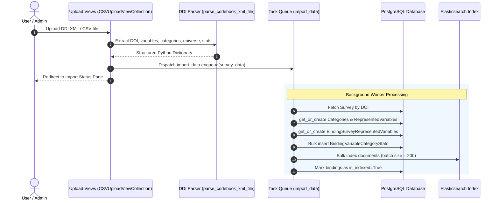
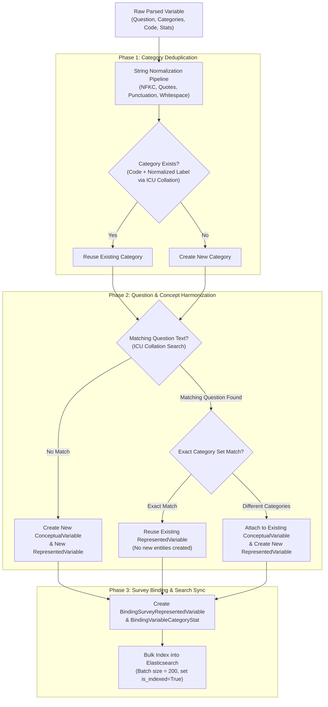

# Technical Overview of `request-ddi` (`re{quest}`)

## Executive Summary

**`request-ddi`** (branded as **`re{quest}`**) is an open-source, enterprise-grade web application and reusable Django package developed by the **Centre des Données Socio-Politiques (CDSP)** at **Sciences Po / CNRS**. Its primary mission is to gather, harmonize, index, compare, and facilitate the reuse of Social Sciences and Humanities (SSH) survey metadata in compliance with **FAIR** (Findable, Accessible, Interoperable, Reusable) data principles.

Key capabilities and technical metrics include:
- **Centralized Question Bank**: Serves over **65,000 questions and variables** across **250+ quantitative survey datasets**.
- **Standardized Metadata Standard**: Implements the **Data Documentation Initiative (DDI)** standard (DDI Codebook 2.5 XML).
- **Hybrid Data Engine**: Blends a relational storage model in **PostgreSQL 17** (using custom case/accent-insensitive collations) with high-speed full-text and similarity search powered by **Elasticsearch 9.4.x**.
- **Asynchronous Data Ingestion Pipeline**: Decouples XML/CSV parsing and data normalization from request handling via background worker execution (`django-tasks-db`).
- **Flexible Deployment Footprint**: Distributed both as a standalone Dockerized/Podman web application and as an installable Python package (`pip install request-ddi`) for integration into external Django projects.

---

## 1. System Architecture & Component Interaction

`request-ddi` follows a modular, decoupled architecture separating relational persistence, search indexing, background ETL execution, and frontend interaction.



### Architectural Principles & Components
1. **Relational Metadata Core (PostgreSQL)**: Serves as the single source of truth. Stores structured hierarchical metadata (`Distributor` → `Collection` → `Subcollection` → `Survey`) as well as questions, concepts, represented variables, and statistical response distributions.
2. **Search & Discovery Engine (Elasticsearch)**: Indexes serialized survey-variable bindings (`BindingSurveyDocument`) into the `binding_survey_variables` index. Custom character filters and analyzers convert French survey text for accent-folding, stopword removal, and full-text search.
3. **Asynchronous ETL Engine (`django-tasks-db`)**: Long-running XML/CSV imports are executed asynchronously to prevent HTTP request timeouts. Tasks report progress and completion stats back to the database.
4. **Dual Mode Operation**:
   - **Standalone Web App**: Uses Gunicorn, WhiteNoise, and Docker Compose to spin up a full web portal.
   - **Reusable Python Library**: Can be added directly to any external Django project's `INSTALLED_APPS` and URL router (`path('request/', include('request_ddi.urls'))`).

---

## 2. Technology Stack

| Layer | Technologies & Libraries | Function / Description |
| :--- | :--- | :--- |
| **Language & Runtime** | Python 3.9 – 3.13, Node.js (build-time) | Core execution platform |
| **Web Framework** | Django $\ge$ 6.0, `django-ninja` 1.3.0 | Application routing, ORM, API handling, admin interface |
| **Relational Database** | PostgreSQL 17 (Alpine), `psycopg2-binary` | Primary persistence engine with custom ICU collations |
| **Search Engine** | Elasticsearch 9.4.3, `django-elasticsearch-dsl` 9.0.0 | Full-text, category, and metadata search with highlighting |
| **Task Queue / ETL** | `django-tasks-db` $\ge$ 0.12.0 | Asynchronous background processing for file imports |
| **XML & File Parsing** | `beautifulsoup4`, `lxml` | DDI Codebook XML parsing (`qstnLit`, `catgry`, `var`) |
| **Data Import / Export** | `django-import-export` 4.1.1, `requests` | CSV import/export workflows and external metadata fetching |
| **WSGI & Static Serving** | Gunicorn 26.0.0, WhiteNoise 6.4.0 | Production HTTP gateway and static asset serving |
| **Frontend & Assets** | Vanilla JS (ES modules), Vite, Bootstrap | Responsive search interface, dynamic AJAX pagination, modals |
| **Build & Packaging** | `hatchling`, `hatch-vcs`, `hatch-jupyter-builder` | Python wheel build system with automatic Vite asset compilation |
| **Code Quality & Testing** | Pytest, `pytest-django`, `pytest-cov`, Ruff, Pre-commit | Unit/integration test execution, coverage, code linting |
| **Containerization** | Docker, Podman, Docker Compose | Multi-container orchestration (App, DB, Elasticsearch) |

---

## 3. Data Model & Domain Design

The domain model captures the complex relationships of survey documentation, distinguishing between abstract conceptual variables and specific survey implementations.



### Key Domain Entities ([`request_ddi/core/models.py`](file:///Users/pascal/git-hub/request-ddi/request_ddi/core/models.py))

- **`Distributor`**: Top-level organization distributing the datasets (e.g., CDSP).
- **`Collection` & `Subcollection`**: Logical groupings of survey series (e.g., *Enquêtes Électorales Françaises*).
- **`Survey`**: A specific survey instance or wave (e.g., *Baromètre Politique Français 2007*), identified by a unique DOI external reference (`external_ref`).
- **`ConceptualVariable`**: Represents an abstract concept (e.g., "Left-Right Political Placement").
- **`RepresentedVariable`**: Represents a specific question wording and set of response categories. Normalizes identical questions across multiple surveys.
- **`Category`**: A response option (code + label, e.g., Code `1`: "Strongly Agree"). Employs custom case- and accent-insensitive database collations.
- **`BindingSurveyRepresentedVariable`**: The junction table connecting a `Survey` to a `RepresentedVariable`. Holds survey-specific metadata such as `variable_name` (e.g., `q01a`), `universe`, `notes`, and `is_indexed` status.
- **`BindingVariableCategoryStat`**: Holds frequency distributions and response statistics (`stat`) for a specific category within a specific survey binding.

### Case & Accent Insensitive Database Collation
To perform accurate string comparisons and avoid duplicate records due to accents or case variations, `request-ddi` registers a custom PostgreSQL collation:
- **`request_ddi_case_accent_insensitive_collation`**: Uses ICU non-ignorable level-1 comparison rules.
- **SQLite Fallback for Unit Testing**: In [`request_ddi/apps.py`](file:///Users/pascal/git-hub/request-ddi/request_ddi/apps.py), a custom Python collation hook `collate_und_ks_level1` is registered dynamically when running under SQLite.

---

## 4. ETL & Ingestion Pipeline

Data ingestion transforms DDI 2.5 XML Codebooks or structured CSVs into normalized database records and Elasticsearch documents.



### Normalization & Deduplication Logic

The ingestion pipeline employs a multi-stage string normalization and database harmonization cascade to ensure survey questions and categories are consistently deduplicated and linked across multiple surveys.

#### 1. String Normalization Pipeline ([`request_ddi/utils/normalize_string.py`](file:///Users/pascal/git-hub/request-ddi/request_ddi/utils/normalize_string.py))

All extracted string fields (question text, variable labels, category labels) pass through a strict cleaning pipeline prior to database lookup:
- **Unicode NFKC Normalization**: Standardizes Unicode characters into canonical compatibility forms (`unicodedata.normalize("NFKC", text)`).
- **Non-Breaking Space Substitution**: Replaces non-breaking and special spaces (`\u00A0`, `\u202F`, `\u2007`, `\u2060`, `\u2027`, `\u00B7`) with standard spaces.
- **Quote & Typography Standardization**: Converts French typographical quotes (`«`, `»`, `“`, `”`) to standard double quotes (`"`), curved apostrophes (`’`) to straight apostrophes (`'`), and en-dashes (`–`) to hyphens (`-`).
- **French Punctuation Spacing**: Enforces spacing rules prior to interrogation/semicolon punctuation (`?`, `;`) and standardizes space placement around quotes.
- **Ellipsis Normalization**: Replaces single-character ellipsis (`…`) or multi-dot sequences with standard three dots (`...`).
- **Whitespace Collapsing**: Strips leading/trailing whitespace and compresses consecutive spaces into a single space (`" ".join(text.split())`).
- **Accent Stripping for Comparison** ([`normalize_string_for_comparison`](file:///Users/pascal/git-hub/request-ddi/request_ddi/utils/normalize_string.py#L41-L53)): Uses Unicode NFD decomposition to isolate and remove combining diacritical marks (`Mn` category), converting strings to lowercased ASCII equivalents for in-memory comparisons and SQLite test collations.

#### 2. Three-Phase Harmonization Cascade ([`request_ddi/core/data_importer.py`](file:///Users/pascal/git-hub/request-ddi/request_ddi/core/data_importer.py))



- **Phase 1: Category Harmonization ([`get_or_create_categories`](file:///Users/pascal/git-hub/request-ddi/request_ddi/core/data_importer.py#L122-L139))**:
  - Each response category label is normalized and checked against existing `Category` records using PostgreSQL's ICU collation (`request_ddi_case_accent_insensitive_collation`).
  - Raw response counts (`stat`) are decoupled from the category definition and stored separately in `BindingVariableCategoryStat` per survey-variable binding.
- **Phase 2: Question & Concept Harmonization ([`get_or_create_represented_variable`](file:///Users/pascal/git-hub/request-ddi/request_ddi/core/data_importer.py#L141-L225))**:
  - **Question Text Matching**: Queries existing `RepresentedVariable` records whose `question_text` matches the normalized question text using ICU collation.
  - **Category Set Evaluation**: For candidate variables with matching question text, compares their associated category IDs (`categories.all()`) with the newly imported category set:
    - *Exact Match (Question + Categories)*: Reuses the existing `RepresentedVariable` (zero entity creation).
    - *Partial Match (Same Question, Different Categories)*: Connects the new `RepresentedVariable` to the **existing** `ConceptualVariable` (grouping them as conceptual variants of the same core question across survey waves), while creating a distinct `RepresentedVariable`.
    - *No Match*: Creates both a new `ConceptualVariable` and a new `RepresentedVariable`.
- **Phase 3: Survey Binding & Search Synchronization**:
  - Creates a `BindingSurveyRepresentedVariable` connecting the specific `Survey` to the harmonized `RepresentedVariable`, capturing survey-level identifiers (`variable_name`), target `universe`, and `notes`.
  - Performs bulk indexing into the Elasticsearch index `binding_survey_variables` in batches of 200 documents, updating `is_indexed=True` upon successful indexing.

#### 3. Harmonization Scope: Cross-Dataset (Global) vs. Dataset-Level

A critical architectural distinction in `request-ddi` is that **normalization, deduplication, and concept mapping operate GLOBALLY ACROSS ALL DATASETS**, while survey-specific context is attached at the binding level:

| Level / Layer | Entities Involved | Scope & Harmonization Behavior |
| :--- | :--- | :--- |
| **Global / Cross-Dataset** | `Category`, `RepresentedVariable`, `ConceptualVariable` | **Applies across ALL surveys in the entire database.**<br>• `Category`: Shared globally across datasets whenever code + normalized label match.<br>• `RepresentedVariable`: Reused globally whenever two different surveys ask the exact same question with the same response categories.<br>• `ConceptualVariable`: Automatically clusters questions across different surveys/waves that share identical question text, even if category options changed between waves. |
| **Dataset / Survey Level** | `Survey`, `BindingSurveyRepresentedVariable`, `BindingVariableCategoryStat` | **Specific to a single survey dataset.**<br>• `BindingSurveyRepresentedVariable`: Binds a shared `RepresentedVariable` to a specific dataset (`Survey`), storing dataset-local metadata like variable name (`q01a`), notes, and target universe.<br>• `BindingVariableCategoryStat`: Stores dataset-specific response frequencies (`stat` counts) for each category in that particular survey. |

---

## 5. Search Mechanics & Elasticsearch Integration

Search is managed via `django-elasticsearch-dsl` through the [`BindingSurveyDocument`](file:///Users/pascal/git-hub/request-ddi/request_ddi/core/documents.py#L21-L170) class indexing into `binding_survey_variables`.

### Index Configuration & Analyzer
To accommodate French language nuances, the Elasticsearch index uses a custom analyzer (`combined_analyzer`):

```json
{
  "analysis": {
    "char_filter": {
      "elided_articles": {
        "type": "pattern_replace",
        "pattern": "(?i)\\b(l|d|j|qu|n|c|m|s|t)'",
        "replacement": ""
      }
    },
    "filter": {
      "asciifolding_filter": {
        "type": "asciifolding",
        "preserve_original": false
      },
      "french_stop": {
        "type": "stop",
        "stopwords": ["_french_", "a"]
      }
    },
    "analyzer": {
      "combined_analyzer": {
        "type": "custom",
        "tokenizer": "standard",
        "char_filter": ["elided_articles"],
        "filter": ["lowercase", "asciifolding_filter", "french_stop"]
      }
    }
  }
}
```

### Search Query Capabilities
- **Target Fields**: Question text (`variable.question_text`), category labels (`variable.categories.category_label`), variable name (`variable_name`), internal label (`variable.internal_label`), notes (`notes`), universe (`universe`).
- **Facet & Filter Support**: Filter search results dynamically by `survey`, `subcollection`, `collection`, `decades`, and `years`.
- **Match Highlighting**: Returns search snippets wrapped in custom `<mark>` tags for rendering highlighted matching terms on the frontend.

---

## 6. Frontend & Build Pipeline

The frontend uses lightweight Vanilla JavaScript modules located in [`js/src`](file:///Users/pascal/git-hub/request-ddi/js/src), bundled into production bundles via Vite.

```
js/
├── package.json
├── vite.config.js
└── src/
    ├── base.js                 # Global UI scripts
    ├── export.js               # Export interaction logic
    ├── import.js               # File upload drag-and-drop
    ├── import_status.js        # Polling background import jobs
    ├── question_detail.js      # Accordion & detail view handling
    ├── upload_xml.js           # XML validation and upload handlers
    └── search_results/         # Dynamic search results rendering
```

### Python-Jupyter Build Hook Integration
During Python package installation (`pip install .` or `python -m build`), Hatch execution triggers the `hatch-jupyter-builder` hook configured in [`pyproject.toml`](file:///Users/pascal/git-hub/request-ddi/pyproject.toml#L110-L134). This automatically compiles JS source files into the Django static directory:
- `request_ddi/static/js/base.bundle.js`
- `request_ddi/static/js/export.bundle.js`
- `request_ddi/static/js/questionDetail.bundle.js`
- `request_ddi/static/js/searchResults.bundle.js`
- `request_ddi/static/js/importCsv.bundle.js`
- `request_ddi/static/js/importStatus.bundle.js`

---

## 7. URL Routing & API Endpoints

### Core Web Views ([`request_ddi/urls.py`](file:///Users/pascal/git-hub/request-ddi/request_ddi/urls.py))
- `GET /`: [`RepresentedVariableSearchView`](file:///Users/pascal/git-hub/request-ddi/request_ddi/views/search_views.py#L29-L39) — Homepage and search entry.
- `POST /search-results/`: [`search_results`](file:///Users/pascal/git-hub/request-ddi/request_ddi/views/search_views.py) — Search execution view returning HTML fragments.
- `GET /question/<id_quest>/`: [`QuestionDetailView`](file:///Users/pascal/git-hub/request-ddi/request_ddi/views/detail_views.py) — Detailed view of a question and its statistical categories across surveys.
- `GET /import/` & `POST /import/`: [`CSVUploadViewCollection`](file:///Users/pascal/git-hub/request-ddi/request_ddi/views/upload_views.py) — File upload interface.
- `GET /import/status/`: [`ImportStatusView`](file:///Users/pascal/git-hub/request-ddi/request_ddi/views/import_status.py) — Real-time progress monitoring for background tasks.
- `POST /export-csv/`: [`export_page`](file:///Users/pascal/git-hub/request-ddi/request_ddi/views/export_views.py) — Data export in CSV format.

### API Endpoints ([`request_ddi/api_urls.py`](file:///Users/pascal/git-hub/request-ddi/request_ddi/api_urls.py))
- `POST /api/v1/search-results/`: [`SearchResultsDataView`](file:///Users/pascal/git-hub/request-ddi/request_ddi/views/search_views.py#L43-L92) — JSON API returning paginated search hits and highlighted fragments.
- `GET /api/v1/get-subcollections-by-collections/`: Dynamic filter dropdowns helper.
- `GET /api/v1/get-surveys-by-subcollections/`: Dynamic filter dropdowns helper.
- `GET /api/v1/get-decades/` & `GET /api/v1/get-years-by-decade/`: Temporal filter helpers.

---

## 8. Application Bootstrap & Operations

`request-ddi` includes a custom Django management command ([`request_ddi/management/commands/bootstrap.py`](file:///Users/pascal/git-hub/request-ddi/request_ddi/management/commands/bootstrap.py)) that handles container startup and orchestration:

```bash
request_ddi_manage bootstrap --ensuresuperuser --startserver
```

### Bootstrap Execution Steps
1. **Health Verification**: Waits for PostgreSQL and Elasticsearch to become healthy.
2. **Database Provisioning**: Executes `request_ddi_case_accent_insensitive_collation` creation SQL and runs `migrate`.
3. **Superuser Creation**: Ensures the default superuser exists based on environment variables (`DJANGO_SUPERUSER_USERNAME`, etc.).
4. **Elasticsearch Index Initialization**: Checks if `binding_survey_variables` index exists; creates and populates it if missing.
5. **Server Launch**: Spawns Gunicorn in production mode or Django's development server if `DJANGO_DEBUG=True`.

---

## 9. Testing Strategy

The repository uses Pytest with dedicated test configurations ([`config/test_settings.py`](file:///Users/pascal/git-hub/request-ddi/config/test_settings.py)):
- **Zero-Dependency Test Mode**: SQLite is used in-memory for unit testing, avoiding the need for a running PostgreSQL instance.
- **Custom SQLite Collation Mock**: [`request_ddi/apps.py`](file:///Users/pascal/git-hub/request-ddi/request_ddi/apps.py) dynamically injects custom Python collations into SQLite connections to test string normalization without requiring ICU extensions.
- **Coverage Target**: Configured via `pytest-cov` to enforce branch coverage across `request_ddi`.

---

## 10. Outdated Tools, Techniques & Recommended Upgrades

As part of the technical audit, several architectural patterns, dependencies, and build techniques were identified as potentially outdated, sub-optimal, or candidates for modern upgrading.

| Component / Area | Current State / Tool | Identified Issue / Risk | Recommended Upgrade / Modernization |
| :--- | :--- | :--- | :--- |
| **Frontend Libraries** | **jQuery (`^4.0.0`)** in [`js/package.json`](file:///Users/pascal/git-hub/request-ddi/js/package.json#L22) | Modern Vite/ES-module setups are burdened by legacy jQuery DOM manipulations and global AJAX bindings. | Refactor DOM handlers to native Vanilla JavaScript (ES2022+ APIs) or lightweight reactive tools like HTMX / Alpine.js. Remove jQuery dependency. |
| **XML Parsing Performance** | **BeautifulSoup (`bs4` with XML parser)** in [`parse_codebook_xml_file`](file:///Users/pascal/git-hub/request-ddi/request_ddi/core/parser.py#L18) | `BeautifulSoup` loads the complete DOM into memory as Python objects, creating high CPU & RAM overhead for large DDI XML Codebooks. | Migrate to streaming XML parsers using `lxml.etree.iterparse` or Python's native `xml.etree.ElementTree`. Yields 10x–50x speed improvements and minimal memory footprint. |
| **Task Backend & Scaling** | **`django-tasks-db`** (Database Task Queue) | Database-backed task queues cause database bloat and row-level locking under high import volume or status polling. | Migrate background task handling to Celery, `django-q2`, or Redis Queue (RQ) for heavy production environments. |
| **Build Hook Complexity** | **`hatch-jupyter-builder`** in [`pyproject.toml`](file:///Users/pascal/git-hub/request-ddi/pyproject.toml#L110-L134) | `hatch-jupyter-builder` was designed specifically for Jupyter Lab extensions, adding unnecessary build-system complexity to standard Django apps. | Replace with standard Hatch build hooks or custom npm build integration (`hatchling.build.hooks`). |
| **DDI Metadata Standard Support** | **DDI-Codebook 2.5 XML standard only** | Restricts metadata compatibility to legacy XML codebooks; misses richer longitudinal schema models in DDI-Lifecycle. | Extend parser to support DDI-Lifecycle 3.3 XML/JSON-LD, enabling deeper interoperability with European social science data archives (CESSDA). |
| **Legacy CI/CD Configuration** | **`tool.gitlab-activity`** in [`pyproject.toml`](file:///Users/pascal/git-hub/request-ddi/pyproject.toml#L174-L200) alongside `.gitlab-ci.yml` | Project maintains GitLab-specific config and CI files while primary CI/CD runs on GitHub Actions. | Deprecate `.gitlab-ci.yml` and `tool.gitlab-activity` if GitHub is the primary host, streamlining CI maintenance. |
| **Synchronous View & I/O Pipeline** | **Synchronous Django Views** & DB Queries | Standard synchronous `ListView` classes block worker processes during external I/O or Elasticsearch execution. | Modernize key endpoints (`SearchResultsDataView`, API endpoints) to use Django 6 native `async` view handlers and async Elasticsearch client calls. |

