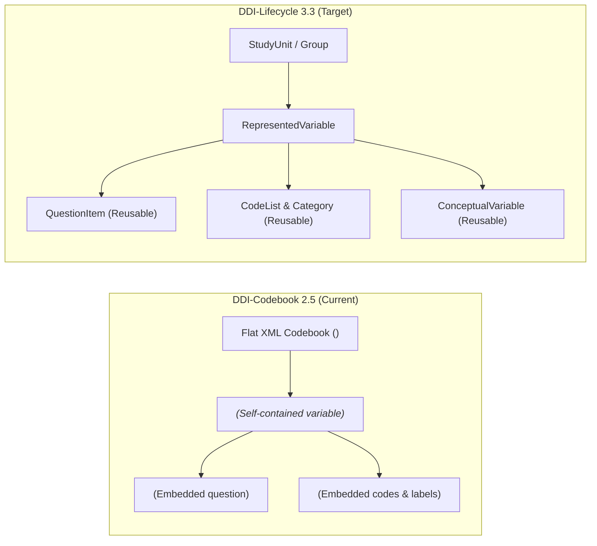
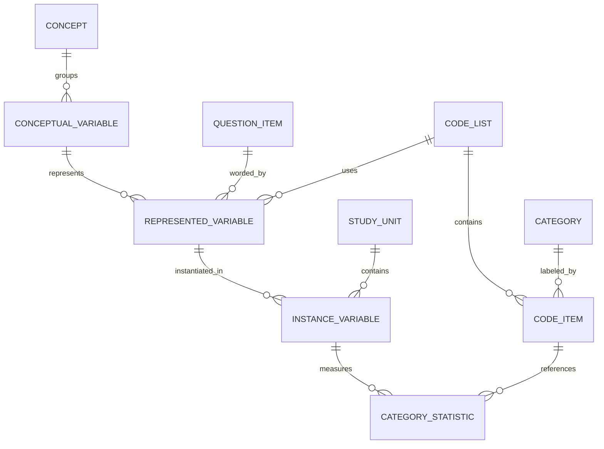
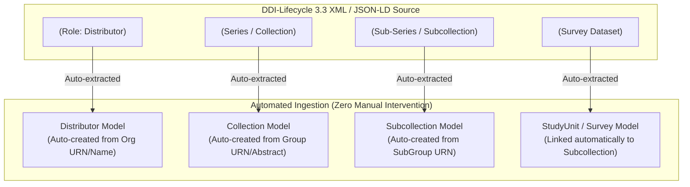
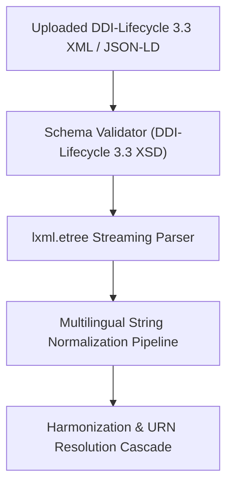
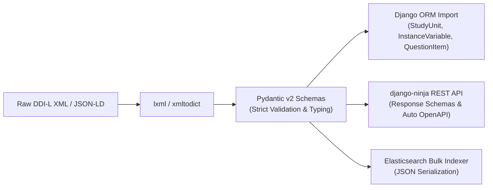
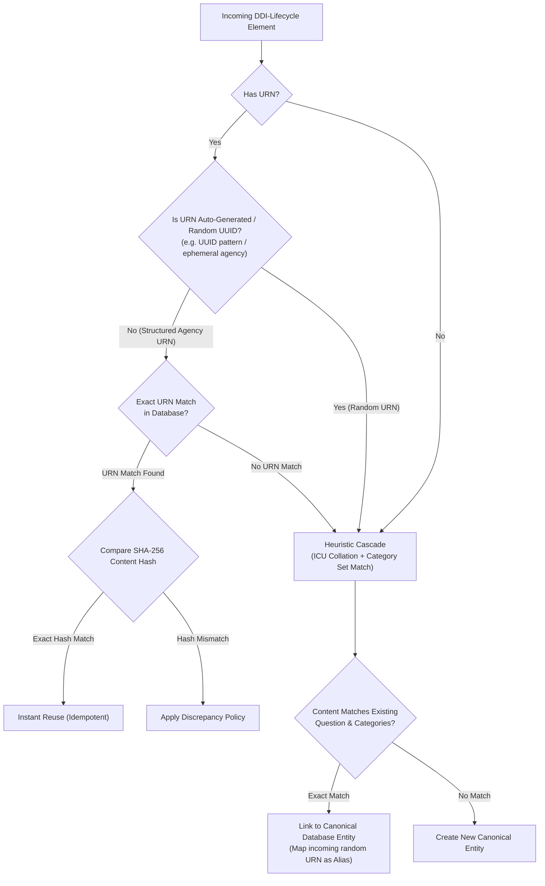
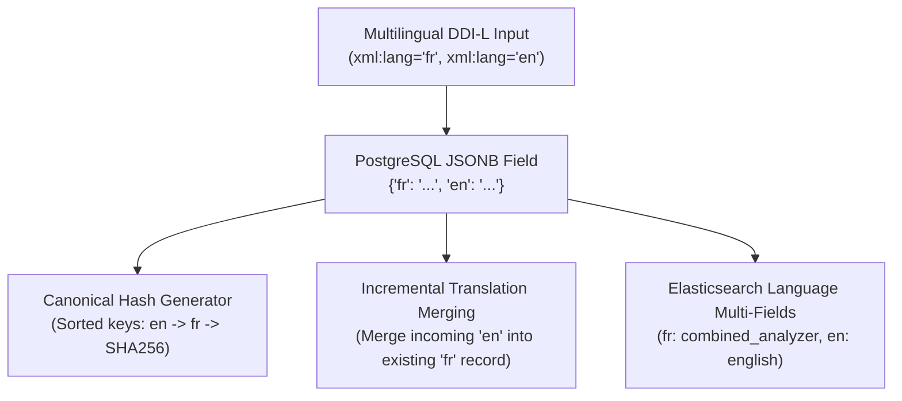
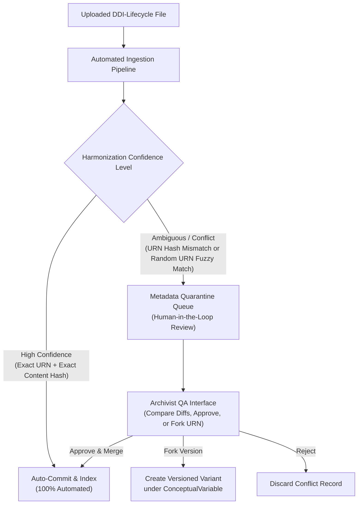
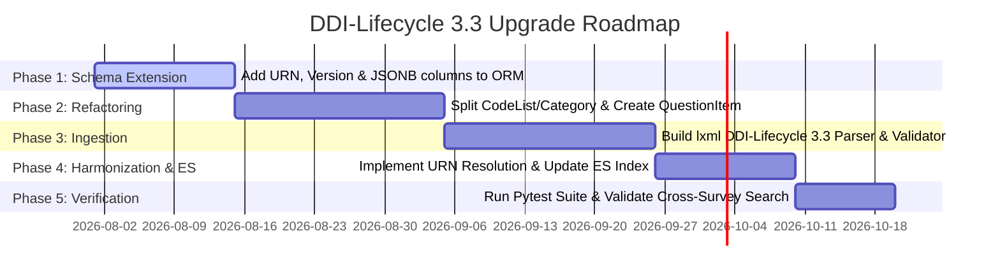
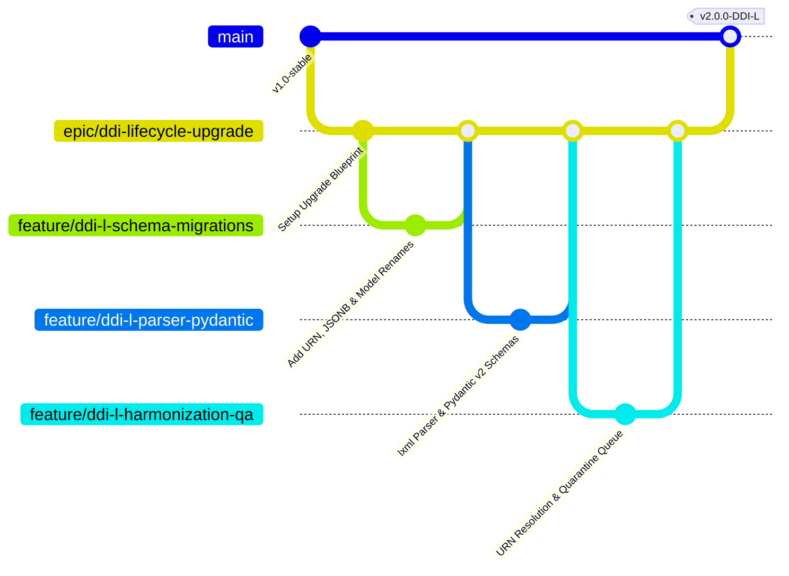

# Architectural Roadmap: Upgrading `request-ddi` to DDI-Lifecycle 3.3

## Executive Summary

This document outlines the technical specification and migration strategy for upgrading **`request-ddi`** from the **DDI-Codebook 2.5** standard to **DDI-Lifecycle 3.3** (XML & JSON-LD). 

While DDI-Codebook represents survey documentation as flat, study-bound XML documents with duplicated inline metadata, DDI-Lifecycle introduces a modular, component-based, versioned architecture designed for cross-study harmonization, longitudinal tracking, and metadata reuse. Because `request-ddi` already implemented custom Django abstractions (`ConceptualVariable`, `RepresentedVariable`, `Category`, `BindingSurveyRepresentedVariable`) to approximate a cross-survey Question Bank, the domain model is conceptually well-positioned for this upgrade.

---

## 1. DDI-Codebook 2.5 vs. DDI-Lifecycle 3.3 Paradigm Shift



| Dimension | DDI-Codebook 2.5 (Current) | DDI-Lifecycle 3.3 (Target Upgrade) |
| :--- | :--- | :--- |
| **Document Architecture** | Flat, single-file study metadata container (`<codeBook>`). | Modular, component-based schemes (`ResourcePackage`, `StudyUnit`, `Group`). |
| **Identification & Versioning** | Non-standard, relies on database auto-increment integer PKs. | Persistent URNs (`urn:ddi:agency:id:version`) on all elements. |
| **Question Wording** | Embedded string tag (`<qstnLit>`) inside each variable element. | Reusable, standalone `QuestionItem` objects with version tracking. |
| **Category & Code Representation** | Codes and labels combined in inline `<catgry>` tags. | Decoupled: `Category` (text label) separated from `CodeList` (value mapping). |
| **Longitudinal Harmonization** | Inferential: string collation matching across independent XML uploads. | Explicit: Native `<Group>` and `<ResourcePackage>` comparative relationships. |
| **Language Support** | Single language per document instance. | Native multilingual support (`xml:lang`) on every text element. |

---

## 2. Database Schema & Domain Model Evolution

To support DDI-Lifecycle, the relational database schema in PostgreSQL must be extended to support persistent URNs, versioning, decoupled code lists, and localized text fields.



### 2.1 DDI Terminology Alignment & Model Renaming

Aligning internal database model names with official **DDI-Lifecycle 3.3 terminology** eliminates translation layers, reduces cognitive overhead for DDI data engineers, and ensures 1:1 parity between database entities and export schemas.

#### A. Terminology Mapping Matrix

| Current `request-ddi` Model Name | Target DDI-Lifecycle 3.3 Name | Status & Justification for Renaming |
| :--- | :--- | :--- |
| **`BindingSurveyRepresentedVariable`** | **`InstanceVariable`** | **High Priority Rename**. In DDI-Lifecycle, the physical realization of a variable in a specific dataset/study column is formally named an `InstanceVariable`. Replaces a 32-character cumbersome name. |
| **`Survey`** | **`StudyUnit`** | **High Priority Rename**. In DDI-Lifecycle, a survey dataset wave is represented as a `StudyUnit` (nested within a longitudinal `Group`). |
| **`BindingVariableCategoryStat`** | **`CategoryStatistic`** | **High Priority Rename**. Standard DDI term for numerical frequencies attached to response categories within a dataset. |
| **`ConceptualVariable`** | **`ConceptualVariable`** | **Already Aligned**. Retained as-is. |
| **`RepresentedVariable`** | **`RepresentedVariable`** | **Already Aligned**. Retained as-is. |
| **`Category`** | **`Category`** | **Already Aligned**. Retained as-is. |
| *(New Entity)* | **`QuestionItem`** | **New Entity**. Extracted question wording and interviewer instructions. |
| *(New Entity)* | **`CodeList` & `CodeItem`** | **New Entity**. Decouples codes from category text labels. |

#### B. Strategic Advantages
1. **Eliminates Translation Layers**: REST APIs, GraphQL endpoints, and JSON-LD/XML export serializers map 1:1 to DDI specifications without requiring custom transformation adapters.
2. **Clean Entity Progression**:
   - `ConceptualVariable` (Concept Layer)
   - `RepresentedVariable` (Representation Layer: `QuestionItem` + `CodeList`)
   - `InstanceVariable` (Dataset Column Layer: `StudyUnit` + `RepresentedVariable`)
3. **Data-Preserving Django Migration**:
   Django natively supports zero-data-loss model renames via `migrations.RenameModel`:
   ```python
   from django.db import migrations

   class Migration(migrations.Migration):
       dependencies = [
           ('request_ddi', '0017_previous_migration'),
       ]

       operations = [
           migrations.RenameModel(
               old_name='BindingSurveyRepresentedVariable',
               new_name='InstanceVariable',
           ),
           migrations.RenameModel(
               old_name='Survey',
               new_name='StudyUnit',
           ),
           migrations.RenameModel(
               old_name='BindingVariableCategoryStat',
               new_name='CategoryStatistic',
           ),
       ]
   ```

### 2.2 Automated Collection & Distributor Hierarchy Extraction

Currently in `request-ddi` (under DDI-Codebook 2.5), `Distributor`, `Collection`, and `Subcollection` entries must be **created manually** by administrators in Django Admin prior to or during file uploads, because flat DDI-Codebook XML files lack standardized series hierarchy schemas.

**DDI-Lifecycle 3.3 completely eliminates manual collection creation** by standardizing series hierarchies directly inside the XML metadata (`<Group>`, `<SubGroup>`, `<StudyUnit>`, and `<Organization>`).



#### Mapping Matrix for Hierarchy Automation

| Existing `request-ddi` Model | DDI-Lifecycle 3.3 Element | Automated Ingestion Behavior |
| :--- | :--- | :--- |
| **`Distributor`** | `<Archive>` / `<Organization>` / `<Agent>` (Role: `Distributor`) | **Fully Automated**: Extracted directly from XML agent roles. Matches existing `Distributor` by URN or normalized organization name. |
| **`Collection`** | `<Group>` (Series / Project Group) | **Fully Automated**: `<Group>` tags carry persistent URNs (`urn:ddi:fr.cdsp:Group:SERIES_ELECTIONS:1.0`), titles, and collection-level abstracts. Ingests and updates `Collection` automatically. |
| **`Subcollection`** | `<SubGroup>` (Sub-Series / Sub-Project) | **Fully Automated**: `<SubGroup>` tags define nested subcollections, automatically binding parent `Collection` (`<Group>`) and child `StudyUnit` (`<StudyUnit>`). |
| **`Survey` (`StudyUnit`)** | `<StudyUnit>` | **Fully Automated**: Links automatically to the parsed `Subcollection` / `Collection` parent chain. |

#### Architectural Advantages:
1. **Zero Manual Setup**: Admin user intervention is no longer required prior to uploading datasets.
2. **URN-Based Series Clustering**: Multiple survey wave imports referencing the same `<Group>` URN automatically attach to the exact same `Collection` in PostgreSQL.
3. **Rich Collection Abstracts**: Preserves series-level funding, project dates, and principal investigator metadata embedded within `<Group>` tags.

---

### Key Schema Modifications ([`request_ddi/core/models.py`](file:///Users/pascal/git-hub/request-ddi/request_ddi/core/models.py))

#### A. Universal Resource Names (URNs) & Version Control
Add persistent identification columns to core models (`Survey`, `ConceptualVariable`, `RepresentedVariable`, `Category`, `QuestionItem`):
- `urn`: `CharField(max_length=512, unique=True, null=True, blank=True)`
- `agency`: `CharField(max_length=255, default="fr.cdsp")`
- `identifier`: `CharField(max_length=255, null=True, blank=True)`
- `version`: `CharField(max_length=64, default="1.0.0")`

#### B. Decoupling `Category` from `CodeList`
Currently, `Category` combines numerical `code` and `category_label` into one row. Under DDI-Lifecycle:
1. **`Category`**: Holds text labels with multilingual `JSONB` support (`category_label = JSONField(default=dict)`).
2. **`CodeList`**: Defines named sets of response choices.
3. **`CodeItem`**: Connects a `CodeList` to a `Category` with a specific `code_value` (e.g. `1` → "Strongly Agree").

#### C. Dedicated `QuestionItem` Entity
Extract `question_text` from `RepresentedVariable` into a standalone table:
- **`QuestionItem`**: Holds `question_text` (`JSONB`), interviewer instructions, and `urn`.
- **`RepresentedVariable`**: References `ConceptualVariable`, `QuestionItem`, and `CodeList`.

#### D. Native Multilingual Support (`JSONB`)
Convert text columns (`question_text`, `category_label`, `notes`, `universe`) to PostgreSQL `JSONB` fields:
```json
{
  "fr": "Diriez-vous que vous vous intéressez à la politique...",
  "en": "Would you say that you are interested in politics..."
}
```

---

## 3. Data Normalization & Ingestion Engine Upgrades



### A. Parser Engine Replacement
- **Current**: `BeautifulSoup(content, "xml")` in [`request_ddi/core/parser.py`](file:///Users/pascal/git-hub/request-ddi/request_ddi/core/parser.py#L18).
- **Target**: `lxml.etree.iterparse` targeting DDI-Lifecycle 3.3 XML schemas (`rddi:ResourcePackage`, `g:Group`, `s:StudyUnit`, `d:DataRelationship`). Stream-parses large XML files without loading full DOM trees into memory.

### B. Pydantic v2 Integration for DDI-Lifecycle Data Validation & Transfer

Leveraging **Pydantic v2** as the data validation and serialization layer for DDI-Lifecycle provides immense architectural benefits. Because `request-ddi` already depends on `django-ninja==1.3.0` (which uses Pydantic natively), introducing Pydantic schemas for DDI-Lifecycle creates a unified typing and validation boundary.



#### 1. Core Architectural Advantages
- **Type Safety & Immediate Boundary Validation**: Rejects malformed or incomplete DDI-L metadata files **before** initiating database transactions or background tasks. Field-level validation errors (`ValidationError`) pinpoint exact line items.
- **Rust-Powered Parsing Performance**: Pydantic v2's core (`pydantic-core`) executes validation routines in compiled Rust, processing thousands of metadata variables per second.
- **Unified 3-Way Reuse**: The exact same Pydantic schema class is reused across:
  1. File import parsing & normalization.
  2. `django-ninja` API endpoint request/response schemas.
  3. Elasticsearch document serialization (`.model_dump(mode="json")`).
- **Native JSON-LD & Multilingual Support**: Handles language-tagged dictionaries (`{"fr": "...", "en": "..."}`) and nested URN objects effortlessly.

#### 2. DDI-Lifecycle Pydantic Schema Blueprint (`request_ddi/core/schemas.py`)

```python
from typing import Dict, List, Optional
from pydantic import BaseModel, Field, field_validator

class DDIURN(BaseModel):
    agency: str = "fr.cdsp"
    identifier: str
    version: str = "1.0.0"

    @property
    def urn_string(self) -> str:
        return f"urn:ddi:{self.agency}:{self.identifier}:{self.version}"

class LocalizedText(BaseModel):
    __root__: Dict[str, str]  # e.g., {"fr": "Texte en français", "en": "English text"}

class QuestionItemSchema(BaseModel):
    urn: DDIURN
    question_text: Dict[str, str] = Field(description="Localized question text")
    interviewer_instructions: Optional[Dict[str, str]] = None

class CategorySchema(BaseModel):
    urn: DDIURN
    label: Dict[str, str]

class CodeItemSchema(BaseModel):
    code_value: str
    category: CategorySchema

class CodeListSchema(BaseModel):
    urn: DDIURN
    name: str
    codes: List[CodeItemSchema]

class InstanceVariableSchema(BaseModel):
    urn: DDIURN
    variable_name: str
    question_item: QuestionItemSchema
    code_list: CodeListSchema
    universe: Optional[Dict[str, str]] = None
    notes: Optional[Dict[str, str]] = None
```

#### 3. Impact Assessment Matrix

| Dimension | Without Pydantic (Raw Dicts / BS4) | With Pydantic v2 |
| :--- | :--- | :--- |
| **Error Handling** | Runtime `KeyError` or `AttributeError` deep inside database import tasks. | Pre-flight `ValidationError` returning line numbers and missing URN fields instantly. |
| **Developer Ergonomics** | Guessing dict key names (`question["qstnLit"]` vs `question["text"]`). | Full IDE autocompletion, type hinting, and refactoring safety (`schema.question_item.question_text`). |
| **API Endpoints** | Manual serialization code converting Django ORM models into API dicts. | Automatic API serialization via `django-ninja` schema decorators (`response=List[InstanceVariableSchema]`). |
| **Elasticsearch Sync** | Custom `serialize()` logic in [`documents.py`](file:///Users/pascal/git-hub/request-ddi/request_ddi/core/documents.py#L140-L170). | Standardized `.model_dump(mode="json")` serialization directly into ES bulk actions. |

---

### C. Pre-Ingestion Schema Validation
Integrate automated XML schema validation against official DDI-Lifecycle 3.3 XSDs before dispatching background processing tasks.

---

## 4. Harmonization & Deduplication Cascade Upgrades

Harmonization evolves from **pure heuristic string matching** to **deterministic URN resolution with a heuristic fallback**.



### A. Deterministic URN Matching Phase
1. **URN Lookup**: If the incoming element contains a valid DDI URN, search PostgreSQL by `urn`.
2. **Exact Version & Content Match**: Reuses existing `QuestionItem`, `CodeList`, or `RepresentedVariable`.
3. **New Version Match**: If the identifier matches but the version number is higher (e.g. `1.1.0`), creates a new versioned entry linked to the parent `ConceptualVariable`.

### B. URN Discrepancy & Content Fingerprint Protocol (`content_hash`)

A major risk in metadata repositories is **Metadata Drift (Unversioned Edits)**: two files share the exact same URN (e.g., `urn:ddi:fr.cdsp:QuestionItem:Q01:1.0`), but their underlying content differs (e.g., question text wording was edited, or response categories changed without incrementing the version string).

To prevent silent database corruption or data loss, the ingestion pipeline implements **SHA-256 Content Fingerprinting**:

#### 1. Content Hash Generation
Every core model stores a deterministic `content_hash = CharField(max_length=64)` generated upon initialization:
- **`QuestionItem` Hash**: `SHA256(canonicalize(question_text + interviewer_instructions))`
- **`CodeList` Hash**: `SHA256(canonicalize(sorted(code_value + category_label)))`
- **`RepresentedVariable` Hash**: `SHA256(question_item.content_hash + code_list.content_hash)`

#### 2. Discrepancy Resolution Matrix (URN Match + Hash Mismatch)

| Resolution Strategy | Ingestion Action | Use Case |
| :--- | :--- | :--- |
| **Strategy 1: Administrative Quarantine (Recommended Default)** | Inserts the variable but flags the import task with `DiscrepancyWarning`. Creates a `MetadataConflict` entry in Django Admin for archivist review. | Prevents silent data corruption while allowing automated background processing to complete. |
| **Strategy 2: Sub-Revision Forking** | Automatically forks the URN with a revision suffix (e.g. `urn:ddi:fr.cdsp:Q01:1.0.0#rev-2`) and links both to the parent `ConceptualVariable`. | Maintains strict audit lineage across modified third-party imports. |
| **Strategy 3: Strict Validation Failure** | Halts ingestion with a descriptive error: *"URN collision: Content mismatch detected for URN ... without version increment."* | Enforces strict DDI versioning discipline for internal CDSP metadata curation. |

### C. Heuristic Fallback Cascade (For Legacy Codebook Files)
If an incoming file lacks URNs (e.g. legacy DDI-Codebook 2.5 XML), the system falls back to the existing cascade:
1. **String Normalization**: Standardizes Unicode NFKC, French punctuation, quotes, and accents via `normalize_string_for_database()`.
2. **ICU Collation Matching**: Queries existing variables using `request_ddi_case_accent_insensitive_collation`.
3. **Category Set Comparison**: If question text matches and category set matches, reuses `RepresentedVariable`; otherwise, clusters under `ConceptualVariable`.

### D. Handling Auto-Generated / Random URNs (Hybrid Fallback & URN Aliasing)

A common reality in DDI-Lifecycle metadata processing is that many DDI authoring tools (e.g., Colectica, Nesstar, Dataverse exports) **auto-generate random UUIDs or timestamp-based URNs** when exporting files without a curated agency authority (e.g. `urn:ddi:int.example:QuestionItem:550e8400-e29b-41d4-a716-446655440000:1`).

If two separate survey files contain the exact same question wording and categories, but were exported by tools that assigned random UUID URNs to each file, relying solely on URN matching would fail to recognize that the questions are identical, creating fragmented duplicate records in PostgreSQL.

#### 1. Ephemeral / Random URN Classifier
During ingestion, incoming URNs are evaluated against a pattern classifier:
- **Random / Ephemeral URN Pattern**: Matches UUID v4 regexes (`[0-9a-f]{8}-[0-9a-f]{4}-...`), timestamp IDs, or generic placeholder agency prefixes (`int.example`, `temp`, `generated`).
- **Classification Action**: URNs classified as random bypass primary URN authority matching and are routed directly to the **Heuristic Content Cascade** (ICU string normalization + category set comparison).

#### 2. URN Aliasing Table (`URNAlias`)
To maintain internal document consistency without corrupting the canonical deduplication engine, random URNs are stored in a dedicated `URNAlias` junction table:

```python
class URNAlias(models.Model):
    alias_urn = models.CharField(max_length=512, unique=True)
    canonical_urn = models.CharField(max_length=512)
    entity_type = models.CharField(max_length=64)  # QuestionItem, CodeList, etc.
    created_at = models.DateTimeField(auto_now_add=True)
```

- When the Heuristic Cascade matches an incoming item with a random URN to an existing canonical `RepresentedVariable` or `ConceptualVariable`, it records the random URN as an `alias_urn`.
- Subsequent internal references to that random URN within the same file stream resolve instantly via `URNAlias` lookup, ensuring 100% data integrity while achieving true cross-survey harmonization.

### E. Language-Aware String Normalization & Canonical Fingerprinting

String normalization is a foundational prerequisite for both content fingerprinting (`content_hash`) and the heuristic fallback cascade. Under DDI-Lifecycle 3.3, normalization evolves from single-language French rules to **language-aware multilingual processing**:

#### 1. Multilingual Normalization Pipeline ([`request_ddi/utils/normalize_string.py`](file:///Users/pascal/git-hub/request-ddi/request_ddi/utils/normalize_string.py))
The utility functions are upgraded to accept a target language code (`lang="fr"`, `lang="en"`, etc.):
- **Universal Pre-processing**: Performs Unicode NFKC canonical decomposition, line-ending standardization (`\r\n` → `\n`), invisible character removal, and whitespace collapsing.
- **Language-Specific Typographical Rules**:
  - `lang="fr"`: Standardizes French guillemets (`«`, `»`), spacing before punctuation (`?`, `;`), and apostrophe standardization (`’` → `'`).
  - `lang="en"`: Standardizes smart quotes (`“`, `”` → `"`), curly apostrophes, and hyphens.
- **Canonical Hash Preparation**: Strips formatting tags, converts strings to lowercased NFD ASCII equivalents (`normalize_string_for_comparison`), ensuring that `content_hash` generation remains 100% deterministic regardless of minor formatting noise.

#### 2. Interaction with Database Collations
Normalized strings feed directly into PostgreSQL ICU collations:
- **`request_ddi_case_accent_insensitive_collation`**: Executes primary-level ICU searches (`und-u-ks-level1`) across database strings, ensuring case and accent variations match seamlessly.

### F. Multilingual Impact Matrix (DDI-L `xml:lang` Architecture)

DDI-Lifecycle permits **any text element** (`<QuestionText>`, `<Label>`, `<Description>`, `<Instructions>`) to carry explicit ISO language tags (e.g. `xml:lang="fr"`, `xml:lang="en"`, `xml:lang="de"`). This impacts every architectural layer in `request-ddi`:



#### Layer-by-Layer Multilingual Impact Matrix

| Layer | Technical Impact of `xml:lang` | Resolution & Design Implementation |
| :--- | :--- | :--- |
| **PostgreSQL Database Storage** | Flat `TextField` columns can no longer represent single strings. | Convert text fields to PostgreSQL `JSONB` (e.g., `{"fr": "Texte...", "en": "Text..."}`). Enables GIN indexing for fast key-value lookups. |
| **Content Fingerprint (`content_hash`)** | Unordered JSON keys or formatting variations can cause hash mismatches. | Sort language keys alphabetically before hashing: `SHA256(canonicalize(sorted(json_data.items())))`. |
| **Harmonization & Translation Merging** | File A imports French text (`fr`); File B imports English translation (`en`) for the same `QuestionItem` URN. | **Incremental Merging**: Instead of creating duplicates or overwriting, the database updates the `JSONB` payload to append the new language translation (`jsonb_set` / dictionary update). |
| **Heuristic Fallback Matching** | Text matching across different languages cannot be solved via simple string collation. | **Language-Keyed Collation**: Fallback text matching compares identical language keys (e.g. `fr` vs `fr`). Cross-language linking relies on `ConceptualVariable` URN grouping. |
| **Elasticsearch Search Index** | Single French analyzer cannot stem or tokenize English/German search queries correctly. | **Multi-Field Language Indexing**: Map text fields into language sub-fields (`question_text.fr`, `question_text.en`), applying appropriate language stemmers to each sub-field. |

### G. Tiered Human-in-the-Loop QA & Metadata Quarantine Workflow

Currently in `request-ddi`, file ingestion is **100% automated once staff triggers the upload**—there is no QA review stage or approval queue. Once files pass basic format checks, database records are inserted and indexed into Elasticsearch immediately.

To support complex DDI-Lifecycle metadata imports safely, we recommend introducing a **Tiered Human-in-the-Loop QA Workflow**:



#### Ingestion Confidence Tiers & Actions

| Confidence Tier | Criteria | Ingestion Behavior |
| :--- | :--- | :--- |
| **High Confidence** *(Auto-Commit)* | • Exact URN match + Exact SHA-256 `content_hash` match.<br>• Clean new URN insertion with valid agency authority. | **100% Automated Execution**: Instantly committed to PostgreSQL and indexed into Elasticsearch. |
| **Medium Confidence** *(Quarantine Review)* | • **URN Drift**: URN matches an existing entity, but `content_hash` differs.<br>• **Fuzzy Random URN Match**: Auto-generated/random UUID URN with question text matching existing entities at $\ge 90\%$ similarity, but category labels differ. | **Quarantined for QA Review**: Inserted into a `MetadataQuarantine` holding table. Generates an administrative task notification. |
| **Low Confidence** *(Validation Error)* | • Invalid URN format, broken XML structure, or missing required DDI-L schemas. | **Pre-flight Rejection**: Returns field-level `ValidationError` instantly. |

#### Archivist QA Dashboard Requirements
- **Side-by-Side Diff Viewer**: Renders field-level comparisons (question text, categories, language tags) between the existing database record and the incoming DDI-L metadata payload.
- **One-Click Action Buttons**:
  - **`Approve & Merge`**: Accepts incoming updates or merges language translation dictionaries (`jsonb_set`).
  - **`Fork Version`**: Creates a new minor version/variant linked under the parent `ConceptualVariable`.
  - **`Reject`**: Discards the quarantined payload without altering canonical records.

---

## 5. Search Engine (Elasticsearch) & API Impacts

### A. Elasticsearch Document Mapping Updates ([`request_ddi/core/documents.py`](file:///Users/pascal/git-hub/request-ddi/request_ddi/core/documents.py))
Update `BindingSurveyDocument` mapping to index localized multilingual text fields:

```json
{
  "properties": {
    "variable": {
      "properties": {
        "question_text": {
          "properties": {
            "fr": { "type": "text", "analyzer": "combined_analyzer" },
            "en": { "type": "text", "analyzer": "english" }
          }
        }
      }
    }
  }
}
```

### B. REST API Endpoint Evolution ([`request_ddi/api_urls.py`](file:///Users/pascal/git-hub/request-ddi/request_ddi/api_urls.py))
Upgrade Ninja / REST serializer schemas to output URNs, version identifiers, and localized text objects for external API consumers.

---

## 6. Phased Implementation Strategy



1. **Phase 1 (Schema Extension)**: Add nullable `urn`, `agency`, `version`, and `JSONB` columns to existing models without breaking current views.
2. **Phase 2 (Entity Refactoring)**: Create `QuestionItem` and `CodeList` tables; run Django data migrations to backfill existing records into the new structure.
3. **Phase 3 (Ingestion Engine)**: Implement `lxml`-based DDI-Lifecycle 3.3 XML/JSON-LD parser in `request_ddi/core/parser.py`.
4. **Phase 4 (Harmonization & ES Sync)**: Implement dual-mode harmonization (Deterministic URN lookup + Heuristic fallback) and update Elasticsearch mappings.
5. **Phase 5 (Testing & Verification)**: Validate using Pytest suite with mock DDI-Lifecycle fixtures.

### 6.1 Recommended Git Branching & Integration Strategy

**Yes, creating a dedicated epic branch strategy for this upgrade is strongly recommended.**

Because the DDI-Lifecycle upgrade introduces structural database migrations, model renaming (`InstanceVariable`), new parsers, and Elasticsearch index mapping updates, developing directly on `main` would risk breaking ongoing production releases and hotfixes.



#### Strategic Branching Plan

- **Main Epic Branch**: `epic/ddi-lifecycle-upgrade` (or `feature/ddi-lifecycle-upgrade`).
  - Serves as the integration branch for all DDI-Lifecycle sub-features during the migration.
- **Sub-Feature Branches** (merged via Pull/Merge Requests into `epic/ddi-lifecycle-upgrade`):
  1. `feature/ddi-l-schema-migrations`: Model renaming (`InstanceVariable`, `StudyUnit`), URN fields, `JSONB` multilingual text columns, and data backfill migrations.
  2. `feature/ddi-l-parser-pydantic`: `lxml` streaming XML/JSON-LD parser, Pydantic v2 schema definitions, and pre-flight XSD validation.
  3. `feature/ddi-l-harmonization-qa`: Deterministic URN resolution, SHA-256 content fingerprinting, URN Aliasing table, and the `MetadataQuarantine` QA dashboard.
  4. `feature/ddi-l-es-multilingual`: Elasticsearch mapping updates for language-specific multi-fields (`fr`, `en`, `de`).
  5. `feature/ddi-l-api-evolution`: Updated `django-ninja` REST API endpoints and OpenAPI schemas.

#### Production Deployment Safety
- Allows the core team to continue issuing `main` branch bug fixes or patch releases (`v1.0.x`) while the DDI-Lifecycle upgrade progresses in parallel.
- Enables complete end-to-end testing of SQLite and PostgreSQL migration rollbacks before merging the final `v2.0.0` release into `main`.
